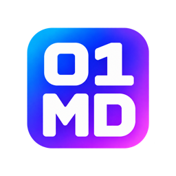

<p align="center">
  
</p>

# Binary Markdown Editor

An open-source visual Markdown editor for VS Code, independently maintained by BinaryOutlook. Edit Markdown in a rendered view, switch to source when needed, copy multiline code accurately, and keep the outline the way you prefer.

Binary Markdown builds on [Any Markdown by raggbal and contributors](https://github.com/raggbal/any-markdown), licensed under MIT. The visual editor and most existing features come from that project. BinaryOutlook maintains this fork's changes, releases, and support. See [Acknowledgments](ACKNOWLEDGMENTS.md) and the [changelog](CHANGELOG.md) for provenance.

## Open source, releases and support

Binary Markdown is proudly open source. Official releases are published periodically, when a set of changes has completed release validation; we do not promise a fixed release schedule.

You are welcome to build, study, and modify the extension between releases. For development builds, we recommend starting from `main`, where changes are integrated. Other branches may contain incomplete experiments. An unreleased build has not necessarily undergone the same validation as an official release.

Bug reports from development builds are welcome—even when the affected commit is not the latest release or the current tip of `main`. Please include the full commit ID, whether you made local changes, your environment, and clear reproduction steps. This helps us check out the same revision and investigate.

We will make a reasonable effort to reproduce and diagnose reported problems. We may ask you to test a newer commit, and fixes will normally land in current development rather than being backported to every historical revision.

Access to the source is central to this project. Building your own version is an intended way to use Binary Markdown.

Read the [build guide](docs/building.md), [release and support policy](docs/releases-and-support.md), and [roadmap](docs/roadmap.md).

## Install

Download a version from [GitHub Releases](https://github.com/BinaryOutlook/binary-markdown/releases). Check its release notes for included features; the **0.1.0 prerelease** predates export. Marketplace and Open VSX publication remain future work.

1. Download the `.vsix` and its SHA-256 checksum from the chosen release, or [build from source](docs/building.md).
2. In VS Code, open **Extensions**, select **… → Install from VSIX…**, and choose the file.
3. Open a Markdown document and select **Reopen Editor With… → Binary Markdown**.

The extension is optional: installing it does not change your default Markdown editor. You can choose **Configure Default Editor…** yourself if you prefer to use it for every Markdown document.

The extension ID is `BinaryOutlook.binary-markdown`. It has separate commands, settings, and editor registration from Any Markdown. Read the [migration guide](docs/migration.md) if you used an earlier test build.

The package declares VS Code 1.85.0 or later. Validation targets local desktop VS Code on macOS ARM64 and Ubuntu x86-64; see the [candidate validation record](docs/validation/0.2.0.md) for actual results. Other editors and platforms need their own compatibility checks.

## Features

Inherited from Any Markdown:

- Visual editing and a source-mode toggle for `.md` and `.markdown` files.
- Headings and outline navigation; bold, italic, strikethrough, lists, task lists, and blockquotes.
- Tables, links, images, code blocks with syntax highlighting, and YAML front matter.
- Mermaid diagrams and KaTeX expressions in fenced `mermaid` and `math` blocks.
- An action palette, keyboard shortcuts, multiple themes, and seven interface languages.
- Synchronization with external file changes, including changes made by coding tools.

Changes developed in this fork:

- Code-block copying preserves rendered line breaks, indentation, and meaningful blank lines.
- Outline visibility can be remembered per file or globally, with a configurable initial state.
- Opening the outline does not mark the Markdown document as edited.
- Independent Binary Markdown names and identifiers throughout the extension and desktop sources.
- Experimental HTML, PDF, DOCX and EPUB export, with local conversion and visible progress.
- A source-stamped VSIX and **Copy Build Information** command for reproducible bug reports.

The first two changes were also proposed upstream as [PR #8](https://github.com/raggbal/any-markdown/pull/8) and [PR #9](https://github.com/raggbal/any-markdown/pull/9). This fork's release decisions are independent of those PRs.

## Configure the editor

Open **Settings** (`Cmd+,` on macOS or `Ctrl+,` on Windows/Linux) and search for **Binary Markdown**. Settings can be applied at User or Workspace scope.

| Setting | Default | Purpose |
| --- | --- | --- |
| `binary-markdown.outlineDefaultOpen` | `true` | Start with the outline open when no remembered state exists. |
| `binary-markdown.outlineStateScope` | `file` | Remember each file separately, or choose `global` to share visibility across files and workspaces. |
| `binary-markdown.toolbarMode` | `simple` | Use the compact toolbar or choose `full`. |
| `binary-markdown.theme` | `things` | Choose `github`, `sepia`, `night`, `dark`, `minimal`, `perplexity`, or `things`. |
| `binary-markdown.fontSize` | `16` | Editor font size in pixels. |
| `binary-markdown.language` | `default` | Editor interface language: follow VS Code, or select a supported language. |
| `binary-markdown.imageDefaultDir` | `""` | Image save directory; empty means the document's directory. |
| `binary-markdown.forceRelativeImagePath` | `false` | Prefer relative Markdown image paths when an absolute image directory is configured. |
| `binary-markdown.enableDebugLogging` | `false` | Enable diagnostic logging when investigating an issue. |

Settings descriptions and option explanations follow **VS Code's display language**. English, Japanese, Simplified Chinese, Traditional Chinese, Korean, Spanish, and French are supported; other display languages fall back to English. Use **Configure Display Language** in the Command Palette and restart VS Code to change the display language. The `binary-markdown.language` setting controls the editor interface independently of these settings descriptions.

To start new files with a closed outline:

```json
{
  "binary-markdown.outlineDefaultOpen": false,
  "binary-markdown.outlineStateScope": "file"
}
```

A remembered visibility overrides the initial default. Changing the default does not erase previously saved outline states. These settings control the editor's outline, not VS Code's Explorer sidebar.

## Everyday commands

Search for **Binary Markdown** in the Command Palette. Commands include opening the editor, switching source mode, opening as text, comparing as text, inserting tables or a table of contents, and undo/redo.

| Action | macOS | Windows/Linux |
| --- | --- | --- |
| Open action palette | `Cmd+/` | `Ctrl+/` |
| Toggle source mode | `Cmd+.` | `Ctrl+.` |
| Open as text | `Cmd+Shift+.` | `Ctrl+Shift+.` |

The [editor guide](docs/editor-guide.md) covers formatting, keyboard operations, and images. Export commands and **Copy Build Information** are also available here.

## Experimental export

Export supports **HTML, PDF, Word (.docx), and EPUB** in **local desktop VS Code on macOS and Linux**. HTML/PDF follow supported editor rendering; DOCX/EPUB prioritize editable content and structure. See [candidate validation](docs/validation/0.2.0.md) and the [export validation history](docs/export-validation.md) for tested systems and limitations.

Save the named Markdown file, then select the sharing-arrow button immediately to the right of the VS Code-logo toolbar button. Choose a format from its dropdown. Unsaved work produces a save-and-retry message; export does not save automatically. The job shows its actual stage, supports cancellation, and reports the saved path and any fallback warnings.

| Format | Tool to install | Initial output goal |
| --- | --- | --- |
| HTML | None beyond the running extension | Standalone supported rendering with embedded resources |
| PDF | Chrome, Chromium, or Microsoft Edge | Prepared HTML printed by a headless browser with simple pagination |
| Word / EPUB | Pandoc | Editable text and document structure; layout can differ from browser output |

Install Pandoc using its [official instructions](https://pandoc.org/installing.html); Homebrew users can use `brew install pandoc`. For PDF, install [Google Chrome](https://www.google.com/chrome/) or another supported Chromium-family browser. Native tools are user-managed and are not downloaded or bundled by the extension. A browser is the PDF rendering engine; HTML and Pandoc formats do not require it.

Open VS Code Settings and search for `binary-markdown.export`. Leave the following **machine-specific** settings empty for automatic detection, or supply an absolute executable path:

| Setting | Example macOS executable path | Example Linux executable path |
| --- | --- | --- |
| `binary-markdown.export.pandocPath` | `/opt/homebrew/bin/pandoc` | `/usr/bin/pandoc` or an absolute user-space installation path |
| `binary-markdown.export.browserPath` | `/Applications/Google Chrome.app/Contents/MacOS/Google Chrome` | `/usr/bin/google-chrome` |

An invalid manual path is reported instead of silently selecting a different tool. Reopen the export menu after installing a tool to rescan. The initial workflow requires a trusted workspace; remote hosts, browser VS Code and Electron-app export are deferred.

Files are saved beside the Markdown source with the same filename stem. An occupied name uses the final eight SHA-256 hexadecimal characters of the completed output, then `_2`, `_3`, and so on if needed. An identical hash-named file is reused, and existing files are preserved. No destination dialog is shown.

Supported resources retain source resolution; missing or unsupported content receives a visible fallback and warning summary. PDF uses simple block fitting, so blank regions are acceptable. Advanced pagination, templates, compression, custom destinations and unsaved export remain future work. See [export help](media/export-help.md) for the initial format limitations and [the subsystem outline](docs/export-subsystem.md) for the agreed implementation scope.


## Build and contribute

Start development builds from `main`, select the Node version in `.node-version`, then run:

```sh
git clone https://github.com/BinaryOutlook/binary-markdown.git
cd binary-markdown
npm ci
npm run package
```

The package command compiles the extension and writes `dist/<name>-<version>.vsix`, a SHA-256 checksum, and build information. It links installed documentation to the source commit. See [building](docs/building.md) for historical revisions, isolated installation and verification, and [CONTRIBUTING.md](CONTRIBUTING.md) for tests and focused PRs.

Bug reports, translations, accessibility work and compatibility testing are welcome in [this fork's issue tracker](https://github.com/BinaryOutlook/binary-markdown/issues). Reports from identifiable older development commits are welcome too.

## Project history and license

The [reference archive](archive/README.md) preserves superseded README, website, screenshots, and upstream release notes for historical reference. Archived instructions describe the original project and should not be used to install this fork.

For the 0.2.0 transition, Binary Markdown is licensed under [GNU AGPL version 3 or later](LICENSE) (`AGPL-3.0-or-later`). Earlier MIT releases retain their original terms. The [retained MIT notice](LICENSES/AnyMarkdown-MIT.txt) covers inherited upstream code and prior MIT contributions; third-party components retain their own licences. See [NOTICE](NOTICE) and the [licensing guide](docs/licensing.md) for scope, retained grants and matching source. Project and dependency licence notices are included in packaged builds. The Electron desktop sources are retained under the Binary Markdown name; desktop installers and their compatibility are a separate release effort.
