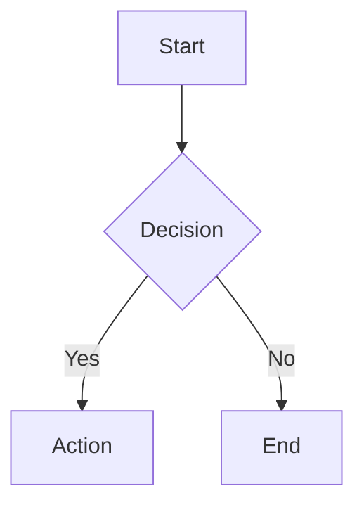

# Binary Markdown editor guide

Adapted from the inherited Binary Markdown documentation. See [Acknowledgments](../ACKNOWLEDGMENTS.md) for provenance and the [README](../README.md) for installation and current settings.

## 📝 Creating Markdown Elements

### Block Elements

| Element | Pattern Input | Toolbar | Shortcut |
| --- | --- | --- | --- |
| Heading 1 | `# ` + Space | Heading menu → H1 | `Ctrl+1` |
| Heading 2 | `## ` + Space | Heading menu → H2 | `Ctrl+2` |
| Heading 3 | `### ` + Space | Heading menu → H3 | `Ctrl+3` |
| Heading 4 | `#### ` + Space | Heading menu → H4 | `Ctrl+4` |
| Heading 5 | `##### ` + Space | Heading menu → H5 | `Ctrl+5` |
| Heading 6 | `###### ` + Space | Heading menu → H6 | `Ctrl+6` |
| Paragraph | (default)<br> | — | `Ctrl+0` |
| Unordered List | `- ` or `* ` + Space | List button | `Ctrl+Shift+U` |
| Ordered List | `1. ` + Space | Numbered list button | `Ctrl+Shift+O` |
| Task List | `- [ ] ` + Space | Task list button | `Ctrl+Shift+X` |
| Blockquote | `> ` + Space | Quote button | `Ctrl+Shift+Q` |
| Code Block | ````` ``` ````` + Enter | Code button | `Ctrl+Shift+K` |
| Table | `| col1 | col2 |` + Enter | Table button | `Ctrl+T` |
| Horizontal Rule | `---` + Enter | HR button | `Ctrl+Shift+-` |


### Inline Elements

| Element | Pattern Input | Toolbar | Shortcut |
| --- | --- | --- | --- |
| Bold | `**text**` + Space | Bold button | `Ctrl+B` |
| Italic | `*text*` + Space | Italic button | `Ctrl+I` |
| Strikethrough | `~~text~~` + Space | Strikethrough button | `Ctrl+Shift+S` |
| Inline Code | ``` `text` ``` + Space | Code button | ``` Ctrl+` ``` |
| Link | `[text](url)` <br>Space conversion not supported<br> | Link button | `Ctrl+K` |
| Image | `` <br>Space conversion not supported<br> | Image button | `Ctrl+Shift+I` |


---

## ⌨️ Special Operations

### General Shortcuts

These shortcuts are active when the Binary Markdown editor is focused:

| Shortcut | Action |
| --- | --- |
| `Cmd+/` / `Ctrl+/` | Open Action Palette |
| `Cmd+.` / `Ctrl+.` | Toggle Source Mode |
| `Cmd+Shift+.` / `Ctrl+Shift+.` | Open in Text Editor |
| `Ctrl/Cmd + S` | Save |
| `Ctrl/Cmd + Z` | Undo |
| `Ctrl/Cmd + Shift + Z` | Redo |
| `Ctrl/Cmd + B` | Bold |
| `Ctrl/Cmd + I` | Italic |
| `Ctrl/Cmd + K` | Insert link |
| `Ctrl/Cmd + F` | Find |
| `Ctrl/Cmd + H` | Find and replace |
| `Ctrl/Cmd + L` | Open source file with selected lines in text editor |

### Escaping Block Elements

| Element | Key | Action |
| --- | --- | --- |
| Code Block | `Shift+Enter` | Exit code block and create new paragraph |
| Blockquote | `Shift+Enter` | Exit blockquote and create new paragraph |
| Mermaid/Math | `Shift+Enter` | Exit block and create new paragraph |
| Code Block | `↑` at first line | Exit to previous element |
| Code Block | `↓` at last line | Exit to next element |
| Blockquote | `↑` at first line | Exit to previous element |
| Blockquote | `↓` at last line | Exit to next element |
| Mermaid/Math | `↑` at first line | Exit to previous element |
| Mermaid/Math | `↓` at last line | Exit to next element |

### Escaping Inline Elements

To exit inline formatting, type the closing marker followed by Space:

| Element | Input | Action |
| --- | --- | --- |
| Bold | `**` + Space | Close bold and move cursor outside |
| Italic | `*` + Space | Close italic and move cursor outside |
| Strikethrough | `~~` + Space | Close strikethrough and move cursor outside |
| Inline Code | ``` ` ``` + Space | Close inline code and move cursor outside |

### Table Operations

| Key | Action |
| --- | --- |
| `Tab` | Move to next cell |
| `Shift+Tab` | Move to previous cell |
| `Enter` | Insert new row |
| `Shift+Enter` | Insert line break within cell |
| `↑` / `↓` | Navigate between rows |
| `←` / `→` | Navigate within/between cells |
| `Cmd+A` | Select all text in current cell |

### Code Block Operations

| Key | Action |
| --- | --- |
| `Tab` | Insert 4 spaces |
| `Shift+Tab` | Remove up to 4 leading spaces |
| `Cmd+A` | Select all text within code block |

### List Operations

| Key | Action |
| --- | --- |
| `Tab` | Indent list item (increase nesting) |
| `Shift+Tab` | Outdent list item (decrease nesting) |
| `Enter` on empty item | Convert to paragraph or decrease nesting |
| `Backspace` at start | Convert to paragraph |
| Pattern at line start + Space | Convert list type in-place (e.g., `1. ` converts `- item` to ordered list) |

### Multi-Block Selection

| Key | Action |
| --- | --- |
| `Tab` | Insert 4 spaces at the beginning of each selected block |
| `Shift+Tab` | Remove up to 4 leading spaces from each selected block |

---

## 💻 Code Block Features

### Supported Languages

The editor supports syntax highlighting for the following languages:

`javascript`, `typescript`, `python`, `json`, `bash`, `shell`, `css`, `html`, `xml`, `sql`, `java`, `go`, `rust`, `yaml`, `markdown`, `c`, `cpp`, `csharp`, `php`, `ruby`, `swift`, `kotlin`, `dockerfile`, `plaintext`

**Language Aliases:** `js`→javascript, `ts`→typescript, `py`→python, `sh`→bash, `yml`→yaml, `md`→markdown, `c++`→cpp, `c#`→csharp

### Display Mode / Edit Mode

- **Display Mode**: Shows syntax-highlighted code with language tag and copy button
- **Edit Mode**: Plain text editing (click on code block to enter)
- **Expand Button**: Open code in a separate VS Code editor tab for larger editing

### Mermaid Diagrams

Code blocks with language `mermaid` are rendered as diagrams:



- Click on diagram to edit source
- Diagram re-renders when exiting edit mode

### KaTeX Math Equations

Code blocks with language `math` are rendered as mathematical equations using KaTeX:

```math
E = mc^2
\int_0^\infty e^{-x} dx = 1
\sum_{n=1}^{\infty} \frac{1}{n^2} = \frac{\pi^2}{6}
```

- Each line is rendered as an independent display-mode equation
- Click on the rendered equation to edit the LaTeX source
- Equations re-render automatically (500ms debounce) while editing
- Invalid LaTeX is shown as a red error message (does not break the layout)
- Empty blocks show "Empty expression"
- Navigate in/out with arrow keys, just like code blocks and Mermaid diagrams

---

## 🖼️ Image Path Configuration

Images can be saved to custom directories when pasting or drag-and-dropping.

### Configuration Levels

| Level | Setting File | Description |
| --- | --- | --- |
| **Global** | `~/Library/Application Support/Code/User/settings.json` (macOS)<br>`%APPDATA%\Code\User\settings.json` (Windows)<br>`~/.config/Code/User/settings.json` (Linux) | VS Code user settings |
| **Project** | `.vscode/settings.json` | Project-level override |
| **File** | Per-file directive | Per-file override in markdown footer |

### VS Code settings.json Setting

```json
{
  "binary-markdown.imageDefaultDir": "./images",
  "binary-markdown.forceRelativeImagePath": true
}
```

### Per-File Directive

Add at the end of your markdown file:

```markdown
---
IMAGE_DIR: ./assets/images
FORCE_RELATIVE_PATH: true
```

### Path Behavior Matrix

`forceRelativeImagePath` allows you to separate the **image save location** from the **path written in Markdown**.

**Use case**: When you want to save images to a specific absolute path (e.g., `/Users/shared/images/`) but reference them using relative paths from the Markdown file, set this to `true`.

> **Note**: `forceRelativeImagePath` only takes effect when `imageDefaultDir` is an absolute path. When using relative paths, the setting is ignored as paths are always relative.

| imageDefaultDir | forceRelativeImagePath | Image Save Location | Path in Markdown |
| --- | --- | --- | --- |
| Absolute (e.g., `/Users/shared/images`) | `false` | Specified absolute path | Absolute path |
| Absolute (e.g., `/Users/shared/images`) | `true` | Specified absolute path | Relative path from Markdown file |
| Relative (e.g., `./images`) | `false` | Relative to Markdown file | Relative path |
| Relative (e.g., `./images`) | `true` | Relative to Markdown file | Relative path (setting ignored) |

---

## 🎨 Configuration

### VS Code Settings

| Setting | Description | Default |
| --- | --- | --- |
| `binary-markdown.theme` | Editor theme (`github`, `sepia`, `night`, `dark`, `minimal`, `perplexity`, `things`) | `things` |
| `binary-markdown.fontSize` | Base font size (px) | `16` |
| `binary-markdown.imageDefaultDir` | Default directory for saved images | `""` (same as markdown file) |
| `binary-markdown.forceRelativeImagePath` | Force relative paths for images | `false` |
| `binary-markdown.language` | UI language (`default`, `en`, `ja`, `zh-cn`, `zh-tw`, `ko`, `es`, `fr`) | `default` |
| `binary-markdown.toolbarMode` | Toolbar display mode (`full`, `simple`). Simple shows only undo/redo and utility buttons (use `Cmd+/` for other operations) | `simple` |
| `binary-markdown.outlineStateScope` | Remember outline visibility per Markdown file (`file`) or share it across all Markdown files (`global`) | `file` |
| `binary-markdown.outlineDefaultOpen` | Open the outline when the selected scope does not have a saved state yet | `true` |
| `binary-markdown.enableDebugLogging` | Enable debug logging in browser console | `false` |
| `binary-markdown.export.pdfWhiteBackground` | Export PDF with a white page and GitHub light appearance. Disable to fill the whole page, including margins, with the editor theme. Other formats keep their existing styling. | `true` |

With `outlineStateScope` set to `file`, every Markdown resource restores its own last outline state in the current workspace. With `global`, toggling the outline controls the next Markdown editor that renders as well, and the preference survives VS Code restarts.

### Themes

| Theme | Description |
| --- | --- |
| `github` | Clean GitHub-style rendering |
| `sepia` | Warm, paper-like appearance for comfortable reading |
| `night` | Dark theme with Tokyo Night inspired colors (blue tint) |
| `dark` | Pure dark theme with neutral black/gray colors |
| `minimal` | Distraction-free black and white design |
| `perplexity` | Light theme with Perplexity brand colors (Paper White background) |
| `things` | Clean, minimal theme inspired by Things app (SF Pro font, blue accents) (default) |

---

## 🌐 Supported Languages (i18n)

The editor UI supports the following languages:

| Language | Code |
| --- | --- |
| English | `en` (default) |
| Japanese | `ja` |
| Simplified Chinese | `zh-cn` |
| Traditional Chinese | `zh-tw` |
| Korean | `ko` |
| Spanish | `es` |
| French | `fr` |

Set via `binary-markdown.language` or use `default` to follow VS Code's display language.

---

## 🔧 Commands

Available in Command Palette (`Ctrl+Shift+P` / `Cmd+Shift+P`):

| Command | Description |
| --- | --- |
| `Binary Markdown: Open with Binary Markdown Editor` | Open markdown file in WYSIWYG editor |
| `Binary Markdown: Insert Table` | Insert a new table |
| `Binary Markdown: Insert TOC` | Insert table of contents |
| `Binary Markdown: Open as Text` | Open in standard text editor |
| `Binary Markdown: Compare as Text` | Compare with text version |
| `Binary Markdown: Toggle Source Mode` | Switch between WYSIWYG and source mode |
| `Binary Markdown: Undo` | Undo last edit |
| `Binary Markdown: Redo` | Redo last undone edit |

---

## 🔄 External File Changes

When another tool (e.g., AI coding assistants like Claude Code, Cursor, etc.) modifies the same markdown file while you have it open in Binary Markdown:

- **Block-level DOM diff**: Only changed blocks are updated — your cursor position and in-progress edits are preserved.
- **Toast notification**: A notification appears allowing you to review and accept or dismiss external changes.
- **Unsaved changes warning**: If you have unsaved edits, a confirmation dialog prevents accidental overwrites.

---
