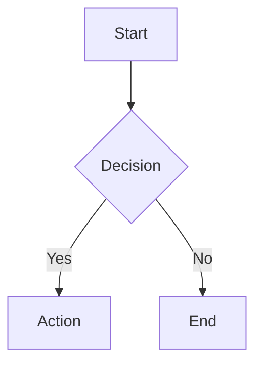

# Binary Markdown editor guide

Adapted from the inherited Binary Markdown documentation. See [Acknowledgments](../ACKNOWLEDGMENTS.md) for provenance and the [README](../README.md) for installation and current settings.

## Formatting toolbar

The **Full** toolbar shows standard text formatting by default in VS Code and the desktop app. Choose **Simple** with `binary-markdown.toolbarMode` in VS Code Settings or **Toolbar** in desktop Preferences for compact controls. Explicit `simple` and `full` preferences are retained. This default also applies to existing configurations without a stored toolbar preference; it is not limited to new installations.

Resizing keeps complete buttons in the toolbar and puts remaining actions under **More toolbar actions**. At very narrow widths, utility actions can also move into that menu. Use the arrow keys or `Home`/`End` within the menu, and `Escape` to close it. Changing toolbar mode updates the current editor without replacing its document, selection, active equation input, or undo history.

## Underline

Select ordinary text and choose **Underline**, use `Ctrl+U` (`Cmd+U` on macOS), or find **Underline** in the Action Palette. A mixed selection becomes fully underlined; an entirely underlined selection loses underline. At a caret, the command changes the formatting of subsequent typing. One Undo reverses a selection-formatting action.

Underline is saved as `<u>text</u>`. The visual editor recognizes paired, attribute-free `<u>` tags and supports combinations with bold, italic, strikethrough, and links in paragraphs, lists, quotes, and table cells. Formatting across paragraph or quote-line boundaries produces balanced inline wrappers for each source line. Arbitrary HTML attributes and unrelated HTML are not activated by this feature.

Code spans, code blocks, equations, and generated document blocks cannot be underlined through the command. To show a literal example, use code such as `` `<u>text</u>` `` or escape the opening angle brackets as `\<u>text\</u>`. Other Markdown readers need support for this inline HTML representation to display underline. See [underlined text in exports](../media/export-help.md#underlined-text) for the existing four export formats and reader limitations.

## Insert menu

**Insert** is available in both **Full** and **Simple** mode. Its dropdown includes inline equations, block equations, tables, code blocks, links, images, Mermaid diagrams, and a managed table of contents. At very narrow widths, open **More toolbar actions** to find **Insert**. Existing toolbar buttons, shortcuts, and the Action Palette remain available.

Opening the menu retains your caret or selection. Use up/down arrows or `Home`/`End` to navigate, `Enter` or `Space` to choose an item, and `Escape` to close it. Opening, navigating, or cancelling the menu does not edit the document. Cancelling a link or image dialog also leaves the document and undo history unchanged. Confirmed insertions use the retained location and can be undone in one step.

Inline equations wrap the selected text, or start with `x` at a caret, and open their source input. Links use selected text as their label; images replace the selection or insert at the caret. Code blocks, block equations, and Mermaid diagrams appear after the current paragraph, or replace an empty paragraph, with their source ready to edit. Tables insert at the caret. The TOC command inserts a managed table of contents or refreshes the existing one.

The menu explains unavailable contexts. Switch to the visual editor to insert items. Move outside code, equation, metadata, or generated blocks before using the menu. Inline items are available in ordinary list items and table cells; block items require a paragraph outside lists, tables, and blockquotes. These restrictions preserve the surrounding document structure.

## 📝 Creating Markdown Elements

### Block Elements

| Element | Pattern Input | Toolbar | Shortcut |
| --- | --- | --- | --- |
| Heading 1 | `# ` + Space | Heading menu → H1 | `Ctrl+1` |
| Heading 2 | `## ` + Space | Heading menu → H2 | `Ctrl+2` |
| Heading 3 | `### ` + Space | Heading menu → H3 | `Ctrl+3` |
| Heading 4 | `#### ` + Space | Heading menu → H4 | `Ctrl+4` |
| Heading 5 | `##### ` + Space | Heading menu → H5 | `Ctrl+5` |
| Heading 6 | `###### ` + Space | Heading menu → H6 | `Ctrl+6` |
| Paragraph | (default)<br> | — | `Ctrl+0` |
| Unordered List | `- ` or `* ` + Space | List button | `Ctrl+Shift+U` |
| Ordered List | `1. ` + Space | Numbered list button | `Ctrl+Shift+O` |
| Task List | `- [ ] ` + Space | Task list button | `Ctrl+Shift+X` |
| Blockquote | `> ` + Space | Quote button | `Ctrl+Shift+Q` |
| Code Block | ````` ``` ````` + Enter | Code button | `Ctrl+Shift+K` |
| Table | `\| col1 \| col2 \|` + Enter | Table button | `Ctrl+T` |
| Horizontal Rule | `---` + Enter | HR button | `Ctrl+Shift+-` |

### Inline Elements

| Element | Pattern Input | Toolbar | Shortcut |
| --- | --- | --- | --- |
| Bold | `**text**` + Space | Bold button | `Ctrl+B` |
| Italic | `*text*` + Space | Italic button | `Ctrl+I` |
| Underline | `<u>text</u>` in source | Underline button | `Ctrl+U` |
| Strikethrough | `~~text~~` + Space | Strikethrough button | `Ctrl+Shift+S` |
| Inline Code | ``` `text` ``` + Space | Code button | ``` Ctrl+` ``` |
| Link | `[text](url)` <br>Space conversion not supported<br> | Link button | `Ctrl+K` |
| Image | `` <br>Space conversion not supported<br> | Image button | `Ctrl+Shift+I` |

---

## ⌨️ Special Operations

### General Shortcuts

These shortcuts are active when the Binary Markdown editor is focused:

| Shortcut | Action |
| --- | --- |
| `Cmd+/` / `Ctrl+/` | Open Action Palette |
| `Cmd+.` / `Ctrl+.` | Toggle Source Mode |
| `Cmd+Shift+.` / `Ctrl+Shift+.` | Open in Text Editor |
| `Ctrl/Cmd + S` | Save |
| `Ctrl/Cmd + Z` | Undo |
| `Ctrl/Cmd + Shift + Z` | Redo |
| `Ctrl/Cmd + B` | Bold |
| `Ctrl/Cmd + I` | Italic |
| `Ctrl/Cmd + U` | Underline |
| `Ctrl/Cmd + K` | Insert link |
| `Ctrl/Cmd + F` | Find |
| `Ctrl/Cmd + H` | Find and replace |
| `Ctrl/Cmd + L` | Open source file with selected lines in text editor |

### Escaping Block Elements

| Element | Key | Action |
| --- | --- | --- |
| Code Block | `Shift+Enter` | Exit code block and create new paragraph |
| Blockquote | `Shift+Enter` | Exit blockquote and create new paragraph |
| Mermaid/Math | `Shift+Enter` | Exit block and create new paragraph |
| Code Block | `↑` at first line | Exit to previous element |
| Code Block | `↓` at last line | Exit to next element |
| Blockquote | `↑` at first line | Exit to previous element |
| Blockquote | `↓` at last line | Exit to next element |
| Mermaid/Math | `↑` at first line | Exit to previous element |
| Mermaid/Math | `↓` at last line | Exit to next element |

### Escaping Inline Elements

To exit inline formatting, type the closing marker followed by Space:

| Element | Input | Action |
| --- | --- | --- |
| Bold | `**` + Space | Close bold and move cursor outside |
| Italic | `*` + Space | Close italic and move cursor outside |
| Strikethrough | `~~` + Space | Close strikethrough and move cursor outside |
| Inline Code | ``` ` ``` + Space | Close inline code and move cursor outside |

### Table Operations

Select a table cell to show its controls. **Automatic** is the default: the controls use an available corner or side, based on the visible table and surrounding content, and move into the top bar when there is no room. When space shrinks, complete leading buttons remain visible and **More table actions** (⋯) contains the remaining actions. A top bar with too little room for a leading action and overflow shows a table icon (**Table controls**) containing all actions. The controls keep a usable position while you work and wait for scrolling or resizing to settle before leaving the top bar.

In **Full** mode, docked table controls occupy a second row beneath general formatting and utilities. In **Simple** mode, they share the primary row. The second row appears only for the selected table when its controls are docked; selecting other content or entering Source mode removes it. Explicit floating positions keep their existing layout. You can reach both rows with `Tab`, or use `Alt+F10` to go directly from the table to its controls.

Use the table icon with a gear (**Table toolbar position**) to choose **Automatic**, **Always in top bar**, or **Choose a fixed position…**. Fixed positions include all four corners and the two vertical sides. You can also change `binary-markdown.tableToolbarPosition` in VS Code Settings, or **Table toolbar position** in desktop Preferences. Explicit choices are retained; only an unset preference uses the new default. The picker updates an existing workspace preference when present, otherwise your user preference.

One selection applies and saves the placement without reloading the editor. If saving the preference fails, a notification explains the failure and the previous setting remains active. You can retry the choice without changing the document.

Fixed controls stay at the chosen anchor where possible and use the overflow menu when horizontal or vertical space is limited. They hide when their table is completely offscreen. Automatic and top-bar controls remain available for the selected table until you select another block or enter Source mode. Changing placement does not edit the Markdown or add an undo step.

Press `Alt+F10` from a table cell to focus its controls. Use left/right arrows in a horizontal toolbar, up/down arrows in a vertical toolbar or menu, and `Home`/`End` to move to the first/last action. `Enter` or `Space` activates a control; `Escape` returns to and reveals the retained cell. Focus follows an action into or out of overflow as space changes. Short menus scroll to reveal the focused item. Inserting above the header, deleting the header, and deleting the final column are disabled in both the toolbar and its overflow menu.

Wide tables scroll horizontally within the table, keeping the surrounding document in place. Use the scrollbar below the table or a horizontal trackpad gesture to reveal offscreen columns. `Tab` and `Shift+Tab` move between cells and reveal the caret, including in headers and cells wider than the pane. Up/down navigation and `Escape` from the table controls also reveal the selected cell. Scrolling, window resizing, and cell navigation do not edit the Markdown or create an undo step. Column resizing remains available; the local scroll box is editor presentation and does not constrain exported tables.

| Key | Action |
| --- | --- |
| `Tab` | Move to next cell |
| `Shift+Tab` | Move to previous cell |
| `Enter` | Insert new row |
| `Shift+Enter` | Insert line break within cell |
| `↑` / `↓` | Navigate between rows |
| `←` / `→` | Navigate within/between cells |
| `Cmd+A` | Select all text in current cell |

### Code Block Operations

| Key | Action |
| --- | --- |
| `Tab` | Insert 4 spaces |
| `Shift+Tab` | Remove up to 4 leading spaces |
| `Cmd+A` | Select all text within code block |

### List Operations

| Key | Action |
| --- | --- |
| `Tab` | Indent list item (increase nesting) |
| `Shift+Tab` | Outdent list item (decrease nesting) |
| `Enter` on empty item | Convert to paragraph or decrease nesting |
| `Backspace` at start | Convert to paragraph |
| Pattern at line start + Space | Convert list type in-place (e.g., `1. ` converts `- item` to ordered list) |

### Multi-Block Selection

| Key | Action |
| --- | --- |
| `Tab` | Insert 4 spaces at the beginning of each selected block |
| `Shift+Tab` | Remove up to 4 leading spaces from each selected block |

---

## 💻 Code Block Features

### Supported Languages

The editor supports syntax highlighting for the following languages:

`javascript`, `typescript`, `python`, `json`, `bash`, `shell`, `css`, `html`, `xml`, `sql`, `java`, `go`, `rust`, `yaml`, `markdown`, `c`, `cpp`, `csharp`, `php`, `ruby`, `swift`, `kotlin`, `dockerfile`, `plaintext`

**Language Aliases:** `js`→javascript, `ts`→typescript, `py`→python, `sh`→bash, `yml`→yaml, `md`→markdown, `c++`→cpp, `c#`→csharp

### Display Mode / Edit Mode

- **Display Mode**: Shows syntax-highlighted code with language tag and copy button
- **Edit Mode**: Plain text editing (click on code block to enter)
- **Expand Button**: Open code in a separate VS Code editor tab for larger editing

### Mermaid Diagrams

Code blocks with language `mermaid` are rendered as diagrams:



- Click on diagram to edit source
- Diagram re-renders when exiting edit mode

### KaTeX Math Equations

Use `$x^2$` or `\(x^2\)` for an inline equation. Use a standalone `$$…$$` or `\[…\]` block for a display equation. Existing fenced `math` blocks are also supported.

```text
The cost is $O(V^3)$.

$$
\begin{aligned}
E &= mc^2 \\
a^2 + b^2 &= c^2
\end{aligned}
$$
```

- **Insert Equation** creates a display block using `$$`. **Insert Inline Equation** wraps the selection in `$…$` and opens its source input. Both actions are available in the Insert menu, toolbar, and Action Palette.
- Type `$$` and press Enter to create a display block. Complete an inline expression and type a space to render it.
- Click a display equation to edit its TeX source. Click an inline equation, or focus it and press Enter, to edit it; Enter applies, Escape cancels, and clearing the input removes the equation.
- Saving retains the original equation delimiters, including imported backslash delimiters and old fences. Backslash recognition is enabled by default; disable `binary-markdown.math.backslashDelimiters` for documents that use these sequences literally.
- Each display block is one complete TeX expression. Physical newlines are whitespace. To retain separate rows in an old fence, use `gathered` or `aligned` with explicit `\\` row breaks, as in the example above.
- Code examples, link destinations, escaped delimiters, unmatched delimiters and common currency forms stay literal. Inline dollar math requires non-whitespace next to both delimiters and no digit immediately after the closing delimiter.
- KaTeX renders supported TeX commands; this is not full MathJax or LaTeX support. Invalid expressions show an error and retain editable source. Empty display blocks show "Empty expression".

HTML and PDF embed KaTeX rendering. DOCX and EPUB use Pandoc's native math conversion, which has its own command support. Backslash delimiters are normalized in an export-only copy; the Markdown file is never rewritten for conversion.

---

## 🖼️ Image Path Configuration

Images can be saved to custom directories when pasting or drag-and-dropping.

### Configuration Levels

| Level | Setting File | Description |
| --- | --- | --- |
| **Global** | `~/Library/Application Support/Code/User/settings.json` (macOS)<br>`%APPDATA%\Code\User\settings.json` (Windows)<br>`~/.config/Code/User/settings.json` (Linux) | VS Code user settings |
| **Project** | `.vscode/settings.json` | Project-level override |
| **File** | Per-file directive | Per-file override in markdown footer |

### VS Code settings.json Setting

```json
{
  "binary-markdown.imageDefaultDir": "./images",
  "binary-markdown.forceRelativeImagePath": true
}
```

### Per-File Directive

Add at the end of your markdown file:

```markdown
---
IMAGE_DIR: ./assets/images
FORCE_RELATIVE_PATH: true
```

### Path Behavior Matrix

`forceRelativeImagePath` allows you to separate the **image save location** from the **path written in Markdown**.

**Use case**: When you want to save images to a specific absolute path (e.g., `/work/project/images/`) but reference them using relative paths from the Markdown file, set this to `true`.

> **Note**: `forceRelativeImagePath` only takes effect when `imageDefaultDir` is an absolute path. When using relative paths, the setting is ignored as paths are always relative.

| imageDefaultDir | forceRelativeImagePath | Image Save Location | Path in Markdown |
| --- | --- | --- | --- |
| Absolute (e.g., `/work/project/images`) | `false` | Specified absolute path | Absolute path |
| Absolute (e.g., `/work/project/images`) | `true` | Specified absolute path | Relative path from Markdown file |
| Relative (e.g., `./images`) | `false` | Relative to Markdown file | Relative path |
| Relative (e.g., `./images`) | `true` | Relative to Markdown file | Relative path (setting ignored) |

---

## 🎨 Configuration

### VS Code Settings

| Setting | Description | Default |
| --- | --- | --- |
| `binary-markdown.theme` | Editor theme (`github`, `sepia`, `night`, `dark`, `minimal`, `perplexity`, `things`) | `things` |
| `binary-markdown.fontSize` | Base font size (px) | `16` |
| `binary-markdown.imageDefaultDir` | Default directory for saved images | `""` (same as markdown file) |
| `binary-markdown.forceRelativeImagePath` | Force relative paths for images | `false` |
| `binary-markdown.language` | UI language (`default`, `en`, `ja`, `zh-cn`, `zh-tw`, `ko`, `es`, `fr`) | `default` |
| `binary-markdown.toolbarMode` | Toolbar display mode (`full`, `simple`). Simple shows undo/redo, Insert, and utility buttons; use the Action Palette for other operations | `full` |
| `binary-markdown.outlineStateScope` | Remember outline visibility per Markdown file (`file`) or share it across all Markdown files (`global`) | `file` |
| `binary-markdown.outlineDefaultOpen` | Open the outline when the selected scope does not have a saved state yet | `true` |
| `binary-markdown.enableDebugLogging` | Enable debug logging in browser console | `false` |
| `binary-markdown.export.pdfWhiteBackground` | Export PDF with a white page and GitHub light appearance. Disable to fill the whole page, including margins, with the editor theme. Other formats keep their existing styling. | `true` |

With `outlineStateScope` set to `file`, every Markdown resource restores its own last outline state in the current workspace. With `global`, toggling the outline controls the next Markdown editor that renders as well, and the preference survives VS Code restarts.

### Themes

Changing the editor theme updates colors in place in VS Code and the desktop app, preserving the current selection and undo history. Quotes, their links, and inline code use the selected editor theme even when the surrounding VS Code workbench uses a different theme.

| Theme | Description |
| --- | --- |
| `github` | Clean GitHub-style rendering |
| `sepia` | Warm, paper-like appearance for comfortable reading |
| `night` | Dark theme with Tokyo Night inspired colors (blue tint) |
| `dark` | Pure dark theme with neutral black/gray colors |
| `minimal` | Distraction-free black and white design |
| `perplexity` | Light theme with Perplexity brand colors (Paper White background) |
| `things` | Clean, minimal theme inspired by Things app (SF Pro font, blue accents) (default) |

---

## 🌐 Supported Languages (i18n)

The editor UI supports the following languages:

| Language | Code |
| --- | --- |
| English | `en` (default) |
| Japanese | `ja` |
| Simplified Chinese | `zh-cn` |
| Traditional Chinese | `zh-tw` |
| Korean | `ko` |
| Spanish | `es` |
| French | `fr` |

Set via `binary-markdown.language` or use `default` to follow VS Code's display language.

---

## 🔧 Commands

Available in Command Palette (`Ctrl+Shift+P` / `Cmd+Shift+P`):

| Command | Description |
| --- | --- |
| `Binary Markdown: Open with Binary Markdown Editor` | Open markdown file in WYSIWYG editor |
| `Binary Markdown: Insert Table` | Insert a new table |
| `Binary Markdown: Insert TOC` | Insert table of contents |
| `Binary Markdown: Open as Text` | Open in standard text editor |
| `Binary Markdown: Compare as Text` | Compare with text version |
| `Binary Markdown: Toggle Source Mode` | Switch between WYSIWYG and source mode |
| `Binary Markdown: Undo` | Undo last edit |
| `Binary Markdown: Redo` | Redo last undone edit |

---

## 🔄 External File Changes

When another tool (e.g., AI coding assistants like Claude Code, Cursor, etc.) modifies the same markdown file while you have it open in Binary Markdown:

- **Block-level DOM diff**: Only changed blocks are updated — your cursor position and in-progress edits are preserved.
- **Toast notification**: A notification appears allowing you to review and accept or dismiss external changes.
- **Unsaved changes warning**: If you have unsaved edits, a confirmation dialog prevents accidental overwrites.

---
