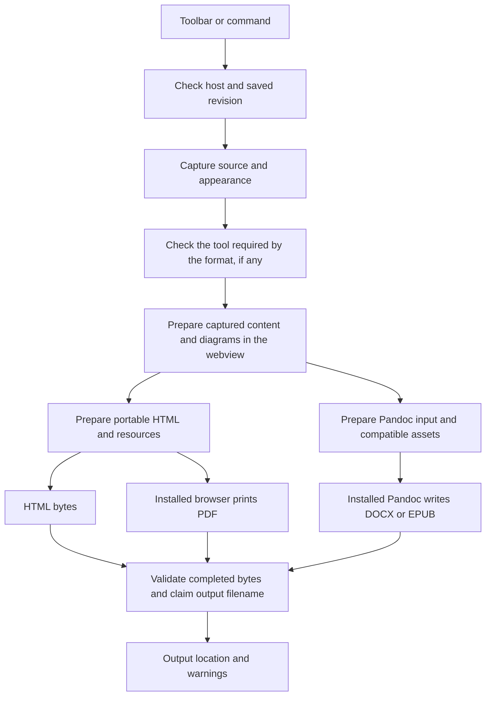

# How export works

Explanation · Maintained with the source in this checkout. Recorded test results are indexed separately in [reports](../reports/README.md).

Binary Markdown uses a shared export lifecycle and two conversion routes. HTML retains the supported editor appearance. PDF uses its captured white/theme mode. DOCX and EPUB prioritize editable document structure through Pandoc. The [export reference](export-subsystem.md) defines the requirements and format-support boundary; the [user guide](../media/export-help.md) explains how to export a document.

## Capture one saved revision

Saving involves both the webview and the VS Code host. A clean document flag alone does not establish that the two agree. The [controller](../src/export/controller.ts) waits for the save barrier, checks the document's name and dirty state, requests the editor snapshot, and compares it with the captured document text while checking that the revision is unchanged. Export does not initiate a save. Later edits do not change the job's captured Markdown.

For PDF, `binary-markdown.export.pdfWhiteBackground` defaults to `true`, selecting GitHub light appearance and a white page. Disabling it retains the editor theme across the whole page. The controller captures the effective theme and base font size before tool discovery, then passes them to offscreen rendering. This does not change the live editor or the appearance of other export formats. See the [PDF appearance requirements](export-subsystem.md#pdf-page-appearance).

The controller also checks the local desktop host and workspace trust. Non-HTML formats probe their required executable for each job. Menu capability labels can be refreshed independently and are not a substitute for these job checks.

## Conversion routes

HTML requires no additional native converter. PDF uses an installed browser as its production layout engine, running without a visible browser window. DOCX and EPUB use temporary Markdown/JSON and prepared assets; they do not use the styled HTML as their document-layout input. The common webview preparation step still supplies rendered diagrams and diagnostics for those formats.

Separate adapters keep a missing format-specific tool from disabling otherwise available formats. The extension's PDF path uses its shipped browser-control library, not VS Code's internal Electron APIs. Electron application export remains deferred. Changes to a backend still share source capture, cancellation, resource handling, output validation, and finalization.

## Shared contracts

The contracts are implemented in [types.ts](../src/export/types.ts) and correlated host/webview requests in [webview-rpc.ts](../src/export/webview-rpc.ts). Preserve these meanings across adapters.

| Boundary | Required information and behavior |
| --- | --- |
| Saved document | Job/document identity, captured revision and Markdown, resource base, and resolved appearance. Capture must not rewrite the source. |
| Prepared document | Document-only HTML where needed, asset inventory and captured asset data, rendering readiness, and warnings tied to the captured source. |
| Backend capability | Format availability, resolved executable/version, invalid-configuration or missing-tool reason, and setup guidance. |
| Job lifecycle | Actual stage changes, cancellation signal, owned workers/temp resources, and one final result. Every backend uses the same output naming and cleanup policy. |
| Export result | Actual output location when successful, newly written versus identical-file reuse, warnings, or an explicit cancelled/failed outcome. A partial artifact is never success. |

Keep source capture, export preparation, backend invocation, and output finalization separable. The prepared HTML and Pandoc input are representations of the same saved source; DOCX/EPUB need not be routed through display HTML. Target preparation may normalize syntax and assets in temporary input while preserving the source file.

## Rendering readiness

Render the complete captured document in both visual and source mode. The live viewport or a stale hidden preview cannot establish complete output. Preparation removes editor controls and host machinery, strips recognized image directives from temporary input, and waits for supported math, diagrams, images, and fonts. The source Markdown remains unchanged. Incompatible content receives the declared fallback and warning treatment in the [format-support matrix](export-subsystem.md#rendering-and-format-support).

## Dependency and resource handling

Native VS Code settings `binary-markdown.export.pandocPath` and `binary-markdown.export.browserPath` provide machine-scoped executable overrides; the export menu provides status and setup guidance. A dedicated new settings page is not required.

Discovery order is an explicit override, the extension host's PATH, then conventional platform locations. On macOS, GUI application PATH can differ from a terminal's PATH; consider standard Homebrew locations and installed Chrome/Edge application executables. An invalid explicit override is an error, not permission to select another executable silently. Validate the tool's version and needed capabilities; cache discovery and invalidate/rescan when relevant configuration changes.

Use asynchronous subprocess APIs with argument arrays. Do not construct shell commands, accept document-supplied filters, or install native dependencies implicitly. Honor VS Code trust boundaries for process execution and machine settings. Pin a browser-control library compatible with the declared extension host and browser; a library working under the developer's Node executable alone is insufficient evidence. See [configuration scope](https://code.visualstudio.com/api/references/contribution-points#scope), [Workspace Trust](https://code.visualstudio.com/api/extension-guides/workspace-trust), and [Pandoc security guidance](https://pandoc.org/MANUAL.html#security).

The inspected extension declares VS Code `^1.85.0`. Account for its supported extension-host runtime when selecting libraries. Raising the minimum supported host version is a compatibility-contract change to discuss explicitly; do not introduce it indirectly through an incompatible dependency.

Resolve relative assets against the Markdown file, not a webview URI or process working directory. Retrieve only necessary referenced resources, including required references in selected styles; do not crawl ordinary hyperlinks. Capture resolved asset data for the job, account for failed retrievals, and ensure the final standalone HTML does not require a network connection. Keep conversion local.

Generate and validate complete bytes before exposing a successful final output. Hash those exact bytes when needed; do not change them after choosing a hash suffix or insert a self-referential final filename into them. Use a finalization strategy that handles concurrent candidate claims without overwriting and cleans up owned temporary/partial files on failure or cancellation. Exact filesystem primitives are an implementation choice to verify on the required host.

## Output finalization

For example, if `report.pdf` is occupied and the completed export's SHA-256 ends in `7c91a2ef`, try `report_7c91a2ef.pdf`. Reuse that file only if its bytes are identical. Otherwise try `report_7c91a2ef_2.pdf`, then `_3`, until an unused name can be claimed without overwriting. Occupancy of the basic name triggers hashing even if its contents happen to match. Another process claiming a candidate during finalization must not cause an overwrite.

Repeated exports need not produce identical bytes: document containers and engines can introduce metadata differences. Identical-file reuse is conditional on the actual completed bytes, not on an assumption that unchanged Markdown always produces the same hash.

The [finalizer](../src/export/output.ts) writes complete bytes to a temporary file beside the source and claims a destination with a hard link. An occupied name triggers the next candidate without an overwrite. Its `finally` block removes the owned temporary directory. This implementation should be checked again when adding support for another filesystem or host.

## Repository map and integration pitfalls

These pointers describe the implemented integration; recheck them after rebasing.

| Area | Current source | Integration behavior / remaining caution |
| --- | --- | --- |
| Commands and toolbar | [extension.ts](../src/extension.ts), [editor-body-html.js](../src/shared/editor-body-html.js), [export-ui.js](../src/webview/export-ui.js) | All four formats enter the shared [controller](../src/export/controller.ts) through commands or the menu beside the VS Code button. Native selection checks reject commands from ordinary text tabs instead of exporting hidden documents. |
| Save synchronization | [editorProvider.ts](../src/editorProvider.ts), [editor.js](../src/webview/editor.js), [edit-queue.ts](../src/export/edit-queue.ts) | Ordered edits, save acknowledgements and native-save completion feed a read-only snapshot agreement gate. Checking only a dirty flag remains insufficient. |
| Host communication | [host-bridge.ts](../src/shared/host-bridge.ts), [webview-rpc.ts](../src/export/webview-rpc.ts) | Correlated capture/render/decode replies, cancellation and panel disposal handling separate browser and host responsibilities. |
| Renderer and resources | [editor.js](../src/webview/editor.js), [html.ts](../src/export/html.ts), [resources.ts](../src/export/resources.ts) | Detached captured-source rendering awaits math/diagrams; host resource capture embeds supported assets and reports visible fallbacks. |
| Temporary input cleanup | [editor.js](../src/webview/editor.js) | Serialization can include `IMAGE_DIR` and `FORCE_RELATIVE_PATH` directives. Recognize their actual syntax before stripping only temporary export input; preserve real code/YAML content. Handle `[TOC]` deliberately. |
| Settings and localization | [settings-provider.ts](../src/shared/settings-provider.ts), [package.json](../package.json), [package.nls.json](../package.nls.json), [editorProvider.ts](../src/editorProvider.ts) | Some live paths read configuration directly. Updating an interface alone is insufficient. Preserve seven native settings catalogs and separate runtime language handling. Export-path changes should not rebuild editor content unnecessarily. |
| VSIX packaging | [.vscodeignore](../.vscodeignore), [package-vsix.js](../scripts/package-vsix.js), [copy-vendor.js](../scripts/copy-vendor.js), [copy-webview.js](../scripts/copy-webview.js) | The packager uses `--no-dependencies` and excludes `node_modules/**`. A manifest dependency alone does not ship runtime code; bundle/copy required modules, assets, fonts and licenses explicitly. Test the installed package early. |
| Shared desktop build | [tsconfig.json](../tsconfig.json), [electron/tsconfig.json](../electron/tsconfig.json), [desktop HTML generator](../electron/src/html-generator.ts) | The extension and Electron app have separate TypeScript roots and explicit asset copies. Shared changes must keep builds compatible; Electron export is deferred. |

## Code presentation in DOCX and PDF

DOCX uses bundled references for [bottom labels or hidden labels](../media/export-reference.docx), [top labels](../media/export-reference-top.docx), and [top labels with a count footer](../media/export-reference-top-footer.docx), selected from the captured presentation, with the existing Pandoc JSON transformation. The reference adds code paragraph and metadata styles; a native Word shape supplies the attached label while preserving editable code and language text. The reproducible asset builder is [build-docx-reference.py](../scripts/build-docx-reference.py). Normal compilation uses the checked-in assets and does not require that Python builder.

Direct PDF uses the shared [language mapping](../src/export/code-language.ts) and [language-tab renderer](../src/export/language-tab.ts). Labels enter as text, and code nodes are retained intact. The job captures the document-scoped `binary-markdown.export.showCodeLanguage` and `binary-markdown.export.codeLanguagePosition` settings once in `CodePresentationOptions`. Invalid/unset placement normalizes to `top-left`; the other supported values are `top-right`, `bottom-left`, and `bottom-right`. HTML/EPUB, inline code, math and Mermaid retain their existing conversion routes.

PDF metadata rows identify their `top`/`bottom` edge and `left`/`right` side outside the retained code node. DOCX metadata uses corresponding paragraph styles and escaped editable label text. Top metadata precedes the code and keeps with its first part; bottom metadata follows the complete code and keeps with its last part. Labels occur once per block, including across pages. These rows provide the placement boundary for additional export metadata without inserting it into source code.

The top-label reference removes the code paragraph's inherited keep-with-next and moves its spacing after the block, avoiding an unwanted link to following prose. The footer reference keeps code with its footer. Keeping a DOCX footer attached can move a long block to the next page; long blocks remain splittable. Current user-facing behavior is described in [export help](../media/export-help.md#code-language-tabs). The [dated investigation](../reports/investigations/2026-09-14-docx-code-blocks.md) records compared approaches and reader-specific evidence.

### Authored code lines

The shared [line model](../src/export/code-lines.ts) takes a payload with fence separators and display-only breaks already excluded. It preserves every character and intentional blank line; an explicit source distinction separates an empty block (zero lines) from one blank line. The [shared fixtures](../test/fixtures/export-code-lines.cjs) declare counts independently and cover tabs, Unicode, unknown languages, wrapping and pagination.

The detached editor parser supplies `data-export-code-lines` only during export preparation and marks display-only breaks. PDF counts use that model without changing the retained code node. The live editor, its serialization and code-copy path do not acquire export metadata.

DOCX reads with [Pandoc's tab-preservation option](https://pandoc.org/MANUAL.html#option--preserve-tabs). A separate `sourcepos` analysis identifies the source extent of each code block and is matched against the main reader's payload and language. It is never used as the writer's tree: in the tested Pandoc version, source-position mode changes fenced-math recognition. The adapter removes only a proven unclosed-fence EOF delimiter and supplies the DOCX writer's consumed final newline when an authored blank tail needs preserving. Actual-converter regressions compare all resulting code characters; these adjustments occur only in the export copy.

`binary-markdown.export.showCodeLineCount` defaults off and is captured with its localized label. PDF adds a bottom metadata row; DOCX uses `CodeLineCount` and a footer-aware reference. A bottom language label keeps with the separate count row below it. Counts never enter code payloads, and they are independent of language visibility and placement. Reader appearance and interactive copying remain separate verification boundaries.

Keep-with-next is a layout request, not a cross-reader guarantee. In LibreOfficeDev 26.8.0.0.alpha0, a 150-line unnumbered block can leave its count alone on the next page. The code and count survive, but footer attachment remains an unresolved acceptance item; preserve this limitation in review evidence until the target readers establish otherwise.

### PDF numbering

The captured `binary-markdown.export.showCodeLineNumbers` setting defaults off. When enabled, the PDF adapter splits a detached copy of highlighted code spans at source newlines, verifies every line against the shared model, and wraps each line with a generated gutter. Numbers are CSS presentation content; the reconstructed code text must remain byte-for-byte equal after newline normalization already performed by export preparation. The gutter grows with the number of digits. Logical rows may wrap and paginate without adding numbers.

The original code subtree remains unchanged when numbering is off. Numbering, total counts and language labels are independent. Real-converter fixtures check blank lines, wrapping, metadata combinations and multi-page numbering. Poppler extraction includes gutter numbers and can group text by columns, so it is not a promise of number-free clipboard content or source-preserving reading order. Actual reader selection/copy and accessibility still require acceptance evidence.

### DOCX numbering

The same default-off numbering preference enables the proposed native-paragraph representation from [#38's investigation](../reports/investigations/2026-09-20-docx-code-numbering.md). The adapter marks only ordinary source code in its temporary Pandoc tree. After conversion, [docx-numbering.ts](../src/export/docx-numbering.ts) checks each marked code payload against the shared model, preserves whole-block highlighting runs while splitting them into logical paragraphs, and assigns a fresh numbering instance starting at 1. Empty blocks retain an unnumbered display paragraph. Metadata remains separate; only the last logical paragraph keeps with its footer. Numbered code uses shading without per-paragraph borders so the gutter stays outside the code area. Lists and quotation indents are retained as the base for the gutter.

The transformation handles marked code in the document, footnotes and endnotes, rejects unknown code-run structures or source mismatches, and checks that every marker was consumed. Disabling the option bypasses the transformation. The existing ZIP32 integrity reader is reused with a 128 MiB expanded-package bound; XML parts are limited to 16 MiB, with at most 5,000 code blocks and 100,000 logical lines per block. DTD/entity declarations are rejected. The pinned MIT-licensed [xmldom](https://github.com/xmldom/xmldom) parser and its license are copied into the VSIX; no Python or new native executable is required. ZIP parts are repacked in memory and validated before publication; unrelated part payloads remain unchanged.

These production mechanics do not accept the investigation's reader matrix. Pandoc conversion and the observed LibreOfficeDev rendering/save round trip establish structural and converter evidence only. Microsoft Word, stable LibreOffice, interactive edits/copying, screen readers and final gutter appearance remain review gates. Native numbering may follow paragraph edits, but highlighting is captured at export and does not update afterward.

## Verify a change

Use [Validate an export change](export-verification.md) to choose checks for the affected boundary. Earlier design choices and investigation results are retained in the [development history](../archive/development/export.md#decision-log).
