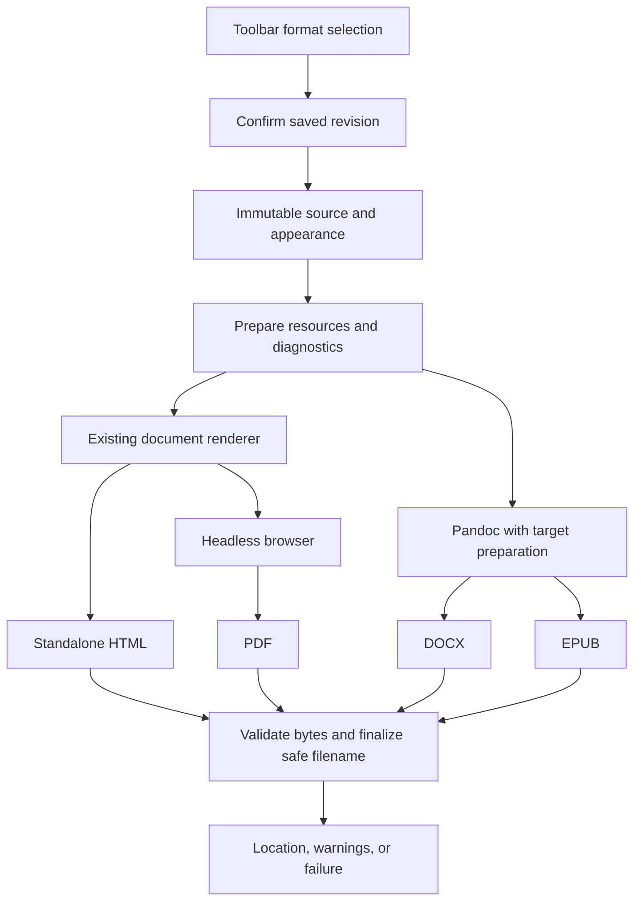

# Export subsystem

Version 1.5 · Updated 2026-09-10 · **Status: D0–D5 implemented; converging in the 0.2.0 integration candidate. The selected license policy is AGPL-3.0-or-later with retained MIT and third-party notices. Maintainer acceptance, merge to main and release remain separate.**

This is the authoritative task brief for Binary Markdown's experimental export subsystem. It consolidates the export reconnaissance, clarification answers, functional and non-functional requirements, implementation plan, and human–AI working agreement. A developer can work from this file without reconstructing the conversation. Keep subsequent scope decisions, milestone status, and evidence references here.

The planning checkout was inspected at `main`, commit `9ff6ce04fa10cc5424783b016330bc4644d3529f`; implementation began from documentation commit `5488f37`. The current implementation/evidence record is below, with supporting detail in [export-validation.md](export-validation.md). Refresh the checkout and evidence when resuming. Historical conversion probes below remain separate from current implementation, acceptance and release state.

Repository conventions: [CONTRIBUTING.md](../CONTRIBUTING.md). This file contains the complete export contract and relevant findings from the earlier feature comparison; no separate planning document is required.

## Reading guide

- [Outcome and confirmed scope](#outcome-and-confirmed-scope)
- [User journey](#user-journey)
- [Architecture and implementation boundaries](#architecture-and-implementation-boundaries)
- [Functional requirements](#functional-requirements)
- [Non-functional requirements](#non-functional-requirements)
- [Reference workload W-30](#reference-workload-w-30)
- [Acceptance criteria and milestone mapping](#acceptance-criteria-and-milestone-mapping)
- [Delivery backlog](#delivery-backlog)
- [Verification and handback](#verification-and-handback)
- [Agile and human-AI working agreement](#agile-and-human-ai-working-agreement)
- [Reconnaissance and remaining risks](#reconnaissance-and-remaining-risks)
- [Deferred scope](#deferred-scope)
- [Delegation prompt](#delegation-prompt)

## Outcome and confirmed scope

Deliver a user-visible workflow in which a user saves a local Markdown document, selects HTML, PDF, DOCX, or EPUB, and receives a usable export beside the source. Explain recoverable compromises and fatal failures clearly. The first release may have simple layout and limited customization; preservation of supported content, source integrity, truthful progress, and safe file handling remain required.

The user has answered all product clarification questions needed for this MVP.

| Area | Confirmed decision |
| --- | --- |
| Required host | Local desktop VS Code on macOS first; the user subsequently requested basic Ubuntu x86-64 cross-validation. Experimental local Linux export is enabled, with evidence scoped to the tested Ubuntu environment. Keep shared editor/Electron builds compatible; other environments require their own acceptance. |
| Formats | Standalone HTML, rendered PDF, Word `.docx`, and EPUB. All four are required for the completed branch. |
| HTML/PDF fidelity | Reuse supported displayed rendering and current appearance. Keep the existing renderer initially. |
| DOCX/EPUB fidelity | Prioritize editable text and document structure; disclose styling/layout differences. |
| Source eligibility | Named, saved Markdown only. Show “save and retry” for unsaved work; no automatic save. |
| Resources | Embed/package original-resolution supported images and prepared diagrams/math. Retrieve only referenced resources needed for the export. Conversion stays local. |
| PDF pagination | Keep ordinary blocks together when they fit a page. Blank space is acceptable. Split oversized text/code/tables; scale oversized graphics to fit. |
| Dependency delivery | Detect installed Pandoc and a compatible browser, accept manual paths, and provide installation instructions. Bundle needed JavaScript/assets; native binaries and automatic downloading are deferred. |
| Entry point | A sharing-arrow button immediately to the right of the VS Code-logo toolbar button, opening a four-format dropdown. |
| Output location | Automatically beside the Markdown file, using its filename stem and the selected extension. No destination or filename dialog. |
| Collisions | Hash completed export bytes, use the last eight lowercase SHA-256 hexadecimal characters, reuse an identical hash-named file, otherwise choose the first unused numbered suffix. Never overwrite. |
| Progress | Show real operation stages and indeterminate activity during opaque work. No export-duration, throughput, or response-time targets. |
| Initial workload | An inspectable, approximately 30-page complex Markdown report with mixed content and assets, defined as W-30 below. |
| Limitations | Mark the feature experimental early. Continue recoverable cases with visible fallbacks and a warning summary; report fatal failures separately. |

These choices supersede exploratory proposals for Save As, Save and Export, overwrite prompts, bundled runtimes, and numerical performance targets. The aim is a useful first release with a clear support boundary. Future community contributions can improve it; their arrival is not a delivery dependency.

### Terms and requirement authority

- **Saved revision:** the named source file's content after pending editor-to-host changes and saving have completed.
- **Export job:** one selected format generated from one fixed saved revision, its prepared resources, and resolved appearance.
- **Source stem:** the source filename without its final Markdown extension; `report.md` becomes `report.pdf`.
- **Recoverable problem:** a content/resource problem for which valid output with an explicit fallback remains possible.
- **Fatal problem:** a condition preventing valid output, such as a missing engine, failed conversion, or unwritable destination.
- **Stage progress:** the operation actually underway. An active indicator does not assert a measured percentage or guarantee eventual success.

All FRs and NFRs below have **Must** priority within the current MVP. **User** identifies a direct product decision; **Derived** identifies a necessary integration safeguard. An acceptance criterion is a verification obligation, not a claim that a test has passed. Preserve requirement IDs as the design evolves, and use the change process below for material changes.

## User journey

1. The user saves the intended Markdown document in visual or source mode.
2. The user opens the sharing-arrow menu. All four formats are listed; experimental status, limitations, and missing-tool guidance are accessible.
3. Selecting a format checks that this editor's document is named, saved, and synchronized. An ineligible document produces a save-and-retry explanation without saving it.
4. The job captures one saved revision and appearance, prepares necessary resources, and converts through the selected backend. Subsequent editing does not change that job's source.
5. Actual stages and an active indicator remain visible. The editor remains usable, and the user can cancel.
6. The completed artifact is validated and finalized beside the source using the naming rules. The result shows its actual location and any fallback warnings, or a specific failure/cancellation outcome.

For example, if `report.pdf` is occupied and the completed export's SHA-256 ends in `7c91a2ef`, try `report_7c91a2ef.pdf`. Reuse that file only if its bytes are identical. Otherwise try `report_7c91a2ef_2.pdf`, then `_3`, until an unused name can be claimed without overwriting. Occupancy of the basic name triggers hashing even if its contents happen to match. Another process claiming a candidate during finalization must not cause an overwrite.

Repeated exports need not produce identical bytes: document containers and engines can introduce metadata differences. Identical-file reuse is conditional on the actual completed bytes, not on an assumption that unchanged Markdown always produces the same hash.

## Architecture and implementation boundaries

Use two conversion routes with a shared job lifecycle. Pandoc supplies document converters; it does not replace rendered HTML preparation, browser layout, resource handling, or host integration.



HTML needs no additional native tool beyond the running extension/webview. Automated PDF needs a browser as a **production rendering engine**, not merely as a validation tool: it lays out prepared HTML/CSS and prints it to PDF. Headless operation means no visible browser window. Browser installation is optional for users who do not need PDF; missing it must leave the other backends independently available. VS Code's internal Electron APIs are not the extension's PDF interface. A future Electron-app adapter can use its own `webContents.printToPDF`. See [Playwright PDF](https://playwright.dev/docs/api/class-page#page-pdf), [VS Code guidance on Electron modules](https://code.visualstudio.com/api/advanced-topics/remote-extensions#avoid-using-electron-modules), and [Electron PDF](https://www.electronjs.org/docs/latest/api/web-contents#contentsprinttopdfoptions).

### Shared contracts

The contracts are implemented in [types.ts](../src/export/types.ts) and correlated host/webview requests in [webview-rpc.ts](../src/export/webview-rpc.ts). Preserve these meanings across adapters.

| Boundary | Required information and behavior |
| --- | --- |
| Saved document | Job/document identity, captured revision and Markdown, resource base, and resolved appearance. Capture must not rewrite the source. |
| Prepared document | Document-only HTML where needed, asset inventory and captured asset data, rendering readiness, and warnings tied to the captured source. |
| Backend capability | Format availability, resolved executable/version, invalid-configuration or missing-tool reason, and setup guidance. |
| Job lifecycle | Actual stage changes, cancellation signal, owned workers/temp resources, and one final result. Every backend uses the same output naming and cleanup policy. |
| Export result | Actual output location when successful, newly written versus identical-file reuse, warnings, or an explicit cancelled/failed outcome. A partial artifact is never success. |

Keep source capture, export preparation, backend invocation, and output finalization separable. The prepared HTML and Pandoc input are representations of the same saved source; DOCX/EPUB need not be routed through display HTML. Target preparation may normalize syntax and assets in temporary input while preserving the source file.

### Rendering and format support

Render the entire captured document, including when the editor is in source mode. Reuse the production renderer with a document-only boundary; copying the live editor's visible viewport or a stale hidden preview is insufficient. Remove controls, caret/selection markup, hidden editors, host bridges, scroll-height restrictions, and active document-supplied scripts. Wait for actual math, diagram, font, and image readiness before capturing output.

The [fixed fixtures](../test/fixtures/exports/README.md) exercise the following support boundary. Implemented behavior and representative checks do not establish compatibility with every document or target viewer; remaining acceptance evidence is tracked in [export-validation.md](export-validation.md).

| Content | HTML/PDF target | DOCX/EPUB target |
| --- | --- | --- |
| Headings, prose, lists, links, tables, code | Supported displayed content and current appearance; PDF adapts for print. | Editable text and structural equivalents. |
| Mathematics | Supported fenced `math` blocks render with KaTeX styles/fonts. Dollar-delimited `$...$` and `$$...$$` remain visible source, matching the existing renderer, with a warning. | Pandoc produces native DOCX Office Math and EPUB MathML for supported equations; unsupported expressions require declared fallbacks. |
| Mermaid/diagrams | Wait for diagram rendering; retain vector form where practical. | Package target-compatible assets; do not silently leave supported diagrams as code. |
| Images and fonts | Resolve and embed needed assets; standalone HTML works after relocation offline. | Package compatible media; preserve source resolution without deliberate downsampling. |
| Raw HTML, editor extensions, unsupported constructs | Follow declared renderer support and remove editor-only machinery. | Explicit target-specific behavior; visible fallback/warning for known incompatible content. |
| Front matter, TOC, internal image directives | Exclude front matter/editor-only directives from visible content. A literal `[TOC]` marker remains visible with a warning; this renderer does not generate a TOC from it. | Normalize temporary input deliberately; avoid duplicate TOCs or leaked directives. |
| Footnotes | Existing footnote markers/definitions remain visible source with a warning; linked footnotes are not generated. | Use Pandoc's supported native note/navigation structures, with target-specific verification. |

Do not claim a parser capability merely because Pandoc can write its output format. Existing rendering bugs are not silently expanded into export guarantees. Declare known limitations and preserve supported content; fallback acceptance is not permission to hide a regression by downgrading the support matrix.

### Dependency and resource handling

Native VS Code settings `binary-markdown.export.pandocPath` and `binary-markdown.export.browserPath` provide machine-scoped executable overrides; the export menu provides status and setup guidance. A dedicated new settings page is not required.

Recommended discovery order is an explicit override, the extension host's PATH, then conventional platform locations. On macOS, GUI application PATH can differ from a terminal's PATH; consider standard Homebrew locations and installed Chrome/Edge application executables. An invalid explicit override is an error, not permission to select another executable silently. Validate the tool's version and needed capabilities; cache discovery and invalidate/rescan when relevant configuration changes.

Use asynchronous subprocess APIs with argument arrays. Do not construct shell commands, accept document-supplied filters, or install native dependencies implicitly. Honor VS Code trust boundaries for process execution and machine settings. Pin a browser-control library compatible with the declared extension host and browser; a library working under the developer's Node executable alone is insufficient evidence. See [configuration scope](https://code.visualstudio.com/api/references/contribution-points#scope), [Workspace Trust](https://code.visualstudio.com/api/extension-guides/workspace-trust), and [Pandoc security guidance](https://pandoc.org/MANUAL.html#security).

The inspected extension declares VS Code `^1.85.0`. Account for its supported extension-host runtime when selecting libraries. Raising the minimum supported host version is a compatibility-contract change to discuss explicitly; do not introduce it indirectly through an incompatible dependency.

Resolve relative assets against the Markdown file, not a webview URI or process working directory. Retrieve only necessary referenced resources, including required references in selected styles; do not crawl ordinary hyperlinks. Capture resolved asset data for the job, account for failed retrievals, and ensure the final standalone HTML does not require a network connection. Keep conversion local.

Generate and validate complete bytes before exposing a successful final output. Hash those exact bytes when needed; do not change them after choosing a hash suffix or insert a self-referential final filename into them. Use a finalization strategy that handles concurrent candidate claims without overwriting and cleans up owned temporary/partial files on failure or cancellation. Exact filesystem primitives are an implementation choice to verify on the required host.

### Repository map and integration pitfalls

These pointers describe the implemented integration; recheck them after rebasing.

| Area | Current source | Integration behavior / remaining caution |
| --- | --- | --- |
| Commands and toolbar | [extension.ts](../src/extension.ts), [editor-body-html.js](../src/shared/editor-body-html.js), [export-ui.js](../src/webview/export-ui.js) | All four formats enter the shared [controller](../src/export/controller.ts) through commands or the menu beside the VS Code button. Native selection checks reject commands from ordinary text tabs instead of exporting hidden documents. |
| Save synchronization | [editorProvider.ts](../src/editorProvider.ts), [editor.js](../src/webview/editor.js), [edit-queue.ts](../src/export/edit-queue.ts) | Ordered edits, save acknowledgements and native-save completion feed a read-only snapshot agreement gate. Checking only a dirty flag remains insufficient. |
| Host communication | [host-bridge.ts](../src/shared/host-bridge.ts), [webview-rpc.ts](../src/export/webview-rpc.ts) | Correlated capture/render/decode replies, cancellation and panel disposal handling separate browser and host responsibilities. |
| Renderer and resources | [editor.js](../src/webview/editor.js), [html.ts](../src/export/html.ts), [resources.ts](../src/export/resources.ts) | Detached captured-source rendering awaits math/diagrams; host resource capture embeds supported assets and reports visible fallbacks. |
| Temporary input cleanup | [editor.js](../src/webview/editor.js) | Serialization can include `IMAGE_DIR` and `FORCE_RELATIVE_PATH` directives. Recognize their actual syntax before stripping only temporary export input; preserve real code/YAML content. Handle `[TOC]` deliberately. |
| Settings and localization | [settings-provider.ts](../src/shared/settings-provider.ts), [package.json](../package.json), [package.nls.json](../package.nls.json), [editorProvider.ts](../src/editorProvider.ts) | Some live paths read configuration directly. Updating an interface alone is insufficient. Preserve seven native settings catalogs and separate runtime language handling. Export-path changes should not rebuild editor content unnecessarily. |
| VSIX packaging | [.vscodeignore](../.vscodeignore), [package-vsix.js](../scripts/package-vsix.js), [copy-vendor.js](../scripts/copy-vendor.js), [copy-webview.js](../scripts/copy-webview.js) | The packager uses `--no-dependencies` and excludes `node_modules/**`. A manifest dependency alone does not ship runtime code; bundle/copy required modules, assets, fonts and licenses explicitly. Test the installed package early. |
| Shared desktop build | [tsconfig.json](../tsconfig.json), [electron/tsconfig.json](../electron/tsconfig.json), [desktop HTML generator](../electron/src/html-generator.ts) | The extension and Electron app have separate TypeScript roots and explicit asset copies. Shared changes must keep builds compatible; Electron export is deferred. |

## Functional requirements

### Entry and format selection

| ID | Requirement | Basis | Acceptance |
| --- | --- | --- | --- |
| FR-EXP-001 | The system shall place an Export button immediately to the right of the existing VS Code-logo toolbar button. | User | AC-01 |
| FR-EXP-002 | The Export button shall use a rightward sharing-arrow icon with a stem curving toward the bottom. | User | AC-01 |
| FR-EXP-003 | Activating the Export button shall open a dropdown containing HTML, PDF, Word (.docx), and EPUB options. | User | AC-01 |
| FR-EXP-004 | Selecting a format shall initiate the export checks for the Markdown document associated with that editor. | User | AC-01, AC-02 |
| FR-EXP-005 | The export interface shall identify formats that require missing dependencies and make the corresponding setup guidance accessible. | Derived | AC-05 |
| FR-EXP-006 | The export interface shall make the experimental status and known format limitations available before conversion begins. | User | AC-01, AC-08 |

The current insertion point is in the utility group in [editor-body-html.js](../src/shared/editor-body-html.js#L83). Icon population is handled by [editor.js](../src/webview/editor.js#L21). These are implementation pointers, not a requirement to change unrelated toolbar behavior or create a separate preferences page.

### Source eligibility and revision consistency

| ID | Requirement | Basis | Acceptance |
| --- | --- | --- | --- |
| FR-EXP-007 | When the selected document is unnamed or has unsaved changes, the system shall reject the export and explain that the user must save and retry. | User | AC-02 |
| FR-EXP-008 | An export request shall not save the source document automatically. | User | AC-02 |
| FR-EXP-009 | The system shall permit conversion only after the editor content and saved revision have been confirmed to agree. | Derived | AC-02 |
| FR-EXP-010 | Changes made after an export job captures its saved revision shall not change the source content used by that job. | Derived | AC-02 |

### Output formats and resources

| ID | Requirement | Basis | Acceptance |
| --- | --- | --- | --- |
| FR-EXP-011 | HTML export shall produce a standalone document containing the complete supported rendered document without editor controls or host-bridge dependencies. | User | AC-03 |
| FR-EXP-012 | PDF export shall generate a PDF from the prepared rendered document using the selected browser engine without opening a visible browser window. | User | AC-06 |
| FR-EXP-013 | DOCX export shall produce a Word document through the selected Pandoc executable. | User | AC-07 |
| FR-EXP-014 | EPUB export shall produce an EPUB document through the selected Pandoc executable. | User | AC-07 |
| FR-EXP-015 | The system shall resolve relative resource references against the saved Markdown document's resource location. | Derived | AC-04 |
| FR-EXP-016 | The system shall embed or package supported source images without deliberate source-resolution reduction. | User | AC-04 |
| FR-EXP-017 | The system shall retrieve online resources only when they are referenced and needed by the selected export. | User | AC-04, AC-12 |
| FR-EXP-018 | The system shall prepare supported mathematical content in the representation appropriate to the selected format. | User | AC-03, AC-07, AC-08 |
| FR-EXP-019 | The system shall prepare supported diagrams as exportable assets for the selected format. | User | AC-03, AC-04, AC-07 |

“Preserve resolution” does not require displaying a large image at its intrinsic pixel dimensions, nor does it require byte-identical image encoding inside every output container. HTML asset embedding can preserve the original bytes; PDF/document backends may require format-specific encoding. Generated diagrams should retain their vector representation where the target supports it. Existing renderer limitations must be declared rather than silently presented as newly supported syntax.

### Simple PDF pagination

| ID | Requirement | Basis | Acceptance |
| --- | --- | --- | --- |
| FR-EXP-020 | When an ordinary block fits a whole printable page but not the remaining space on the current page, the PDF layout shall move that block to the next page. | User | AC-06 |
| FR-EXP-021 | A text, code, or table block larger than a whole printable page shall be split across pages without omitting its content. | Derived | AC-06 |
| FR-EXP-022 | An image or diagram larger than the printable page shall be scaled to fit while preserving its aspect ratio. | Derived | AC-06 |

Large blank regions are acceptable. Advanced pagination optimization is deferred. Reference paper size/margins belong to the fixture/export defaults; matching the precise page count of every target application is not required.

### Dependency configuration

| ID | Requirement | Basis | Acceptance |
| --- | --- | --- | --- |
| FR-EXP-023 | For each external export tool, the system shall attempt automatic discovery of a usable installed executable. | User | AC-05 |
| FR-EXP-024 | The system shall allow a user to configure a manual executable path for each external export tool. | User | AC-05 |
| FR-EXP-025 | When an explicit executable path is unusable, the system shall report that problem rather than silently substituting a different executable. | Derived | AC-05 |
| FR-EXP-026 | When a required tool is unavailable, the system shall provide instructions for installing or configuring that tool. | User | AC-05 |

Executable overrides are machine-specific settings. Tool installation is user-managed in the MVP; no bundled native tools or automatic downloader is required.

### Automatic output naming

| ID | Requirement | Basis | Acceptance |
| --- | --- | --- | --- |
| FR-EXP-027 | The system shall save a successful export automatically without requiring a filename or destination dialog. | User | AC-09 |
| FR-EXP-028 | The default output filename shall use the source stem followed by `.html`, `.pdf`, `.docx`, or `.epub`, according to the selected format. | User | AC-09 |
| FR-EXP-029 | The system shall save the output beside the source Markdown file. | User | AC-09 |
| FR-EXP-030 | If the basic output filename is occupied, the system shall append an underscore and the final eight lowercase hexadecimal characters of the SHA-256 digest of the completed export bytes before the output extension. | User | AC-09 |
| FR-EXP-031 | If the hash-suffixed destination already contains byte-identical export content, the system shall reuse that file as the export result without rewriting it. | User | AC-09 |
| FR-EXP-041 | If the hash-suffixed destination contains different bytes, the system shall append an incrementing suffix starting at `_2` before the output extension until an unused filename is selected. | User | AC-09 |
| FR-EXP-032 | When the automatic destination cannot be written, the system shall report the failure without silently selecting a different location. | Derived | AC-09 |

Candidate names are `report.pdf`, `report_<hash8>.pdf`, and, when the hash name contains different bytes, `report_<hash8>_2.pdf`, `report_<hash8>_3.pdf`, and so on. Eight hexadecimal characters are not a uniqueness guarantee; the numeric suffix resolves remaining collisions. Hash the completed artifact and do not alter its bytes after calculating the suffix. The output filename must not feed back into a self-referential hash computation. No overwrite operation is authorized by this naming policy, including if another job claims a filename during finalization.

Reuse is reported as an existing identical export, with its actual location. It is not reported as a newly written file. The basic name's occupancy triggers the hash rule even if that basic file happens to be identical; identical-content reuse applies at the hash-suffixed destination.

### Progress, warnings, cancellation, and completion

| ID | Requirement | Basis | Acceptance |
| --- | --- | --- | --- |
| FR-EXP-033 | When an export request is accepted for processing, the system shall display an active export status. | User | AC-10 |
| FR-EXP-034 | When the export enters a different operation stage, the system shall update the displayed stage to describe that operation. | User | AC-10 |
| FR-EXP-035 | While an operation remains active without finer-grained progress information, the system shall retain a clearly indeterminate activity indicator for that operation. | User | AC-10 |
| FR-EXP-036 | When a recoverable content/resource problem occurs, the system shall continue conversion with an identifiable visible fallback in the output. | User | AC-08 |
| FR-EXP-037 | When export completes with recoverable problems, the system shall present a summary identifying the affected content/resources and their fallbacks. | User | AC-08, AC-10 |
| FR-EXP-038 | The system shall provide a user action to cancel an active export job. | Derived | AC-11 |
| FR-EXP-039 | On successful completion, the system shall display the actual saved output location. | Derived | AC-09, AC-10 |
| FR-EXP-040 | On cancellation or fatal failure, the system shall display the corresponding outcome instead of reporting export success. | Derived | AC-10, AC-11 |

Examples of real stages are checking the saved document, checking dependencies, preparing resources, rendering diagrams, converting with Pandoc, rendering PDF, and saving the output. Stages may differ by format and should not be simulated merely to make the interface look busy. A backend that supplies no conversion percentage can remain at “Converting to Word…” with an indeterminate indicator until a genuine state change occurs. Known completed-resource counts may be shown when measured; fabricated percentages and completion-time estimates are not required.

## Non-functional requirements

There are **no export-duration, throughput, or response-time targets** in this specification. The user's quality priorities are truthful status visibility, continued usability, integrity, and successful handling of the representative workload. Stage-display actions are FRs; their accuracy and usability are captured below as NFRs.

| ID | Quality attribute and requirement | Basis | Acceptance |
| --- | --- | --- | --- |
| NFR-EXP-001 | **Status accuracy:** Displayed export progress shall be consistent with actual job state and shall not imply measured advancement from elapsed time alone. | User | AC-10 |
| NFR-EXP-002 | **Responsiveness:** An active export shall leave the editor usable for normal interaction and access to cancellation. | User/Derived | AC-10, AC-11, AC-13 |
| NFR-EXP-003 | **Source integrity:** Export processing shall leave the Markdown source, its dirty state, selection, and undo history unchanged. | Derived | AC-02, AC-11 |
| NFR-EXP-004 | **Existing-file integrity:** Export processing shall not overwrite an existing destination file, including when another job creates the candidate filename concurrently. | User/Derived | AC-09, AC-11 |
| NFR-EXP-005 | **Output integrity:** Only a completed, structurally valid artifact shall be exposed as a successful export. | Derived | AC-07, AC-09, AC-11 |
| NFR-EXP-006 | **Dependency isolation:** Failure or absence of a format-specific dependency shall not prevent export through an otherwise available backend. | User/Derived | AC-05 |
| NFR-EXP-007 | **Resource lifecycle:** Finished, cancelled, or failed jobs shall not leave owned rendering/conversion workers running or abandoned partial output files. | Derived | AC-11 |
| NFR-EXP-008 | **Host compatibility:** The packaged subsystem shall operate in the declared local macOS and Ubuntu x86-64 VS Code environments using only its shipped assets and explicitly installed dependencies. Other Linux distributions and architectures require separate evidence. | User, including subsequent Ubuntu validation request | AC-14 |
| NFR-EXP-009 | **Accessibility:** The export control, format menu, progress information, and cancellation action shall be usable by keyboard and expose meaningful accessible names/state. | Derived | AC-01, AC-10, AC-11 |
| NFR-EXP-010 | **Localization:** Export UI and settings shall follow the application's existing separation of runtime UI language and native VS Code settings localization. | Derived | AC-01, AC-05 |
| NFR-EXP-011 | **Privacy:** Conversion shall occur locally without uploading the Markdown document to a conversion service. | User/Derived | AC-12 |
| NFR-EXP-012 | **Execution safety:** Export shall not execute commands, filters, or active scripts supplied by document content as instructions to the host. | Derived | AC-12 |
| NFR-EXP-013 | **Portability:** A completed standalone HTML export shall render its supported document content after relocation without fetching external resources. | User | AC-03, AC-04 |
| NFR-EXP-014 | **Fidelity:** Export shall retain supported document content and structure according to the declared format-support matrix, with visible/accounted-for fallbacks for known unsupported content. | User | AC-03, AC-06, AC-07, AC-08, AC-13 |
| NFR-EXP-015 | **Workload suitability:** The subsystem shall successfully export the defined approximately 30-page complex-report Markdown fixture to all four MVP formats on the declared test environment. | User | AC-13 |

For HTML/PDF, fidelity refers to supported displayed rendering and current appearance. For DOCX/EPUB, fidelity prioritizes editable text and structure, including native mathematical objects where supported, rather than identical browser styling. Scaling an image for layout does not require reducing its stored source resolution. The support matrix must name current limitations; accepting warnings is not permission to silently omit supported content.

## Reference workload W-30

The initial acceptance target is an approximately 30-page complex technical report, not an assertion of coverage for a measured percentage of users. The implementer owns selecting a suitable public reference and preparing the Markdown input; no personal document needs to be supplied by the user.

Before evaluating W-30, record:

- A stable Markdown fixture and asset manifest, with source provenance and hashes. If adapting external material, record its reuse terms before committing that material.
- Representative headings, prose, nested lists, tables, code, equations, diagrams, local/referenced images, and links. Include content that exercises page-boundary behavior. Identify supported constructs separately from deliberate unsupported-content cases.
- Source and asset sizes, content inventory, reference PDF page count, page settings, renderer/engine versions, font setup, and the test environment. These describe the workload; they are not speed limits.
- A reference layout producing approximately 30 pages. The exported HTML/EPUB need not have a fixed page count, and DOCX/PDF pagination may differ with layout and accepted blank space.

A downloaded PDF can guide fixture selection, but copying that PDF through the system does not test Markdown export. Use inspectable Markdown and assets as the actual input. The W-30 source content and expected outcomes should be fixed before using them as acceptance evidence; do not retrospectively redefine the fixture to hide failed cases.

Passing W-30 requires readable/structurally valid artifacts, preserved supported content, accounted-for fallbacks, valid progress, and safe completion. It does not require a particular duration. Measurements may be retained as diagnostic evidence, without turning them into NFR thresholds.

The selected input is [w30-report.md](../test/fixtures/exports/w30-report.md), an original synthetic engineering report frozen as `exports-v1` with the other inputs/assets in [manifest.json](../test/fixtures/exports/manifest.json). Its 12,438 whitespace-delimited words, 84,675 UTF-8 bytes, 24 scenario cards and oversized appendices are workload descriptors. The [fixture README](../test/fixtures/exports/README.md) records provenance and content expectations; the public NIST reference supplies a complexity example without copied report content.

The recorded reference-layout calibration is **35 pages**. The original macOS native W-30 PDF is **51 pages**, and the subsequent Ubuntu native PDF is **54 pages** under captured editor appearance. These are different layout observations on the frozen workload: the latter provides capacity/content evidence and is not a failure to hit an exact page-count target. Preserve the frozen input and verify content, pagination and fallbacks; do not shorten it to force a count. See [export-validation.md](export-validation.md) for the calibration, current artifacts and inspection record. W-30 has been exported through all four native paths and its exact artifacts re-audited; human product acceptance remains separate.

## Acceptance criteria and milestone mapping

| ID | Observable acceptance criterion | Milestone |
| --- | --- | --- |
| AC-01 | In the native editor's supported toolbar modes, verify the Export position/icon, all four menu entries, accessible keyboard operation, localized labels, and access to experimental/format information. Activating it preserves the document's editing state. | D2, D5 |
| AC-02 | Verify untitled/dirty rejection without saving; then type distinctive text, save, and export immediately in both editor modes. Verify correct document/revision, unchanged source/editor state, and consistent output if editing continues after capture. | D1, D5 |
| AC-03 | Export a supported rendering fixture to HTML, relocate it, and open it offline. Verify complete document content/current appearance and the absence of editor controls or host dependencies. | D2 |
| AC-04 | Exercise original-resolution images, paths with spaces/non-ASCII characters, fonts, equations, and diagrams. Verify embedded HTML image bytes/dimensions, portable supported resources, and named fallbacks for unavailable references. | D2, D3, D5 |
| AC-05 | Exercise detected, manually configured, missing, and invalid executables in an installed extension. Verify native settings/localization, setup guidance, and continued availability of independent formats. | D3, D4, D5 |
| AC-06 | Produce a real PDF with a block that moves to the next page, oversized code/table content with identifiable first/last lines, and a large graphic. Inspect page renderings for preservation and fit; blank space is acceptable. | D4 |
| AC-07 | Run real DOCX/EPUB conversions; inspect structure/media and representative target-viewer rendering. Verify editable text/structure and supported native math rather than treating process exit status as sufficient evidence. | D3, D5 |
| AC-08 | Trigger a known unsupported block and a missing resource. Verify an identifiable fallback in output and a corresponding warning summary. Trigger a fatal error separately and verify failure reporting. | D2–D5 |
| AC-09 | Exercise automatic naming beside the source on an empty destination, occupied basic name, byte-identical hash name, hash name with different content, occupied numeric suffixes, a concurrent name claim, and an unwritable directory. Recompute SHA-256 from the completed export bytes; verify the suffix, identical-file reuse, first unused numeric name, and preservation of existing files. | D2, D3, D4, D5 |
| AC-10 | Exercise actual stage changes and a controllable long-running backend without fine-grained progress events. Verify truthful stage labels, continued activity visibility, usable editor controls, and correct final status without a percentage or timing target. | D2–D5 |
| AC-11 | Cancel during resource preparation and backend conversion, and induce a failed write/worker failure. Verify the reported outcome, cleanup, source/existing-output preservation, and absence of success for partial files. | D2–D5 |
| AC-12 | Inspect resource requests and exercise document text resembling commands/active content. Verify only needed referenced resources are retrieved, no document upload occurs, and content is not treated as executable instructions. | D2, D3, D4, D5 |
| AC-13 | Run fixed W-30 input through all four formats, inspect supported content/fallbacks and representative output pages, and observe valid progress and continued editor usability. Record the workload/environment, without pass/fail timing thresholds. | D0 fixture; D5 verification |
| AC-14 | Install the actual VSIX in isolated local macOS and Ubuntu x86-64 VS Code profiles, independently of any development server, record resolved external tools and host architecture/runtime, and reproduce the native entry/save/export flows. Missing-dependency cases remain part of this check. SSH may orchestrate the Ubuntu desktop process; VS Code Remote-SSH remains outside scope. | D2 early smoke; D5 final; subsequent Ubuntu extension |

These criteria are specification targets, not executed results. Record unavailable target viewers or required host checks as unverified. Existing regression failures must be distinguished from new ones; disabling assertions or replacing expected output with the implementation's own output does not establish acceptance.

## Delivery backlog

Implementation branch: `export-subsystem`. Its opening commit established this documentation baseline; D0–D4 are now implemented with focused and integrated tests. D5 engineering handback and the subsequent regression fixes are complete; human review and product acceptance remain pending.

**Start from the reviewed integration revision.** During 0.2.0 preparation use `codex/0.2.0-integration`; after integration use `main`. Record the full commit ID. This file travels with the implementation so delegated worktrees include the handoff. Preserve unrelated changes and verify Git identity before further commits.

Milestones describe observable increments; numbered tickets are intended commit/review slices. Split a ticket if it grows across independent behaviors. Deliver settings and UI with the backend they enable.

| Milestone | Tickets and deliverable | Dependencies | Required evidence |
| --- | --- | --- | --- |
| **D0: baseline and fixtures** | **0.1** record base, runtime and fresh checks. **0.2** establish saved/prepared/result contracts, small fixtures and fixed W-30 expectations. | None | Reproducible baseline, fixture provenance/content inventory, and recorded expected outcomes. |
| **D1: saved capture** | **1.1** complete/acknowledge save synchronization in both modes. **1.2** select the intended document and capture an immutable saved revision. | D0 | Deterministic queue/revision tests and native VS Code save-then-export evidence; AC-02. |
| **D2: complete HTML path** | **2.1** toolbar/menu and HTML job, including shared naming/progress. **2.2** portable assets, styles, math and diagrams. **2.3** early installed-VSIX HTML smoke. | D1 | Usable standalone HTML without Pandoc/additional browser, offline relocation, safe naming, warnings/cancellation; AC-01–04, AC-08–12, early AC-14. |
| **D3: Pandoc formats** | **3.1** native settings, discovery/manual path and DOCX. **3.2** EPUB with target-specific preparation. | D1; D0 contracts; reuse D2 assets | Actual Pandoc outputs, structure/media and viewer checks, dependency isolation, settings/localization; AC-04–05, AC-07–12. |
| **D4: rendered PDF** | **4.1** browser discovery/manual path and headless conversion. **4.2** simple pagination, readiness and oversized-block handling. | D2; shared settings conventions | Real PDF with inspected pages, text/links, first/last oversized content, dependency errors and cleanup; AC-05–06, AC-08–12. |
| **D5: installed handback** | **5.1** integrated acceptance and setup/limitation documentation. **5.2** final VSIX, isolated-profile checks, W-30 outputs and review record. | D1–D4 | All ACs accounted for, fresh regression results, packaged artifacts, explicit unresolved checks, and shared-build compatibility. |

D2 is the first useful end-to-end checkpoint: a user can export HTML from an installed extension. D4 is the four-format checkpoint. Share evidence and remaining work at each, then continue within authorized scope; these checkpoints are not repeated permission gates.

### Ticket boundaries and implementation notes

- **D0:** preserve the selected [fixture set](../test/fixtures/exports/README.md), its provenance and frozen manifest. W-30 is selected and calibrated; subsequent artifact inspection must use those inputs without silently revising their expected content.
- **D1:** test pending webview changes, queued host edits, save followed immediately by export, both editor modes, document switching and stale/closed-document responses. Preserve source, selection and undo state. Export itself must not trigger saving.
- **D2:** split UI, coordinator/finalization and resource preparation into smaller tickets if necessary. Render all content from the captured revision, use current appearance in both modes, and inspect representative light/dark output. Exercise collision races, fallback/warnings and cancellation through the shared path.
- **D3:** add every new native settings translation and runtime message where appropriate. Test usable discovery, explicit invalid paths, missing Pandoc, spaces/Unicode, real conversions and unsupported content. Do not claim Word/EPUB fidelity from exit status alone.
- **D4:** use the prepared HTML from D2. Remove editor overflow restrictions and apply print rules. `break-inside: avoid` alone cannot keep a block larger than a page intact; oversized content needs splitting/scaling and visual evidence. See [CSS fragmentation](https://www.w3.org/TR/css-break-3/#unforced-breaks).
- **D5:** include the JavaScript actually needed at runtime in the VSIX. Stop development servers and record resolved external tools; a fresh VS Code profile can still discover developer-installed executables. Prove missing-dependency behavior separately.

Keep one integration owner for commands, host bridges, settings and packaging. The implementation has used bounded parallel slices for rendering, backends and fixtures; subsequent work should preserve those ownership boundaries. Each contributor supplies evidence for their path, and the integration owner verifies the combined branch.

## Verification and handback

Use layered evidence: focused unit/contract tests for state and naming; production-renderer tests for preparation; real backend conversions for format behavior; native installed-VSIX checks for host integration. A standalone browser fixture cannot prove that VS Code saved the intended revision.

Current repository commands are listed below; consult [CONTRIBUTING.md](../CONTRIBUTING.md) and package scripts for changes when resuming. Use the repository's declared Node version. Run `npm ci` when preparing the implementation environment.

```sh
npm run compile
npm run lint
npm run test:outline-state
npm run test:identity
npm run test:localization
python3 test/fixtures/exports/verify-fixtures.py
npm run test:export
npm run test:e2e -- test/specs/export-editor.spec.ts test/specs/export-ui.spec.ts
npm run test:e2e -- test/specs/codeblock-copy.spec.ts test/specs/sidebar-state.spec.ts test/specs/copy-paste.spec.ts
EXPORT_REAL_TOOLS=1 npm test
npm run package
```

Focused export tests are integrated into the normal test entry points. Real installed-tool tests require `EXPORT_REAL_TOOLS=1`; the separate package-content check requires `EXPORT_VSIX_PATH` pointing to the freshly built VSIX. Compile regenerates and copies the production webview/shared/vendor resources; TypeScript watch alone is insufficient for every asset change. If shared editor/resources change, prepare the Electron development dependencies and run `npm run compile --prefix electron` as a compatibility check. This does not certify Electron export.

Install the actual VSIX using separate `--user-data-dir` and `--extensions-dir` directories, without replacing the user's normal profile. Use the current package artifact/version, open export fixtures, and exercise the toolbar/save/export flow independently of the browser regression server. Declare the tested OS/architecture, VS Code version, extension-host runtime, Pandoc/browser versions and resolved paths. Compare the same package hash across hosts. Do not infer other distributions, Intel/ARM equivalence, remote-host support or viewer compatibility from one host. Ubuntu may use an isolated Xvfb display with an ordinary user and the browser's normal sandbox. Skip blocked privileged setup and record that boundary.

Required evidence includes source/asset hashes, expected-versus-observed text/structure, images/diagrams, PDF page inspection, DOCX/EPUB container checks and representative target-viewer rendering. Test errors and cancellation as well as successful conversion. An unavailable required tool/viewer or native-host check is **unverified/blocked**, not a passing skipped test. Separate baseline failures from introduced regressions; never disable an assertion or generate its expected answer from the implementation merely to obtain green results.

### Definition of ready for review

The implementer supplies:

1. Base/head revisions and a scoped diff, with D0–D5 and AC-01–14 statuses linked to actual evidence.
2. A reproducibly built VSIX with size/hash, environment/dependency inventory and an installed-profile walkthrough.
3. Representative HTML, PDF, DOCX and EPUB outputs, plus W-30 input provenance, inventory and verification results. Keep large generated artifacts out of Git unless deliberately chosen.
4. User setup instructions, the format-support matrix, experimental limitations, warnings/fallback examples and actionable remaining blockers.
5. Fresh regression results and explicit skipped/unverified checks, including target viewers/platforms and Electron build compatibility where affected.

All MVP requirements must be verified, or a material exception must be explicitly agreed and recorded, before describing the MVP as complete. A review-ready branch is not automatically human-accepted, merged or released. Remote PR creation, merging and marketplace publication follow the authorization given for the later implementation task.

## Agile and human-AI working agreement

Use short feedback cycles: choose one observable behavior, state its acceptance case, implement the smallest useful change, inspect the diff, verify, and update the backlog from evidence. AI can accelerate implementation and exploration; the requirement, evidence and review still need clear ownership.

The human owns product scope, acceptable visible compromises and release acceptance. The implementer owns code organization, routine library choices within supported runtimes, tests, debugging, integration and evidence. A reviewer, when assigned, should inspect changes and reproduce important cases; another model agreeing with a summary is not independent execution evidence.

### Flexibility and escalation

| Change | How to proceed |
| --- | --- |
| Exact SVG path, spacing, wording, internal module names, compatible library version, fixture reference or default page settings | Implement autonomously within the requirements; record decisions when they affect later work. |
| Ticket split, reversible refactoring, dependency order adjustment, or a newly discovered regression in this feature | Update the local backlog, preserve acceptance coverage, implement and verify. |
| Renderer/backend uncertainty | Use a bounded spike with a specific question and observable result. Record findings, choose a compatible approach and continue. A standalone probe does not finish the integrated feature. |
| Changing formats, supported host, saved-only behavior, naming, resource policy, fidelity promises, mandatory native dependencies or an acceptance criterion | Present the concrete conflict, evidence, alternatives and recommendation; record the user's decision before changing that contract. Continue unaffected work. |
| Required host/tool/viewer unavailable | Record the precise missing evidence and what can still be verified. Do not claim the missing check passed. |
| Publishing, merging, installing outside the authorized environment or other external action | Follow the implementation task's existing authorization; seek permission only if still required. |

Do not turn routine implementation choices into repeated product questions. Existing user authorization persists. If a requirement proves infeasible, explain the failing case and attempted resolution; do not silently relax the requirement, delete a fixture, or redefine success. Requirements may evolve through recorded decisions.

For an ad hoc request, record: requested behavior, affected FR/NFR/AC IDs, effect on current work, verification needed, and whether it belongs in the MVP or deferred scope. After the decision, update the affected requirement, acceptance case, ticket and support matrix together. Keep stable IDs; if retiring one, mark it superseded and retain its history rather than reusing the number.

### Resumable status record

Update this table at each milestone or meaningful interruption. Distinguish implemented/tested work from completed acceptance, and identify remaining observations explicitly. Track human acceptance, merge and release separately. Supporting receipts and the per-AC checklist belong in [export-validation.md](export-validation.md); this document retains the authoritative requirements and decisions.

| Milestone | Current state | Evidence / next action |
| --- | --- | --- |
| D0 | Implemented; tested | Started at `5488f37` under Node 20.20.0. Untouched baseline reproduced 662 browser passes, 4 skips and the existing Perplexity-color failure. Contracts, frozen `exports-v1` fixtures and 35-page W-30 reference calibration are recorded; preserve the manifest during acceptance. |
| D1 | Implemented; tested | Ordered edit/save barriers, mode-correct acknowledgement and immutable saved snapshots have queue, provider, controller and renderer tests. The installed walkthrough passed four mode/save-entry combinations. Native document-selection, dirty/untitled, later-edit capture and failure/cancellation checks passed under D5. |
| D2 | Implemented; tested | Four-format toolbar/status UI, standalone HTML, portable resources, inert preparation, shared naming and cleanup are implemented. Native HTML artifacts and offline/rendering checks exist. All four actual HTML outputs passed relocation/offline checks; corrected native blockquotes and fallback labels were re-inspected. |
| D3 | Implemented; tested | Installed-tool detection/manual paths and Pandoc DOCX/EPUB adapters pass real conversions plus structure/media/native-math checks. Representative Microsoft Word and Apple Books UI inspection is recorded; this does not certify every construct or viewer. |
| D4 | Implemented; tested | Installed browser PDF conversion, offline preparation, readiness, fragmentation/scaling and cancellation are implemented and tested. Native W-30 PDFs are 51 pages in the original macOS record and 54 pages in the subsequent Ubuntu record; complete content and representative pagination inspection remain the fidelity criteria. |
| D5 | Engineering handback complete; ready for review | All 16 native fixture outputs and four immediate-save combinations passed. Native dependency, naming, dirty/untitled, wrong-tab, immutable-capture, cancellation and failure cases passed; corrected artifacts and offline HTML were re-audited. AC-01–14 are accounted for in the validation record. The latest native harness passed 43 scenarios plus unchanged frozen inputs on each tested host. Human acceptance, merge and release remain unrecorded. |

The original macOS full regression run recorded **684 browser tests passed, 4 skipped and the unchanged Perplexity-color failure**, plus **84 unit tests passed and 1 package test skipped** without `EXPORT_VSIX_PATH`. Compile passed; lint reported 0 errors and 8 existing warnings. After the test-harness script-preservation fix and additional blockquote coverage, **23 focused export browser tests passed**. These runs establish the stated test evidence, not a green full-suite result or blanket acceptance of AC-01–14. The final explicit export run passed **74/74 with no skips**, including real Pandoc, installed Chrome and packaged-runtime checks. See [export-validation.md](export-validation.md) for package/native receipts and limitations.

Export-branch handback before v0.2 convergence (2026-09-10): the reported regression blockers are resolved. The same AGPL VSIX from `8514de9` passed 43 native scenarios plus unchanged inputs on each host, with an additional 16-format run after the development server stopped. Both macOS ARM64 and Ubuntu x86-64 full browser suites passed **691/691 with no failures, skips or retries**, and both unit suites passed **100/100**, including real engines and packaged-runtime checks. Each host's 16 artifacts passed 2,260 marker checks; fourteen PDF pages were inspected across the hosts. The last code-adjacent commit, `54caee9`, only makes the PDF test inspection tool portable. See [the current validation record](export-validation.md#merge-blocker-fixes-and-revalidation--2026-09-10) and [dated evidence](export-evidence/2026-09-10-merge-readiness.json) for hashes, diagnosis, skip disposition and remaining viewer/platform limits. That receipt did not establish hosted CI, acceptance, merge or release. The combined 0.2.0 package, corrected license policy, dependency updates and new CI have their own [validation record](validation/0.2.0.md).

For later work, leave the current ticket, files/commit, checks run and outcomes, next action, and any blocker here. Link detailed logs/artifacts as evidence when needed; keep the task's requirements and decisions in this file. No second competing specification or separate mandatory status document is needed.

### Decision log

| Date | Decision and reason | Affected scope / evidence |
| --- | --- | --- |
| 2026-09-09 | Consolidated the agreed four-format, local macOS VS Code MVP into one authoritative handoff. Preserved all 41 FRs, 15 NFRs and 14 ACs. | User clarification answers and consolidation request; the initial documentation milestone preceded implementation. |
| 2026-09-09 | Separate rendered HTML/PDF from Pandoc DOCX/EPUB, sharing capture/resources/finalization. | Supports the different fidelity priorities; D0–D4 must verify the integrated design. |
| 2026-09-09 | Use installed external tools with detection/manual paths; defer bundling/downloaders and typeset PDF. | Confirmed dependency scope; historical size/probe evidence below explains the tradeoff. |
| 2026-09-09 | Use automatic sibling filenames with hashes of completed output bytes, identical-file reuse and numbered collision handling. | Confirmed follow-up decisions; FR-EXP-027–032 and FR-EXP-041, AC-09. |
| 2026-09-09 | Freeze an original synthetic W-30 report and assets, using a public report only as a complexity reference. Record 35-page reference calibration separately from the original macOS 51-page export layout; subsequent Ubuntu output is 54 pages. | Within the agreed workload/layout flexibility; NFR-EXP-015 and AC-13. Input hashes and content obligations remain unchanged; see the fixture manifest and validation record. |
| 2026-09-09 | Preserve the existing displayed renderer: HTML/PDF retain dollar math, `[TOC]` and footnotes as visible source with explicit warnings; fenced math renders. Pandoc retains its supported native-math route for DOCX/EPUB. | Implements the agreed first-version rendering boundary; NFR-EXP-014 and AC-03–04, AC-07–08. Supplementary fenced-math coverage adds evidence without altering frozen fixture bytes or claiming new editor syntax support. |
| 2026-09-09 | Render export diagrams with strict Mermaid settings and text SVG labels; capture assets before Pandoc sandboxed conversion. | Within-scope portability/execution safeguards; NFR-EXP-011–014 and AC-04, AC-07, AC-12. Interactive HTML labels are deliberately excluded from static export. |
| 2026-09-09 | Track native save completion, bypass stale webview capture for external-file synchronization, and retain the strict read-only export gate. | Source integrity and AC-02/AC-11. VS Code has no native write-failed event: cancellation, a later save or panel closure releases an abandoned native wait; subsequent exports still require clean, matching saved content. |
| 2026-09-09 | Extend the experimental host gate to local Linux and cross-validate the same VSIX on Ubuntu x86-64 and macOS ARM64. Keep remote/web/Windows hosts rejected and the Chromium sandbox enabled. | Explicit subsequent user request for SSH-based Ubuntu testing, temporary installations and skipping sudo blockers; NFR-EXP-008 and AC-14 amended above. Exact evidence and remaining limits are in the validation record. |
| 2026-09-09 | Only the newest dependency-status refresh may update the menu; disposal invalidates pending results. | Review reproduced older successful probes replacing a newer invalid-path result. Regression tests cover overlapping refresh and disposal; per-job tool validation remains independent. |
| 2026-09-10 | Transition to AGPL-3.0-only in a separate first commit while retaining upstream/prior MIT and third-party notices. | Explicit user direction for future commits; `f2a73a5`. Licence/package metadata and shipped notice bytes verified; frozen MIT fixture bytes preserved. |
| 2026-09-10 | Correct the four reported browser tests, restore three skips and replace absent sample fixtures with an independently authored pair. Fix the BR sentinel content bug, explicit export UI readiness and Chrome worker cleanup exposed by these checks. | User-authorized merge-blocker remediation; `3914cbe` through `54caee9`. No FR/NFR/AC scope changed. Full suites, same-package native runs and artifact checks are recorded in the current validation section. |
| 2026-09-10 | Converge export, release identity, documentation and VSIX automation in an isolated integration branch; align the license to the selected AGPL-3.0-or-later policy. | Maintainer-authorized 0.2.0 integration. Preserve export FR/NFR and frozen inputs; see [Decision 001](decisions/001-agpl-transition.md) and the [combined validation record](validation/0.2.0.md). Final main PR and release publication remain review boundaries. |

Append later decisions with date, reason, alternatives where relevant, affected IDs, user authorization or within-scope rationale, and evidence/commit. Rejected implementation experiments need only a short note when the lesson affects future work.

## Reconnaissance and remaining risks

This section preserves useful findings from the **2026-09-08** exploration. These are dated observations and engineering judgments, not a current certification of the feature or external products. Verify dependency compatibility and primary documentation before selecting versions.

### Feasibility and rival approaches

| Approach | What the reconnaissance established | Consequence for this task |
| --- | --- | --- |
| Typora | Built-in HTML/PDF export and optional Pandoc-based additional formats, using a native Pandoc document representation to align conversions with its parser, plus format-specific limitations. [Export](https://support.typora.io/Export/), [Pandoc setup](https://support.typora.io/Install-and-Use-Pandoc/) | Integration needs preparation and explicit target support; attaching Pandoc alone does not supply full visual parity. |
| Markdown Preview Enhanced | Chrome export supports installed-browser discovery and a manual path. [Chrome export documentation](https://github.com/shd101wyy/markdown-preview-enhanced/blob/master/docs/puppeteer.md) | External-browser detection is a practical extension delivery route. |
| Zettlr | Bundles Pandoc, uses additional engines for its typeset PDF route, and also offers Simple PDF through an HTML/browser-style route. [PDF engines](https://docs.zettlr.com/en/export/pdf-engine.html), [Simple PDF](https://docs.zettlr.com/en/export/#special-formats-textbundle-textpack-and-simple-pdf) | Simple rendered PDF and publishing-oriented PDF can remain separate capabilities. |

These documentation checks were not side-by-side fidelity tests. The bounded MVP was assessed at roughly **3/5 engineering difficulty**; broad Typora-level formats, themes, platforms and pagination are a substantially larger compatibility effort. This is a scope judgment, not a delivery-time estimate.

Start Binary Markdown's Pandoc route with a tested Markdown reader and a small adaptation layer. An editor-to-Pandoc AST bridge is a later option if the application adopts a shared document model; it is not a prerequisite for this MVP.

The export subsystem primarily addresses the comparison's HTML/PDF export and Pandoc-integration gaps. Export-specific handling of math, metadata, footnotes, TOCs or alerts does not automatically fix the editor's corresponding behavior. Browser-only VS Code remains outside this MVP.

### Historical probes

| Probe | Observed result | Limit of the evidence |
| --- | --- | --- |
| Pandoc 3.8.3 on macOS ARM64 | HTML, DOCX, EPUB, ODT, PPTX, LaTeX, Typst source and RST conversions exited successfully. DOCX contained three Office Math objects, footnotes, links, an image and a TOC field; HTML/EPUB contained MathML and image content. | Container inspection and conversion success do not prove rendering in native target viewers. Only HTML/PDF/DOCX/EPUB are MVP formats. |
| Markdown-reader behavior | `commonmark_x+tex_math_gfm-smart` was a useful tested candidate for fenced math and avoiding smart punctuation substitutions. Mermaid remained code without preparation; `[TOC]` and editor directives could leak into output. Raw HTML content could disappear from DOCX despite exit success; RTF/plain text warned of math fallback. | Reader flags are a candidate to validate against the fixture matrix, not a frozen dialect or minimum Pandoc-version promise. See the [Pandoc manual](https://pandoc.org/MANUAL.html). |
| Pandoc PDF | Default PDF conversion failed with exit 47 because `pdflatex` was absent. | Pandoc alone is not a PDF engine. No relevant engine found on PATH did not prove none existed elsewhere. Typeset PDF is deferred. |
| Existing renderer | Six simple JSDOM round trips passed; one multiline aligned-math case produced four KaTeX errors. | These were narrow probes, not a native editing/source-preservation certificate or a fix for current renderer limitations. |
| Browser PDF | Playwright 1.58.1 with Chromium 145.0.7632.6 produced a two-page A4 PDF from synthetic prepared HTML with two KaTeX equations, a Mermaid SVG, fonts, a table and links. The PDF had extractable text and three link annotations; both pages were inspected. | This used an already installed development browser and prepared HTML, not an installed VSIX or the complete Markdown pipeline. W-30, CJK, long tables and broad theme coverage were not established. |
| Regression baseline | The comparison recorded compile/Electron type-check success, lint with 0 errors/10 warnings, 13 unit tests passed, and Playwright **662 passed, 4 skipped, 1 failed** out of 667. The failing Perplexity-color fixture appeared to omit production CSS. | Historical only. The audit used Node 25.3.0 while the repository declared 20.20.0. Reproduce under the declared runtime; do not assume the failure is resolved or discard it. |

The browser probe produced HTML of 382,100 bytes and PDF of 88,810 bytes. These observations show feasibility for a small prepared document; they are not performance targets or evidence that packaging, native save capture, and full export integration are finished.

### Dependency size tradeoff

Local measurements used regular-file totals and a ZIP DEFLATE-6 experiment. They are historical estimates, not installer measurements or package-size limits.

| Component measured | Uncompressed | Compressed |
| --- | --- | --- |
| Existing VSIX | — | 1.58 MiB |
| Full `playwright-core` 1.58.1 tree | 8.88 MiB | 2.33 MiB |
| Chromium headless shell, build 1208 | 187.10 MiB | 85.17 MiB |
| Local Homebrew Pandoc executable | 258.11 MiB | 51.83 MiB |

The Pandoc executable measurement does not establish a portable redistributable bundle or include a PDF engine. Native bundling is feasible in principle but adds architecture, packaging, updates and licensing work. The user selected detection/manual paths for the MVP. Browser-control libraries and native browser delivery are separate choices; review [Playwright browsers](https://playwright.dev/docs/browsers), [Puppeteer installation](https://pptr.dev/guides/installation), and [Pandoc installation](https://pandoc.org/installing.html) when implementing.

### Risks to resolve through the milestones

| Risk | Why it matters | Resolution / completion gate |
| --- | --- | --- |
| Stale saved revision | Delayed webview synchronization plus the host edit queue can leave save/export agreement uncertain. | Save/snapshot barriers and four native save combinations are tested. Native document-selection and failure/cancellation cases passed; repeat relevant cases when their implementation changes. |
| Missing packaged runtime | `node_modules` remains excluded; required runtime code must be shipped explicitly. | Vendor packaging and isolated native exports are implemented. Tie final package-content checks and installed-profile receipts to the exact handback VSIX. |
| Markdown interpretation differences | Editor semantics, Pandoc readers and raw HTML handling differ. | Existing renderer for HTML/PDF, explicit target preparation and fixed support fixtures; no mandatory parser rewrite. |
| Incomplete assets or rendering readiness | Fonts, remote resources, async diagrams and target-specific image support can produce missing content. | Shared asset inventory/readiness and explicit fallbacks; offline and target-viewer checks. |
| Pagination and oversized blocks | A short successful PDF does not cover long code/tables or large graphics. | D4 first/last content checks and page inspection, with W-30 integration at D5. |
| Browser/library/host incompatibility | Development Node and browser caches can hide extension-host incompatibility or missing dependencies. | Pin compatible versions and test their resolved executables inside the installed extension. |
| Settings/shared-build side effects | Existing config handlers can rebuild webviews; extension/Electron compilation and assets are separate. | Update only relevant services and verify both affected builds. |

Source agreement, complete resource preparation, package contents and format fidelity remain the important acceptance boundaries even after successful native exports. Preserve the modest layout scope and rerun affected checks for subsequent changes.

## Deferred scope

Deferred work includes Windows, untested Linux distributions/architectures and remote-host acceptance, browser-only VS Code, Electron export integration, unsaved/untitled export, batch export, destination/name customization, templates and export styling controls, image compression/storage optimization, advanced pagination, native runtime bundles/downloaders, typeset PDF, additional Pandoc writers, whole-document image export, arbitrary filters/custom commands, and a full renderer/parser replacement.

Potential later paths include Electron's built-in PDF API, managed native-tool installation, additional Pandoc profiles or PDF engines, and richer print layout. They should be selected from user feedback and concrete failed cases, with their own requirements and acceptance evidence. No current MVP acceptance depends on delivering them.

## Delegation prompt

Use the following when assigning implementation in a new branch/worktree. Adjust the environment or publication boundary only if explicitly intended.

```text
Implement the export MVP specified in docs/export-subsystem.md.

Read the repository's applicable instructions and CONTRIBUTING.md. Treat the
FRs, NFRs, confirmed scope, naming rules and acceptance criteria in that document
as the current contract. Pin the starting revision from codex/0.2.0-integration
during release preparation, or main after integration. Use an isolated feature
worktree and focused commits. Read the resumable status, docs/validation/0.2.0.md
and the dated docs/export-validation.md first: D0–D4 are implemented
and tested; D5 engineering handback is complete and human acceptance is pending. Preserve the frozen fixtures,
refresh evidence affected by new changes, and complete remaining native edge,
artifact/viewer and package checks as small, reviewable increments.

Resolve routine implementation choices autonomously within the agreed scope.
Use checkpoints for evidence and feedback. Record material proposed contract
changes before applying them, and continue unaffected work when blocked.
Preserve unrelated changes and verify Git identity before scoped commits.

Keep milestone status, decisions, evidence references and the next action in
docs/export-subsystem.md so another session can resume. Do not weaken tests
or redefine fixture expectations to fit an implementation. Distinguish
historical probes, mocked checks, real conversions and native installed tests.

Return a review-ready diff, VSIX, four-format sample outputs, acceptance matrix,
setup/limitation documentation and explicit unresolved checks. Do not claim
human acceptance, merge or release from test completion. Remote publication,
merging and marketplace release require separate authorization unless already
provided in this task.
```
