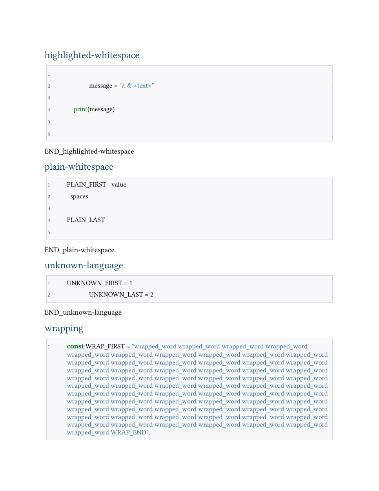
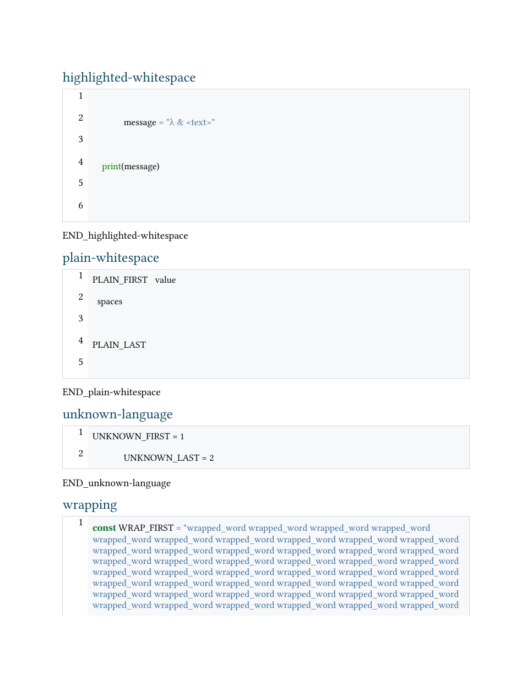

# Editable DOCX code-line numbering investigation

Date: 2026-09-20. Related issue: [#38](https://github.com/BinaryOutlook/binary-markdown/issues/38). Status: **proposal for review; not an accepted technical freeze or a shipped feature**.

## Recommendation

Continue with **one native numbered paragraph per logical code line**, using a separate numbering instance for each block. Retain syntax-highlighted text runs and keep the numbers outside the code text. This candidate rendered correct line associations and preserved source characters through the tested LibreOffice DOCX save round trip. Its production integration still needs reader acceptance, layout refinement, and an explicit contract for editing and copying.

Do not use a `numberLines` attribute alone: the installed Pandoc 3.8.3 writer did not emit numbers in these examples. A two-column table is a credible alternative, but the tested layout consumed more pages and its gutter and code baselines were less consistent. Its static gutter also requires an explicit editing contract: adding a paragraph inside a cell does not create a new logical row or update the following gutter labels.

This investigation changes no production code, settings, reference document, export formats, or host support. Its scripts use Python's standard library and the existing Pandoc/reference document. They are isolated under [experiments/docx-code-numbering](../../experiments/docx-code-numbering/probe.py); they are not imported by the extension.

## Evidence and reader boundary

The investigation examined `85a153ce5a94c8bc8c0e50f69c0792c959e5daa1`, the recorded head of [PR #48](https://github.com/BinaryOutlook/binary-markdown/pull/48). Before publication, the branch incorporated the isolated table-keyboard correction from [PR #49](https://github.com/BinaryOutlook/binary-markdown/pull/49), with base `839bbb66dad280fb17f85c170946cee4aec92934`; the experiment, export code, and reference document are unchanged by that correction. The prototype's exact revision is the investigation PR head. Parent heads are provisional working baselines under the batch authorization; this does not accept their open issues.

| Tool or reader | Observation | What it establishes |
| --- | --- | --- |
| Pandoc 3.8.3, macOS ARM64 | Real Markdown-to-JSON and JSON-to-DOCX conversion | Tested writer behavior and generated document structure |
| LibreOfficeDev 26.8.0.0.alpha0, build `2c87e51eeaa2b413ff4ae097b2705eea1995d8e5` | Headless DOCX import, PDF rendering, DOCX save round trip; representative rendered pages inspected | This development reader build rendered the fixtures and retained the verified code payloads; it is not evidence for a stable LibreOffice release |
| Microsoft Word 16.113.1 for macOS, build `16.113.26091740` | Opening the owned synthetic document through Word's scripting API timed out with AppleEvent error `-1712` | Reader validation unavailable; no Word appearance, edit, or copy success claimed |
| Word for Windows; stable LibreOffice | Not exercised | Unverified |
| Interactive keyboard editing, clipboard copy, screen readers | Not exercised | Structural editability and reading-order analysis below are not interactive acceptance |

The maintainer has not yet accepted a reader/version matrix. The proposed target is desktop Word on Windows and macOS plus a named stable LibreOffice version. This development LibreOffice observation does not settle that choice.

## Fixture and preservation findings

Seven synthetic cases cover highlighted Python, plain text, an unknown language, JavaScript with a long wrapped line, a 150-line block, one deliberately blank line, and an empty block. They include tabs, spaces, Unicode, XML punctuation, leading/internal/trailing blank lines, and independent numbering restarts. The fixture declares authored lines explicitly so its generator can distinguish an empty block from one blank line, even though Pandoc's AST represents both with an empty string.

Both candidate packages retained all seven expected code payloads exactly in XML and after the LibreOffice DOCX save round trip. The native candidate contains 167 numbered paragraphs and no code tables; the table candidate contains six code tables and no native numbered paragraphs. Neither rasterizes code. The empty block has a display paragraph but no number; the one-blank-line case has number 1. This is a probe convention for reviewing the distinction, not a decision overriding the future shared contract in #36.

Two existing conversion behaviors must be addressed by the shared preservation work:

- The current reader arguments expand code tabs. Adding `--preserve-tabs` retained them in this fixture. The experiment uses that flag; production remains unchanged. Its effect on other Markdown structures still needs regression coverage before adoption.
- The writer omitted one trailing blank code line from the highlighted and plain trailing-blank examples. The prototype restores missing blank tails only after verifying all writer-produced characters against the expected source. Any other mismatch fails the probe. Production must derive the source model reliably from the saved input, rather than relying on these known fixture arrays.

The final newline before a closing fence is a delimiter, not an extra line. Authored blank lines before that delimiter remain meaningful. #36 must preserve that distinction consistently before #39 uses its line model.

## Candidate comparison

| Concern | Pandoc attribute control | Native numbered paragraphs | Table gutter |
| --- | --- | --- | --- |
| Visible numbers in this run | None | All 167, in the expected order | All 167, in the expected order |
| Code representation | One paragraph with line breaks per block | One paragraph per source line; numbers are numbering properties | One table row per source line; number and code in separate cells |
| Highlighting | Existing writer token styles | Whole-block token runs retained when split | Same retained token runs in code cells |
| Blank source lines | Trailing-line loss observed | Explicit paragraphs, including numbered blank lines | Explicit rows, including blank code cells |
| Wrapped continuations | Unnumbered | One source-line number; continuation lines receive no new number | One source-line number; a long row can continue on another page |
| Pagination observed | 6 pages; the long block moved past an otherwise nearly empty page | 6 pages; the long block continued across pages | 8 pages in this particular prototype; greater row height contributed |
| Code selection/copy | Interactive behavior unverified | Code XML excludes labels, but the clipboard may include list numbers depending on reader and selection | Code-column selection may exclude labels; whole-table copying may include them; unverified |
| Editing implications | Ordinary code paragraph | Native list numbering can follow paragraph edits; Enter versus a soft break, blank-line behavior, and formatting inheritance need actual reader checks | Code remains editable; new logical lines require row insertion and gutter maintenance |
| Accessibility implications | Existing paragraph content | List semantics expose numbers separately from text; spoken order needs checking | A layout table may be announced as a table; row/cell navigation and spoken order need checking |
| Metadata | Existing production labels are not exercised by this control | Final header/footer placement and count combinations remain #35/#36/#39 integration work | Same pending integration, plus table-to-footer pagination behavior |

All 143 nonblank markers in the 150-line block survived PDF text extraction in order, and the complete visible numbering sequence matched each candidate's expected logical lines. These extraction checks do not prove whitespace-preserving clipboard copying. The observed pagination difference is specific to these prototype styles, not an inherent minimum page count for either representation.

The native prototype still needs gutter/border spacing refinement: multi-digit numbers approach or cross its left border. The table prototype shows uneven vertical alignment between labels and code. Font substitution is visible in this environment, including in the control. These are reasons to retain draft status and test the final styles in the named readers.





## Reproduce the investigation

From the repository root, use Python 3, Pandoc 3.8.3, an available LibreOffice `soffice` executable, and Poppler's `pdftotext` and `pdfinfo`. The repository's existing reference document is the only input asset. The commands create only synthetic artifacts under ignored `.vscode-test` output.

```sh
python3 experiments/docx-code-numbering/probe.py
mkdir -p .vscode-test/docx-numbering/libreoffice
mkdir -p .vscode-test/docx-numbering/libreoffice-roundtrip
soffice --headless --convert-to pdf --outdir .vscode-test/docx-numbering/libreoffice .vscode-test/docx-numbering/paragraph-numbering.docx .vscode-test/docx-numbering/table-gutter.docx .vscode-test/docx-numbering/pandoc-numberLines.docx
soffice --headless --convert-to docx --outdir .vscode-test/docx-numbering/libreoffice-roundtrip .vscode-test/docx-numbering/paragraph-numbering.docx .vscode-test/docx-numbering/table-gutter.docx
python3 experiments/docx-code-numbering/audit_reader.py .vscode-test/docx-numbering
```

Use `probe.py --pandoc PATH --out DIRECTORY` for a different executable or output directory, adjusting subsequent commands accordingly. Use an isolated LibreOffice profile if another instance owns the normal profile. Record that reader's version before interpreting its results.

`receipt.json` identifies source/reference/candidate hashes and structural comparisons. `reader-receipt.json` identifies rendered and resaved artifacts, exact code comparisons, visible-number order, marker order, and page counts. Successful script completion establishes these assertions; review the actual documents separately. Tool/version-dependent package metadata can change artifact hashes on regeneration.

The first observed candidate hashes were `e1fa100d1ec960b291eaa6538eb2c081acebca60922832d6714f6be5485024c6` for native paragraphs and `7671851441018511caa1735b4618cf873d8c4c5c131247821b829da39e10cdc0` for the table gutter. Source SHA-256: `0894e2175bba0a1b2a9b072a35ca0c8325aca3f3812f32b77cd8087d0c81755f`. Generated DOCX/PDF files and raw receipts remain in ignored output; the two public previews contain only synthetic fixture content.

## Proposed implementation and acceptance contract

1. Accept a reader/version matrix and the native-paragraph representation, or record a different decision with its tradeoffs. Name the accepted report/prototype commit explicitly; this draft is not that acceptance.
2. In #36, establish saved-source logical lines and exact whitespace preservation, including blank-only blocks, final delimiters, tabs, and the observed writer loss. Add real-converter comparisons before numbering depends on the result.
3. In #39, integrate a bounded DOCX transformation that preserves whole-block highlighting and code text, assigns independent numbering instances, and fails visibly on unsupported output rather than discarding content. Production package/XML handling needs its own reviewed implementation; this Python probe does not establish a runtime dependency choice.
4. Combine the #35/#36 metadata layout with numbering enabled and disabled. Verify lists, quotations, table-contained blocks, long labels, page breaks, and large line counts. The current probe is deliberately limited to top-level blocks and simple writer runs.
5. In each accepted reader, verify first/middle/last/blank-line edits, Enter and soft breaks, copy into a plain-text editor, numbering restart, saved-document reopen, and screen-reader order. Record where numbers enter copied text and what editing changes automatic numbering. Do not promise number-free copying without observed evidence.

Leave numbering off by default and independent of labels and total counts. Do not advertise a code-editor experience inside Word: native paragraphs can provide editable text and automatic numbering, but they do not automatically re-run syntax highlighting after edits. Production must retain the existing unnumbered behavior when the option is off, while any separately accepted preservation fix applies consistently.

The [Pandoc 3.8.3 DOCX writer](https://github.com/jgm/pandoc/blob/3.8.3/src/Text/Pandoc/Writers/Docx/OpenXML.hs) is the version-specific source reference for this probe. Microsoft's documentation describes [paragraph numbering properties](https://learn.microsoft.com/en-us/dotnet/api/documentformat.openxml.wordprocessing.numberingproperties?view=openxml-3.0.1) and [per-instance start overrides](https://learn.microsoft.com/en-us/dotnet/api/documentformat.openxml.wordprocessing.startoverridenumberingvalue?view=openxml-3.0.1); those structural definitions do not replace reader tests. Production work must follow the maintained [export verification guide](../../docs/export-verification.md).
