# Binary Markdown visual design review

Date: 2026-09-30. Status: **Visual proposals for owner review. Application changes are not implemented.**

[Visual gallery (download and open locally)](index.html) · [Evidence manifest](evidence/capture-source.json) · [Review data](evidence/review-data.json)

This review contains 12 improvement areas, 20 current screenshots and 36 final generated redesign concepts. Each area presents **Recommended**, **Moderate**, then **Experimental**. Recommended balances usability, consistency and implementation practicality; Moderate changes the organization or interaction more visibly; Experimental explores optional workflows with greater cost and uncertainty. Earlier illustrations are retained separately for generation provenance and are not additional recommendations.

The review branch is `feat/ui-ux-visual-review`. Source is `944b4dd2781c906ee9a912295c814e77a0a9f3f0`, inspected after refreshing canonical `origin/main` at the start. The report, review data and reproduction/sharing helpers are the only proposed repository changes. No extension build is being distributed, and no merge or release is implied.

## Sharing and reviewer feedback

The [sharing guide](SHARING.md) describes portable PDF and self-contained HTML editions and provides a reply template. The [publication security audit](evidence/publication-security-audit.json) records checks before GitHub publication. Recommendations are consultant proposals; no owner selection has been recorded.

This record preserves the original 30 September snapshot at `944b4dd2781c906ee9a912295c814e77a0a9f3f0`. Canonical main advanced after capture, including code-block toolbar and wrapping changes. Recheck current behavior before implementation, especially area 06.

For the design discussion, assess writing focus, discoverability, ambiguity and recovery, theme consistency, Markdown/editing preservation, and whether additional modes justify their complexity. Return the area ID, preferred option, rationale, concerns and evidence needed before approval. The owner may mix levels or defer an area.

## How to review

Use the table to choose an area, then compare its current capture with the three options. Images contain numbered pointers. The written 1–3 legend beneath each image states the intended scope precisely; it is authoritative where generated text, shortcut glyphs or incidental chrome differs. Open a full-size image when inspecting small labels.

You may select a different level for each area or defer an area entirely. Approval should name the area ID, option and any adjustments, for example: **06-code: Recommended; 03-commands: Recommended; 11-source: defer.** Approval of a concept would authorize a later implementation plan and appropriate validation, not establish that the image's behavior already exists.

## Design brief

The confirmed direction is a consistent minimalist editor. The working audience assumption is students and developers writing technical documents with prose, code, equations and tables; that audience remains provisional. The concepts favor clarity during writing and recovery when a document block cannot render.

| Element | Proposed shared language | Purpose |
| --- | --- | --- |
| Light surfaces | Canvas `#FAFAF8`; rail `#F3F4F5`; thin neutral dividers | Keep the article primary and distinguish controls gently |
| Text | Charcoal `#242830`; familiar system sans; monospace for authored source | Quiet hierarchy and source recognition |
| Accent | Restrained blue `#4266B0`; pair state color with text, position or shape | Signal selection, focus and actions consistently |
| Dark surfaces | Canvas `#1B1E26`; code/secondary surface `#272D38`; pale readable tokens | Carry the same hierarchy into dark themes |
| Spacing and shape | 8 px spacing rhythm; roughly 6 px radii; 1 px borders | Consistency without decorative card layers |
| Interaction | Persistent purpose labels; grouped commands; progressive disclosure; explicit modes | Reduce scanning and recovery effort |

These are design targets, not measured properties of generated pixels. Preserve supported themes and user settings; do not apply a global default-theme change through a small UI fix. Theme, contrast, accessible names and keyboard behavior need verification in the eventual implementation. The host integration should follow [VS Code's webview UX guidance](https://code.visualstudio.com/api/ux-guidelines/webviews), including theme support and accessible controls.

## Evidence and limits

Current images are screenshots of unchanged shared production markup, CSS and scripts rendered in a local browser with synthetic Markdown and the repository's test HostBridge. The preview uses English messages, macOS utility labels, Full toolbar, an open outline, Automatic table controls and enabled width guidance. Most captures use Things; code uses Night. Images were captured at the recorded viewport dimensions, including a 600 × 720 narrow pane. They are source-rendered current visuals, not screenshots of an installed VSIX inside native VS Code.

Export availability and failure/warning status were injected into the real export UI. Those states demonstrate layout, not converter results, file writes or output-reader fidelity. The mock host supplies no real image-folder or save status; a blank folder value is not a defect. All document text, author values and paths visible in the review are synthetic.

The generated images are static concepts. They do not validate rendering, keyboard access, performance, selection mapping, undo, saving or export. Some options introduce new capabilities and say so explicitly. Incidental document wording, example counters and durations, filename/save labels and shortcut glyphs are illustrative; any future host status must come from authoritative host state. Only the specified changes and written legends belong to the proposal. No sharing, comments, AI, code execution or cell-merge features are proposed.

| Coverage | Evidence in this review | Boundary |
| --- | --- | --- |
| Writing, toolbar, outline and empty document | Wide/narrow browser screenshots and source inspection | No first-time-user study or native-host acceptance |
| Commands, table, code and language picker | Interactive current screenshots and targeted source checks | No full keyboard or assistive-technology audit |
| Equations and diagrams | Valid/invalid synthetic documents and editing captures | No complete TeX/Mermaid correctness assessment |
| Find, metadata and Source mode | Filled-field and disclosure/mode captures; DOM/source checks | No end-to-end save/undo regression result |
| Export menu, failure and warnings | Real UI with simulated capabilities/status | No real converter, native dialog or output-reader result |
| Native Settings, image/link dialogs and standalone shell | Shared entry points inspected; no native capture retained | No redesign conclusion for uncaptured host-owned surfaces |
| Performance, translations and remaining themes | Relevant architecture noted | No timings, locale certification or exhaustive theme result |

## Review table

High means frequent-task clarity, measured readability or recovery; Medium means useful refinement. This is design prioritization, not a claim that every row is a functional defect.

| ID | Area | Evidence type and priority | Current visual | Redesigns, recommended first |
| --- | --- | --- | --- | --- |
| 01-canvas | [Writing canvas and visual hierarchy](#01-canvas) | Design judgment; Medium · daily writing | [Screenshot](images/current/01-overview.jpg) | [Recommended](images/generated/01-canvas-recommended.png) · [Moderate](images/generated/01-canvas-moderate.png) · [Experimental](images/generated/01-canvas-experimental.png) |
| 02-toolbar | [Toolbar hierarchy and narrow-pane overflow](#02-toolbar) | Design judgment; High · frequent controls | [Screenshot](images/current/01-overview.jpg) | [Recommended](images/generated/02-toolbar-recommended.png) · [Moderate](images/generated/02-toolbar-moderate.png) · [Experimental](images/generated/02-toolbar-experimental.png) |
| 03-commands | [Insert and Action Palette discovery](#03-commands) | Observed feedback gap + design judgment; High · discovery and recovery | [Screenshot](images/current/04-palette-no-results.jpg) | [Recommended](images/generated/03-commands-recommended.png) · [Moderate](images/generated/03-commands-moderate.png) · [Experimental](images/generated/03-commands-experimental.png) |
| 04-outline | [Outline hierarchy and sidebar footer](#04-outline) | Design judgment; Medium · document orientation | [Screenshot](images/current/07-outline.jpg) | [Recommended](images/generated/04-outline-recommended.png) · [Moderate](images/generated/04-outline-moderate.png) · [Experimental](images/generated/04-outline-experimental.png) |
| 05-tables | [Contextual table controls](#05-tables) | Design judgment; Medium · editing confidence | [Screenshot](images/current/05-table-controls.jpg) | [Recommended](images/generated/05-tables-recommended.png) · [Moderate](images/generated/05-tables-moderate.png) · [Experimental](images/generated/05-tables-experimental.png) |
| 06-code | [Code readability and block controls](#06-code) | Measured contrast issue + design judgment; High · measurable readability | [Screenshot](images/current/06-code-night.jpg) | [Recommended](images/generated/06-code-recommended.png) · [Moderate](images/generated/06-code-moderate.png) · [Experimental](images/generated/06-code-experimental.png) |
| 07-equations | [Equation source and error recovery](#07-equations) | Observed ambiguity + design judgment; High · error recovery | [Screenshot](images/current/08-equation-error.jpg) | [Recommended](images/generated/07-equations-recommended.png) · [Moderate](images/generated/07-equations-moderate.png) · [Experimental](images/generated/07-equations-experimental.png) |
| 08-diagrams | [Diagram errors and edit affordance](#08-diagrams) | Observed diagnostic overload + design judgment; High · error recovery | [Screenshot](images/current/09-mermaid-error.jpg) | [Recommended](images/generated/08-diagrams-recommended.png) · [Moderate](images/generated/08-diagrams-moderate.png) · [Experimental](images/generated/08-diagrams-experimental.png) |
| 09-find | [Find and Replace labeling and control hierarchy](#09-find) | Observed labeling gap + design judgment; High · control clarity | [Screenshot](images/current/10-find-replace.jpg) | [Recommended](images/generated/09-find-recommended.png) · [Moderate](images/generated/09-find-moderate.png) · [Experimental](images/generated/09-find-experimental.png) |
| 10-metadata | [Metadata and generated contents ownership](#10-metadata) | Design judgment; Medium · source ownership | [Screenshot](images/current/11-metadata-toc.jpg) | [Recommended](images/generated/10-metadata-recommended.png) · [Moderate](images/generated/10-metadata-moderate.png) · [Experimental](images/generated/10-metadata-experimental.png) |
| 11-source | [Visual and Source mode identity](#11-source) | Observed ambiguity + design judgment; High · mode clarity | [Screenshot](images/current/12-source-mode.jpg) | [Recommended](images/generated/11-source-recommended.png) · [Moderate](images/generated/11-source-moderate.png) · [Experimental](images/generated/11-source-experimental.png) |
| 12-export | [Export choice, setup and recovery](#12-export) | Mocked-state design judgment; High · task completion | [Screenshot](images/current/13-export-menu.jpg) | [Recommended](images/generated/12-export-recommended.png) · [Moderate](images/generated/12-export-moderate.png) · [Experimental](images/generated/12-export-experimental.png) |

A practical first implementation sequence would be code contrast, palette recovery, Find labels, explicit Source mode, then equation/diagram recovery. Layout, toolbar, outline and table refinement can follow as a coordinated pass. Export interaction changes should remain a separate host-integrated task. This sequence is proposed and awaits the owner's choice.

## Measured code contrast

The values below use computed foreground/background colors from the Night code capture and the standard sRGB relative-luminance calculation. They are measurements of this sample, not a pass/fail certificate for all themes. A normal-size text target of at least 4.5:1 follows [W3C's contrast minimum criterion](https://www.w3.org/WAI/WCAG22/Understanding/contrast-minimum.html).

| Token | Foreground | Actual code background | Ratio | Compared with 4.5:1 |
| --- | --- | --- | --- | --- |
| String | `#032F62` | `#24283B` | 1.10:1 | Below target |
| Number | `#005CC5` | `#24283B` | 2.31:1 | Below target |
| Keyword | `#D73A49` | `#24283B` | 3.18:1 | Below target |
| Comment | `#6A737D` | `#24283B` | 3.03:1 | Below target |

The existing quoted-code test inspects the plain foreground and ensures syntax colors remain distinct. It does not measure the contrast of every syntax token. That test was inspected, not executed as part of this report-only task. See [code review item 06](#06-code) and the [measurement receipt](evidence/measurements.json).

<a id="01-canvas"></a>

## 01 · Writing canvas and visual hierarchy

**Evidence:** Design judgment. **Priority:** Medium · daily writing.

At 1280 × 720, the first heading starts about 126 px below the editor box top. The source gives the editor and Source view 100 px of top padding. Persistent corner width markers and blue section headings add emphasis outside the prose. Empty documents already show a writing hint; this proposal improves its placement and prominence rather than inventing a missing empty state.

**Source pointers:** [Writing inset and reading width](../../../src/webview/styles.css) (line 418); [Source view inset](../../../src/webview/styles.css) (line 445).

### Current visuals

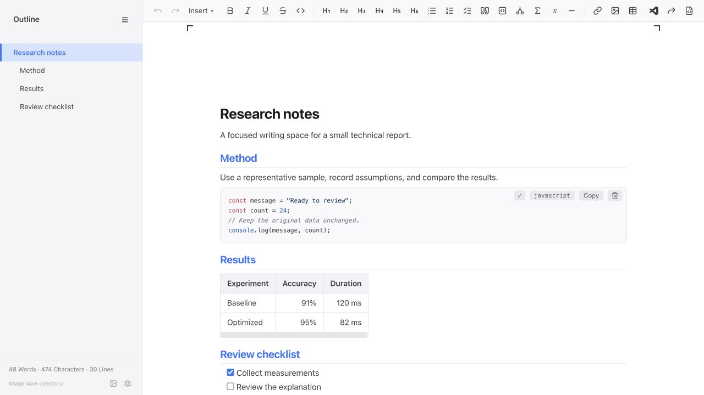

Current wide editor · Full toolbar · Things theme. [Open full size](images/current/01-overview.jpg).

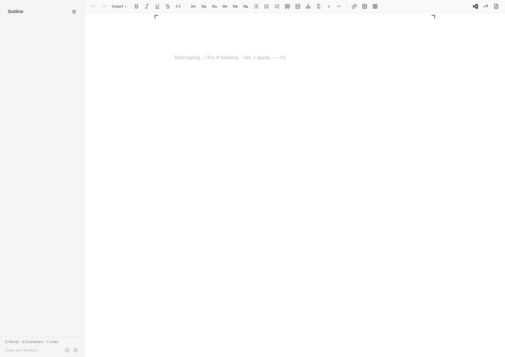

Current empty document · writing hint already present. [Open full size](images/current/01-empty-document.jpg).

**Preserve:** Keep the existing width, alignment, outline and font-size preferences, Markdown content, scroll position and selection. Use an optional focus view rather than replacing the baseline.

<a id="01-canvas-recommended"></a>

### Recommended


[Open full size](images/generated/01-canvas-recommended.png). Static generated concept.

1. Less empty space before writing: reduce the top inset while keeping a comfortable reading column.
2. Quiet hierarchy: use charcoal headings and restrained section rules.
3. Guides when useful: expose width assistance on focus rather than during ordinary reading.

**Rationale:** A smaller top inset gives short panes useful writing space while retaining the familiar page and outline. Quiet typography makes document structure clear without competing with the content.

**Practicality and tradeoff:** Low to medium effort. Tune spacing at multiple pane widths; do not change saved width preferences.

<a id="01-canvas-moderate"></a>

### Moderate

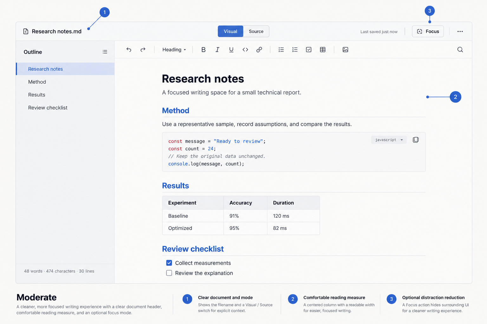

[Open full size](images/generated/01-canvas-moderate.png). Static generated concept.

1. Clear document and mode: add a compact filename and Visual/Source control.
2. Comfortable reading measure: center the article and reduce rail width.
3. Optional Focus: reduce distractions through an explicit user choice.

**Rationale:** A document header clarifies the current file and mode. A narrower rail and optional Focus control provide stronger organization, with more layout work than the first option.

**Practicality and tradeoff:** Medium effort. Header and focus behavior need a host-aware file identity and explicit mode state.

<a id="01-canvas-experimental"></a>

### Experimental

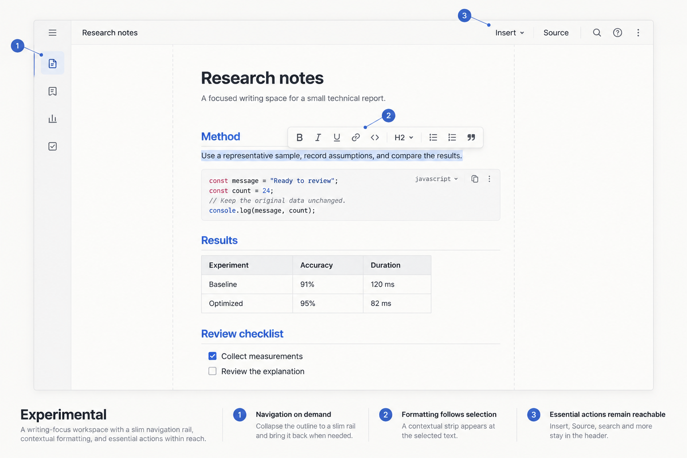

[Open full size](images/generated/01-canvas-experimental.png). Static generated concept.

1. Navigation on demand: use an optional collapsed rail.
2. Formatting follows selection: move secondary tools close to the active text.
3. Essential actions stay reachable: preserve visible Insert and Source access.

**Rationale:** An optional focus workspace prioritizes sustained writing. Contextual tools reduce permanent chrome, but require careful keyboard access and selection behavior.

**Practicality and tradeoff:** High effort. Contextual positioning, focus recovery and discoverability need interaction prototypes.

### Success criteria if authorized

These checks describe later implementation acceptance; they have not been satisfied by a static image.

- At short and narrow pane sizes, the first editable line remains visible without scrolling.
- Opening or closing navigation and width guidance preserves the selection and authored Markdown.
- Empty-document guidance is readable and disappears at the appropriate time without adding document content.

<a id="02-toolbar"></a>

## 02 · Toolbar hierarchy and narrow-pane overflow

**Evidence:** Design judgment. **Priority:** High · frequent controls.

The wide Full toolbar presents H1–H6 as six peer buttons among many icons. At 600 × 720, most formatting commands move into a tall, flat More menu while the outline occupies 260 px. Overflow works and retains commands; the opportunity is faster scanning and clearer essential actions.

**Source pointers:** [Toolbar groups and utility actions](../../../src/shared/editor-body-html.js) (line 77); [Toolbar and overflow styling](../../../src/webview/styles.css) (line 262).

### Current visuals


Current wide editor · Full toolbar · Things theme. [Open full size](images/current/01-overview.jpg).

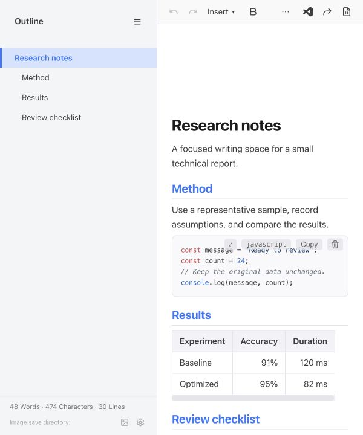

Current narrow pane · 600 × 720. [Open full size](images/current/02-narrow-toolbar.jpg).

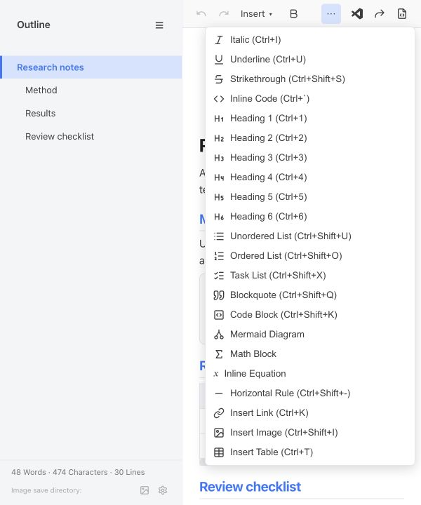

Current narrow More menu · commands retained. [Open full size](images/current/02-toolbar-overflow.jpg).

**Preserve:** Keep Full and Simple preferences, all six heading levels, existing command identities and platform-correct shortcuts. Grouping must not silently drop rarely used commands.

<a id="02-toolbar-recommended"></a>

### Recommended

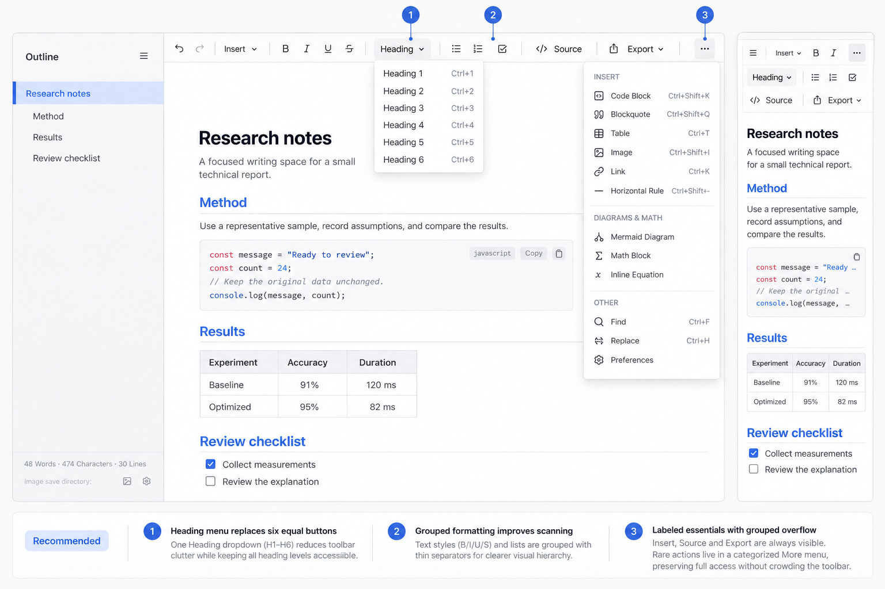

[Open full size](images/generated/02-toolbar-recommended.png). Static generated concept.

1. Heading menu replaces six equal buttons.
2. Grouped formatting improves scanning.
3. Labeled essential actions and grouped overflow preserve access.

**Rationale:** A Heading menu and clear groups reduce visual competition with a small behavioral change. Labeled Source and Export controls remove reliance on icon recognition.

**Practicality and tradeoff:** Medium effort. Check heading access, keyboard menus and overflow thresholds across locales.

<a id="02-toolbar-moderate"></a>

### Moderate

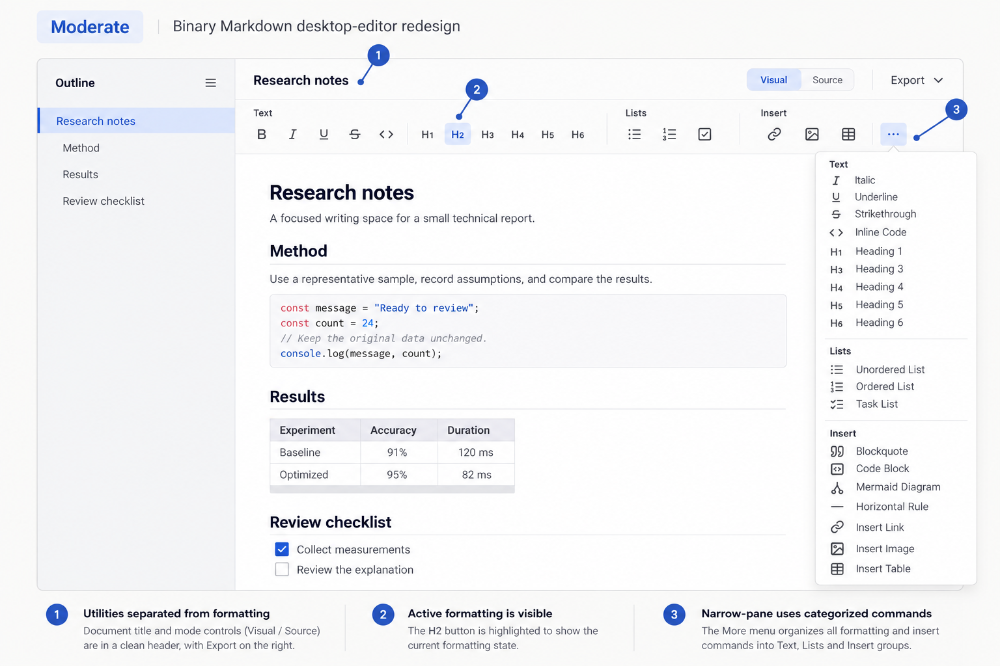

[Open full size](images/generated/02-toolbar-moderate.png). Static generated concept.

1. Utilities separated from formatting.
2. Active formatting is visible.
3. Narrow layout uses categorized commands.

**Rationale:** Separating document utilities from formatting creates a stronger mental grouping. Active-format feedback helps authors understand the selected text, but uses additional vertical space.

**Practicality and tradeoff:** Medium to high effort. A second row must adapt to short panes and selection-dependent active state.

<a id="02-toolbar-experimental"></a>

### Experimental

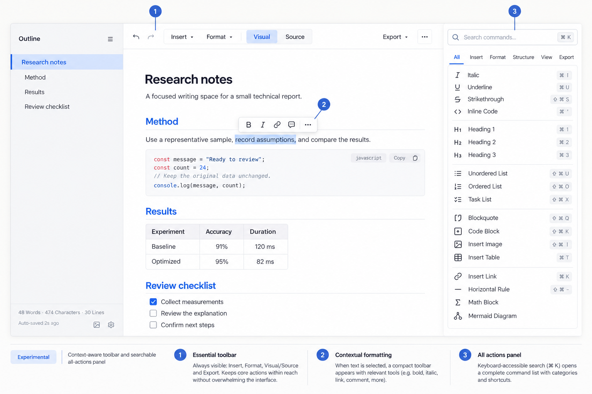

[Open full size](images/generated/02-toolbar-experimental.png). Static generated concept.

1. Permanent essential commands.
2. Selection-specific tools.
3. Search exposes the complete command set.

**Rationale:** Contextual formatting can make the permanent toolbar much lighter. A complete searchable actions panel remains essential so hidden tools stay discoverable.

**Practicality and tradeoff:** High effort. Optional contextual tools require positioning, focus restoration and a complete fallback.

### Success criteria if authorized

These checks describe later implementation acceptance; they have not been satisfied by a static image.

- Every current toolbar action is reachable in Full and Simple at wide and narrow pane widths.
- Menus stay within the pane; Escape returns focus and restores the editing selection.
- Selected formatting and mode states are understandable without relying on color alone.

<a id="03-commands"></a>

## 03 · Insert and Action Palette discovery

**Evidence:** Observed feedback gap + design judgment. **Priority:** High · discovery and recovery.

Entering unmatched-command in the Action Palette leaves the input visible with an empty result area and no explanation. The renderer clears the list and appends only matches. Insert has working menu roles and a visible focus outline, but its flat list gives equations the same emphasis as broadly used insertions.

**Source pointers:** [Palette filtering and list rendering](../../../src/webview/editor.js) (line 12505); [Insert menu container](../../../src/shared/editor-body-html.js) (line 115).

### Current visuals

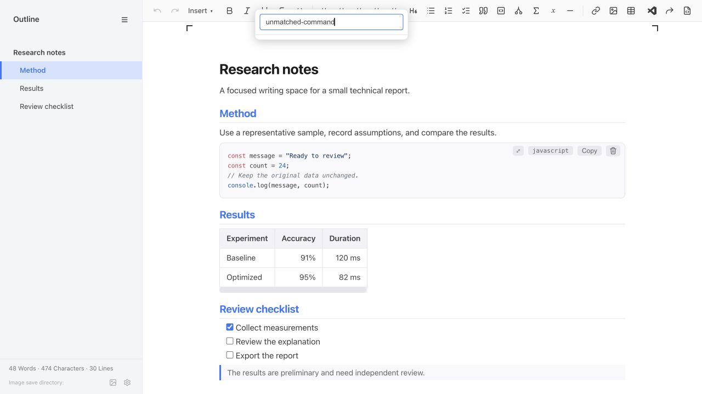

Current Action Palette · unmatched query. [Open full size](images/current/04-palette-no-results.jpg).

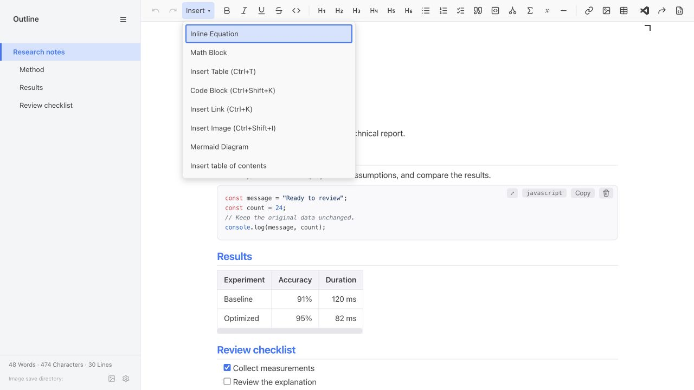

Current Insert menu · keyboard focus visible. [Open full size](images/current/03-insert-menu.jpg).

**Preserve:** Keep the existing palette shortcut, insertion location, keyboard navigation and command routing. Clearing a query is a view action and must not modify the document.

<a id="03-commands-recommended"></a>

### Recommended

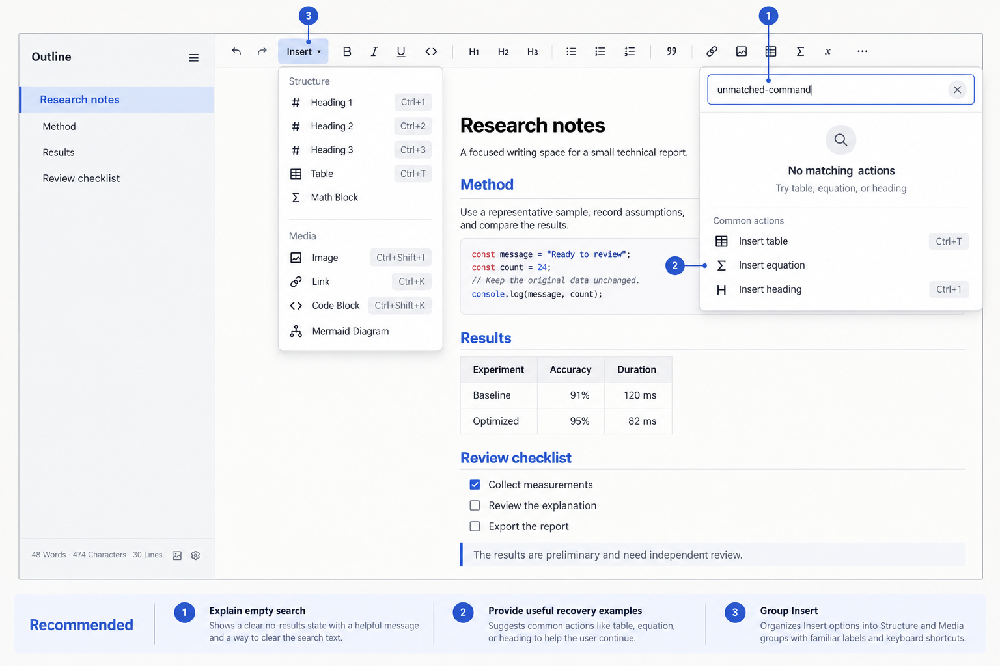

[Open full size](images/generated/03-commands-recommended.png). Static generated concept.

1. Explain empty search.
2. Provide useful recovery examples.
3. Group Insert without changing actions.

**Rationale:** An explicit no-results message and a clear recovery action resolve the observed ambiguity with limited implementation work. Grouped Insert rows support quick scanning.

**Practicality and tradeoff:** Low to medium effort. Add localized empty-state text, announcement and query recovery.

<a id="03-commands-moderate"></a>

### Moderate

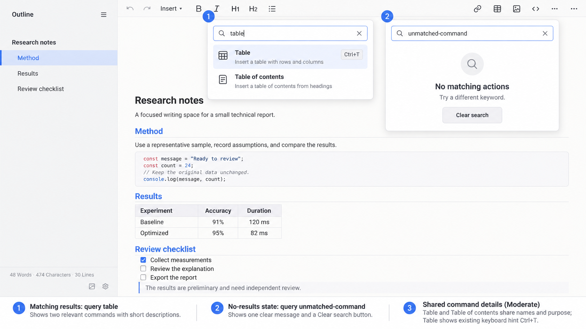

[Open full size](images/generated/03-commands-moderate.png). Static generated concept.

1. Matching results use shared names and short descriptions.
2. Empty results explain the state and offer Clear search.
3. Shared command details retain existing keyboard hints.

**Rationale:** Shared names and descriptions connect Insert with the Action Palette. Searchable Insert adds flexibility, at the cost of another input and more localization.

**Practicality and tradeoff:** Medium effort. Reuse command metadata and preserve consistent filtering across entry points.

<a id="03-commands-experimental"></a>

### Experimental

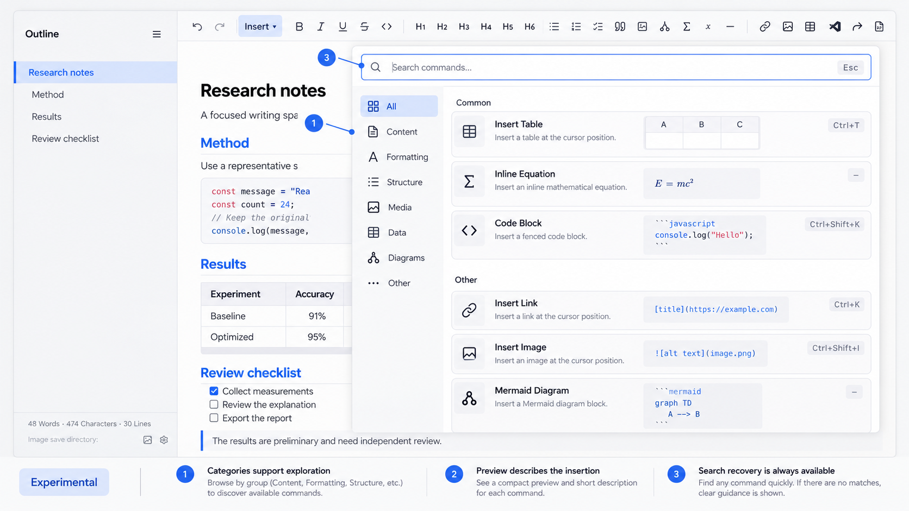

[Open full size](images/generated/03-commands-experimental.png). Static generated concept.

1. Categories support exploration.
2. Preview describes the insertion.
3. Search recovery is always available.

**Rationale:** A larger optional command workspace supports exploration through previews and categories. It is useful for learning, but can interrupt writing and requires a broader command model.

**Practicality and tradeoff:** High effort. Previews, categories and workspace focus management need new UI contracts.

### Success criteria if authorized

These checks describe later implementation acceptance; they have not been satisfied by a static image.

- A query with zero matches announces and visibly explains the state; Clear search restores actions.
- Keyboard and pointer insertion use the same saved selection and command behavior.
- Visible shortcuts follow the platform and do not invent new bindings.

<a id="04-outline"></a>

## 04 · Outline hierarchy and sidebar footer

**Evidence:** Design judgment. **Priority:** Medium · document orientation.

The current outline already nests headings, wraps long titles and highlights the active section. The small, muted footer combines word statistics and icon-only settings affordances. A quieter active marker and stronger footer hierarchy could improve reading and discovery. The blank image-folder value in the mock host is not evidence of a product failure.

**Source pointers:** [Heading hierarchy and active row](../../../src/webview/styles.css) (line 168); [Footer typography and actions](../../../src/webview/styles.css) (line 192); [Outline and status structure](../../../src/shared/editor-body-html.js) (line 48).

### Current visuals

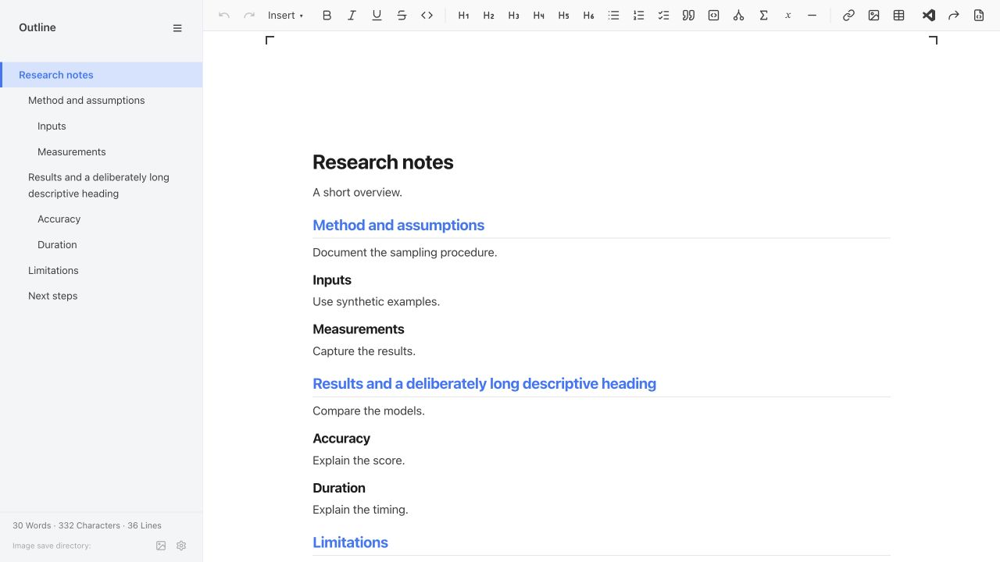

Current nested outline and footer. [Open full size](images/current/07-outline.jpg).

**Preserve:** Keep heading order, nesting, long-title wrapping, resizing and active-section navigation. Folder values must come from the host; ./assets in concepts is synthetic.

<a id="04-outline-recommended"></a>

### Recommended

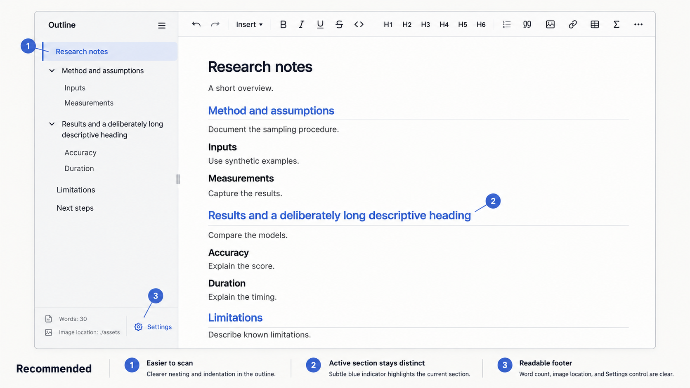

[Open full size](images/generated/04-outline-recommended.png). Static generated concept.

1. Nesting is easier to scan.
2. Active section stays distinct without a huge fill.
3. Footer controls and status are readable.

**Rationale:** The existing tree is useful and needs refinement rather than replacement. Readable footer labels improve orientation with little new interaction.

**Practicality and tradeoff:** Low to medium effort. Validate text sizes, target sizes and long localized labels.

<a id="04-outline-moderate"></a>

### Moderate

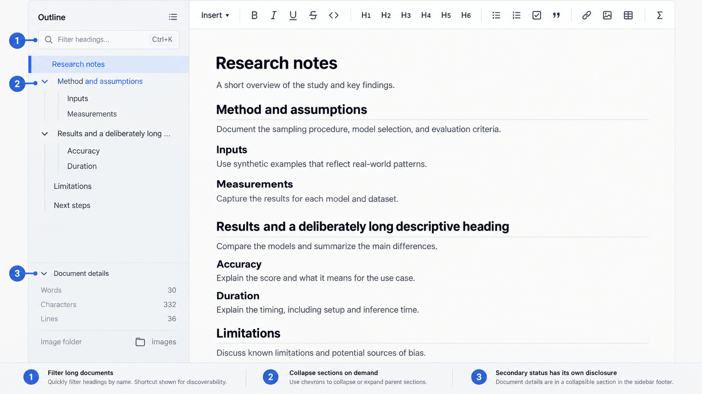

[Open full size](images/generated/04-outline-moderate.png). Static generated concept.

1. Filter long documents.
2. Collapse sections on demand.
3. Secondary status has its own disclosure.

**Rationale:** Filtering and collapsing long outlines reduce navigation effort. A Document details disclosure keeps secondary information available without dominating the rail.

**Practicality and tradeoff:** Medium effort. Filter and collapsed state need accessible tree behavior and sensible persistence.

<a id="04-outline-experimental"></a>

### Experimental

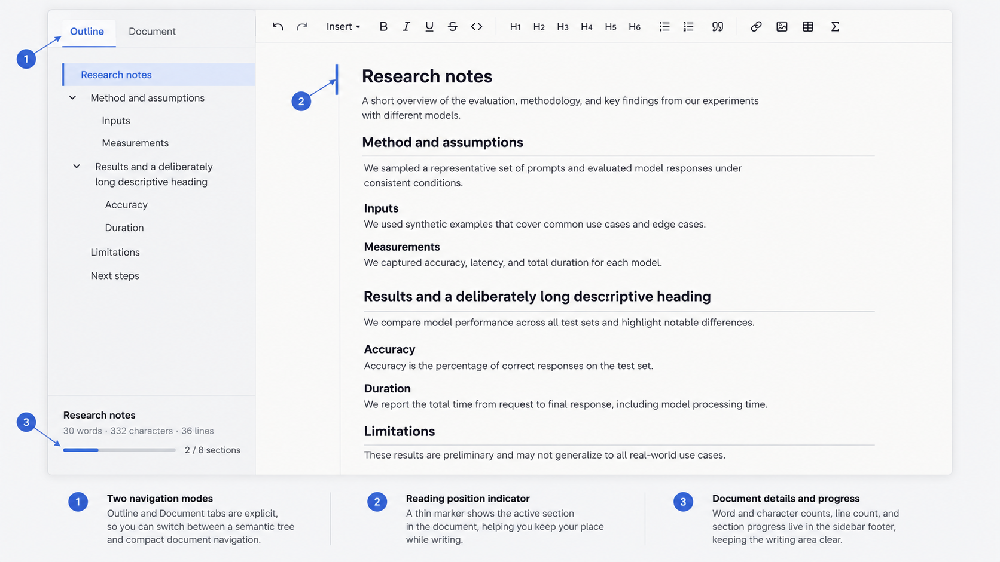

[Open full size](images/generated/04-outline-experimental.png). Static generated concept.

1. Navigation modes are explicit.
2. Progress supports orientation.
3. Document details leave the main writing area clear.

**Rationale:** An optional tabbed rail separates navigation from document information. A reading-position marker could help long documents, but adds state and scroll synchronization.

**Practicality and tradeoff:** High effort. Additional navigation modes and reading-position semantics require user testing.

### Success criteria if authorized

These checks describe later implementation acceptance; they have not been satisfied by a static image.

- A long title remains readable and all heading levels keep their semantic order.
- Selecting a heading scrolls to the correct section and preserves document content.
- Footer actions have understandable labels and host-derived status at high zoom.

<a id="05-tables"></a>

## 05 · Contextual table controls

**Evidence:** Design judgment. **Priority:** Medium · editing confidence.

Automatic placement puts a vertical toolbar beside the active table in this capture. Labels such as ←Col and Row↓ are compact, while deletion appears as repeated trash icons. The controls already have descriptive accessible labels and a placement preference. The proposal targets visible clarity and association with the selected cell, not a proven placement defect.

**Source pointers:** [Accessible labels and visible abbreviations](../../../src/webview/table-toolbar.js) (line 22); [Docked toolbar handling](../../../src/webview/table-toolbar.js) (line 283); [Existing placement choices](../../../src/webview/table-toolbar.js) (line 383).

### Current visuals

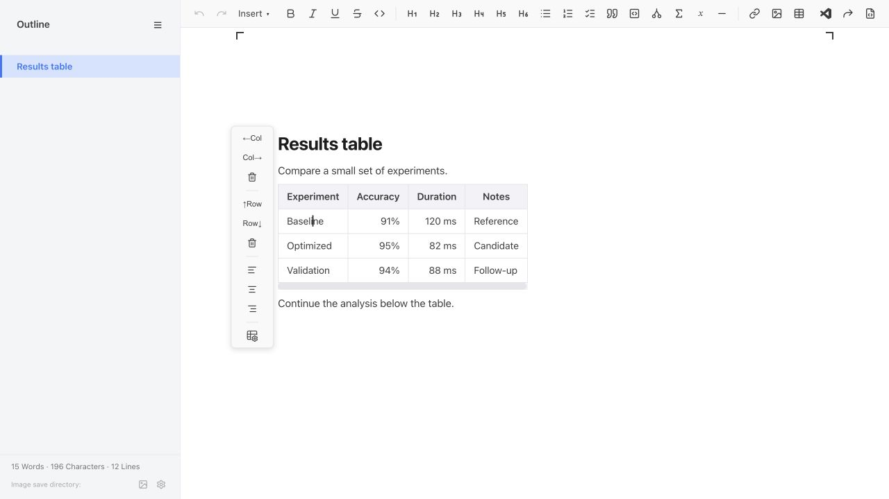

Current table controls · Automatic placement. [Open full size](images/current/05-table-controls.jpg).

**Preserve:** Keep Automatic and explicit placement choices, header-row protections, activeTableCell routing, Markdown table serialization and one appropriate undo step per action. Repositioning controls must not change the selected table.

<a id="05-tables-recommended"></a>

### Recommended

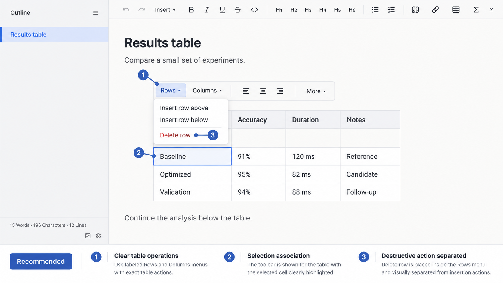

[Open full size](images/generated/05-tables-recommended.png). Static generated concept.

1. Labeled operations replace cryptic abbreviations.
2. Selection association is visible.
3. Destructive commands separated from frequent insertion.

**Rationale:** Rows and Columns menus explain operations without adding a second editing model. Separating destructive actions lowers the chance of a mistaken command.

**Practicality and tradeoff:** Medium effort. Labels, menu geometry and selection retention need careful checks.

<a id="05-tables-moderate"></a>

### Moderate

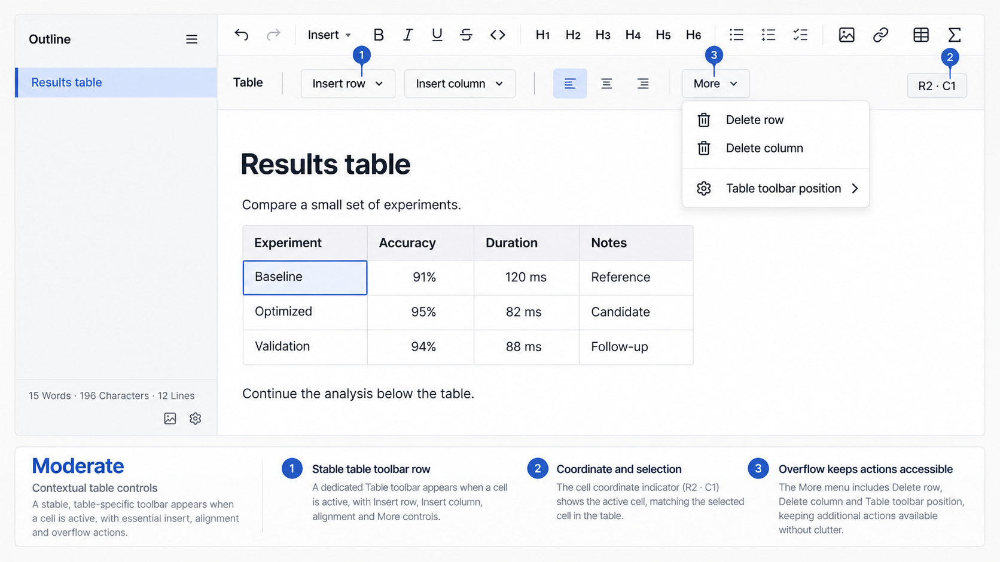

[Open full size](images/generated/05-tables-moderate.png). Static generated concept.

1. Stable table-specific row.
2. Coordinate and selection establish context.
3. Overflow keeps complete actions accessible.

**Rationale:** A stable table row can make repeated editing easier and uses an existing docking capability. A coordinate indicator clarifies context but occupies toolbar space.

**Practicality and tradeoff:** Medium effort. Reuse existing docking; verify short panes and narrow overflow.

<a id="05-tables-experimental"></a>

### Experimental

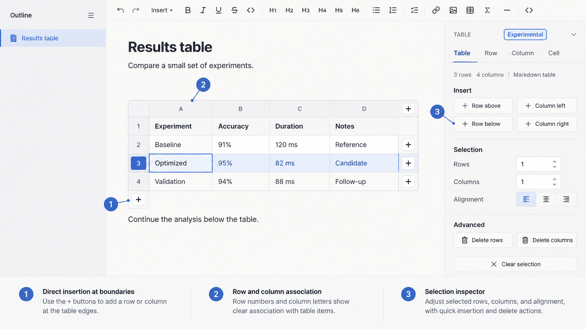

[Open full size](images/generated/05-tables-experimental.png). Static generated concept.

1. Direct insertion at boundaries.
2. Row/column association is visible.
3. Advanced operations remain in a compact inspector.

**Rationale:** Boundary insertion and row/column headers make operations direct. This is a stronger interaction departure and must remain compatible with plain Markdown tables.

**Practicality and tradeoff:** High effort. Hit testing, headers, keyboard mapping and accessibility need a dedicated prototype.

### Success criteria if authorized

These checks describe later implementation acceptance; they have not been satisfied by a static image.

- Insert/delete/alignment actions affect only the intended table cell, row or column.
- Controls stay usable after scrolling, outline resizing, zoom and pane changes.
- Header protections, source switching, save and undo preserve the expected Markdown.

<a id="06-code"></a>

## 06 · Code readability and block controls

**Evidence:** Measured contrast issue + design judgment. **Priority:** High · measurable readability.

In the captured Night theme, JavaScript strings use #032F62 on #24283B (1.10:1) and numbers use #005CC5 (2.31:1). Keywords and comments are also below 4.5:1 in this sample. Generic token colors have Dark overrides but no matching Night overrides. The existing language picker already supports search and selection. Narrow code blocks can place controls over the first source line.

**Source pointers:** [Generic and Dark syntax-token colors](../../../src/webview/styles.css) (line 917); [Code language and block controls](../../../src/webview/editor.js) (line 3396); [Existing test scope: plain quoted code foreground](../../../test/specs/codeblock-theme-contrast.spec.ts) (line 18).

### Current visuals

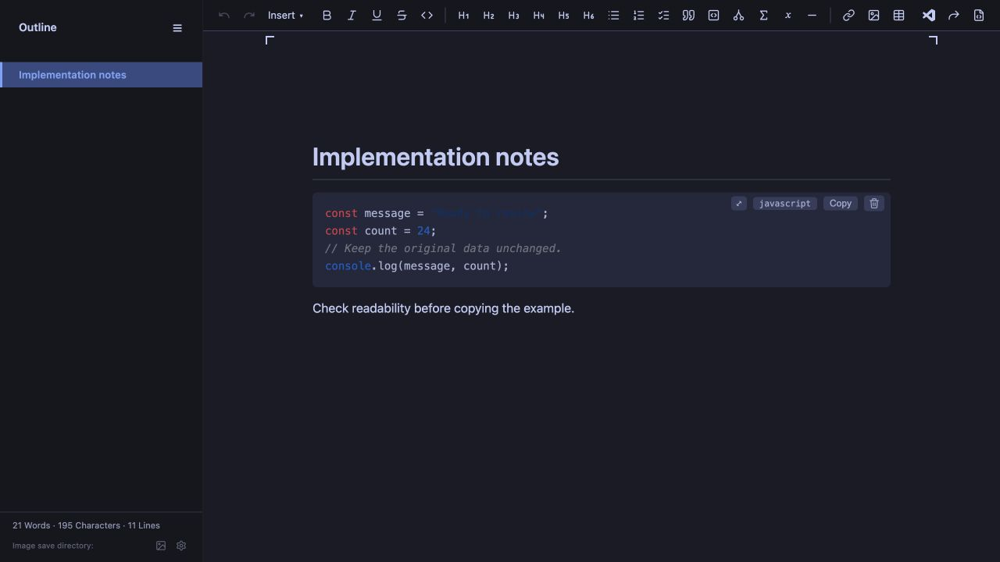

Current JavaScript block · Night theme. [Open full size](images/current/06-code-night.jpg).

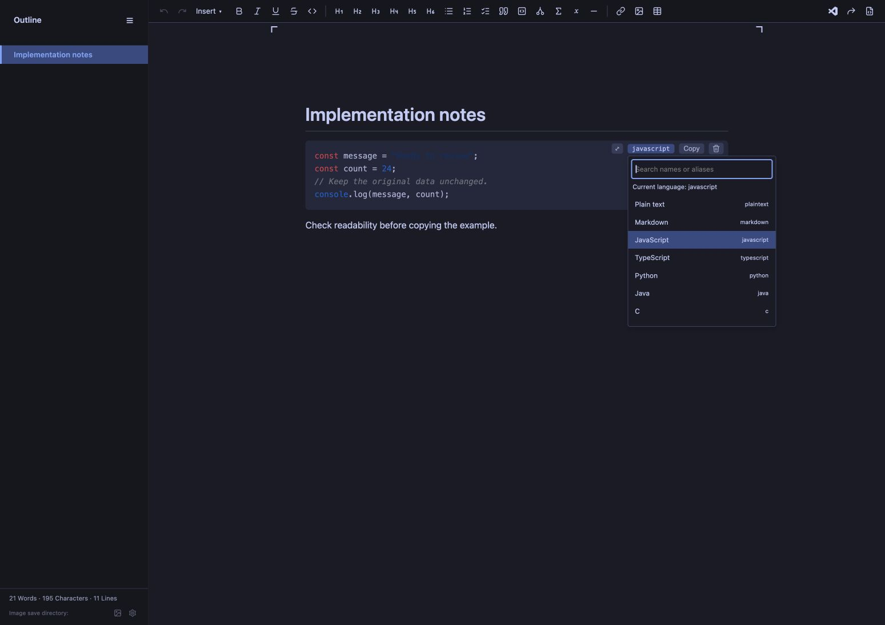

Current searchable language picker. [Open full size](images/current/06-language-picker.jpg).

**Preserve:** Keep source text, fence language, indentation, code copy behavior, language aliases and undo. The concepts do not add code execution. Existing language search should be retained.

<a id="06-code-recommended"></a>

### Recommended

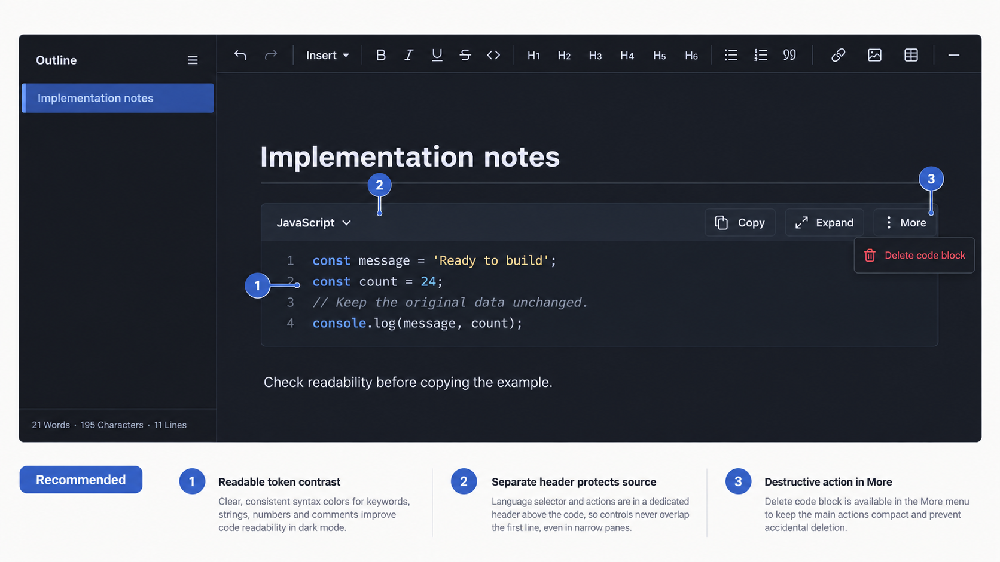

[Open full size](images/generated/06-code-recommended.png). Static generated concept.

1. Readable token contrast.
2. A separate header protects source text.
3. Destructive action in More.

**Rationale:** Readable token colors address the strongest objective finding. A dedicated header prevents controls from competing with source text and leaves deletion in a clearly labeled menu.

**Practicality and tradeoff:** Medium effort. Measure every relevant token across supported themes and editing states.

<a id="06-code-moderate"></a>

### Moderate


[Open full size](images/generated/06-code-moderate.png). Static generated concept.

1. Language is an explicit control.
2. Wrapping reduces horizontal friction.
3. Copy feedback is understandable.

**Rationale:** Explicit language, wrap and copy feedback make block operations easier to understand. Wrapping is optional so source-oriented users can keep horizontal scrolling.

**Practicality and tradeoff:** Medium to high effort. Optional wrapping and feedback must preserve copy and serialization.

<a id="06-code-experimental"></a>

### Experimental

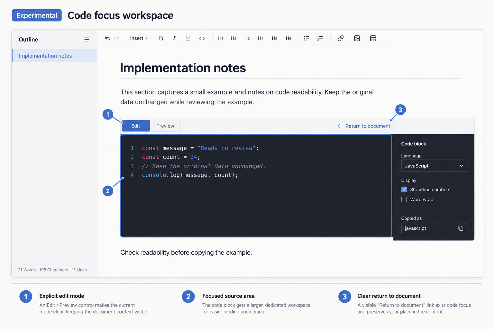

[Open full size](images/generated/06-code-experimental.png). Static generated concept.

1. Explicit edit mode.
2. Source gets a focused space.
3. Clear return preserves document context.

**Rationale:** A code-focus view can support long examples with a clear return path. It is substantially more work and risks creating a second editor inside the document.

**Practicality and tradeoff:** High effort. Additional mode, inspector and selection transitions need architectural work.

### Success criteria if authorized

These checks describe later implementation acceptance; they have not been satisfied by a static image.

- Normal-size code tokens meet a measured contrast target of at least 4.5:1 against their actual background.
- The first source line stays unobstructed at narrow widths and long language names.
- Copy, editing, language changes, source switching, save and undo preserve the authored code.

<a id="07-equations"></a>

## 07 · Equation source and error recovery

**Evidence:** Observed ambiguity + design judgment. **Priority:** High · error recovery.

The unsupported TeX command is rendered in red; clicking into the block exposes authored source above the preview. The relationship between error, source and preview has little visible explanation. The existing Shift+Enter exit behavior is a useful capability to expose, subject to confirming its exact context in an implementation.

**Source pointers:** [Inline math rendering options](../../../src/webview/editor.js) (line 3164); [Display math rendering options](../../../src/webview/editor.js) (line 3305); [Existing special-block exit handling](../../../src/webview/editor.js) (line 7736).

### Current visuals

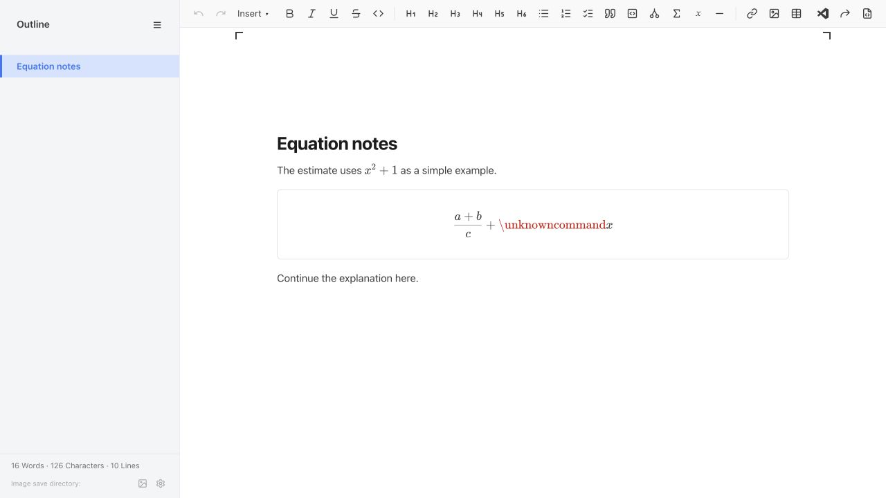

Current unsupported equation · preview. [Open full size](images/current/08-equation-error.jpg).

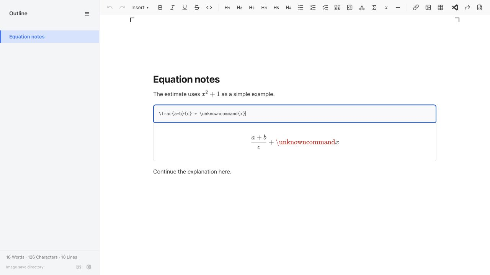

Current unsupported equation · source and preview. [Open full size](images/current/08-equation-edit.jpg).

**Preserve:** Keep TeX source exactly as authored, including unsupported commands and delimiters. Explanatory warnings and view changes must not silently correct or serialize a different equation.

<a id="07-equations-recommended"></a>

### Recommended

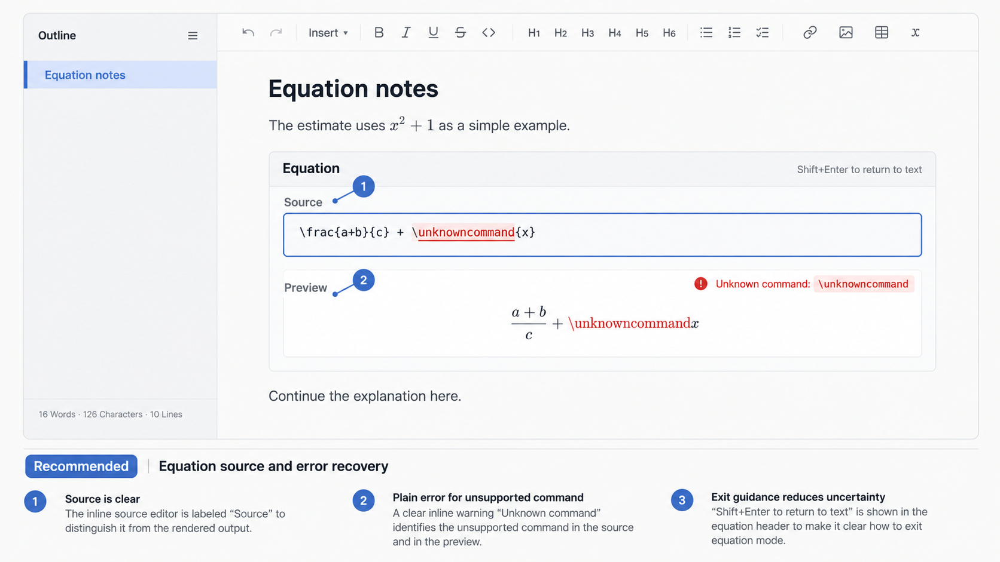

[Open full size](images/generated/07-equations-recommended.png). Static generated concept.

1. Source and preview are distinguished.
2. Plain error explains the red command.
3. Exit guidance reduces mode uncertainty.

**Rationale:** Labels and a concise warning make the current source/preview arrangement understandable. This offers useful recovery without a new equation application.

**Practicality and tradeoff:** Medium effort. Map KaTeX errors to helpful text without claiming a full TeX validator.

<a id="07-equations-moderate"></a>

### Moderate

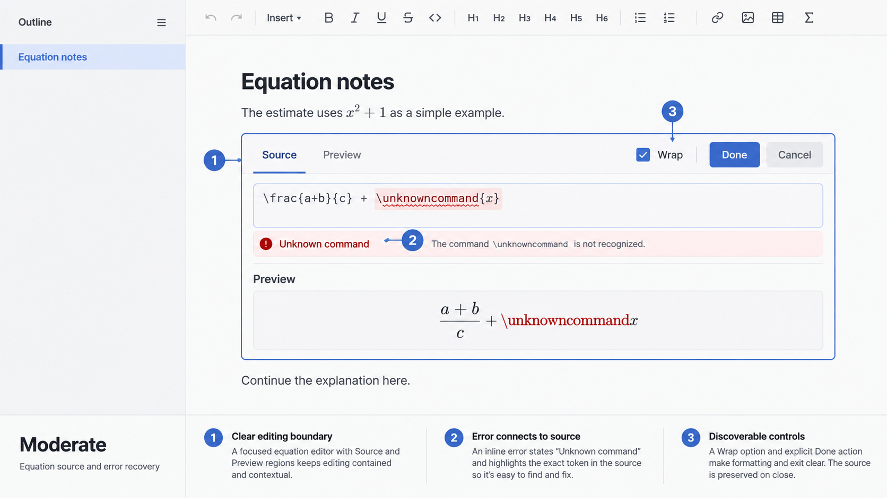

[Open full size](images/generated/07-equations-moderate.png). Static generated concept.

1. Explicit editing boundary.
2. Error connects to source.
3. Controls make wrapping and exit discoverable.

**Rationale:** A bounded editing region with Done clarifies entry and exit. Optional wrapping helps long source, while a nearby error keeps attention on the authored token.

**Practicality and tradeoff:** Medium effort. Define Done and keyboard behavior without dropping selection or edits.

<a id="07-equations-experimental"></a>

### Experimental

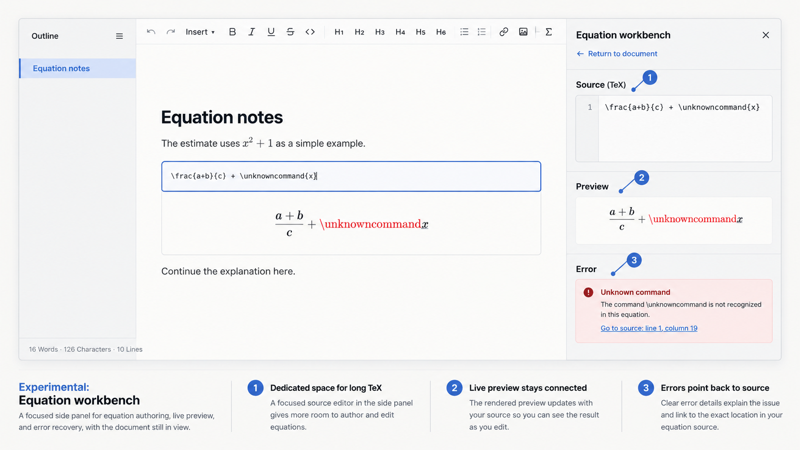

[Open full size](images/generated/07-equations-experimental.png). Static generated concept.

1. Dedicated space for long TeX.
2. Live preview stays connected.
3. Errors point back to authored source.

**Rationale:** A side workbench gives long TeX more room and keeps preview visible. It adds focus, synchronization and layout complexity and should remain optional.

**Practicality and tradeoff:** High effort. Workbench synchronization and error-location mapping need a prototype.

### Success criteria if authorized

These checks describe later implementation acceptance; they have not been satisfied by a static image.

- Unsupported TeX remains editable and survives save, source switching and export fallback.
- The error explains the problem in text and points to the relevant source where reliable.
- Mouse and keyboard users can enter and leave the equation without losing nearby prose.

<a id="08-diagrams"></a>

## 08 · Diagram errors and edit affordance

**Evidence:** Observed diagnostic overload + design judgment. **Priority:** High · error recovery.

A valid diagram renders above the invalid example. The invalid block shows a large Mermaid parser dump including token names. The renderer inserts the parser message directly into an error region. Editing is available through the block interaction, but a visible labeled recovery action would be easier to find.

**Source pointers:** [Empty diagram state](../../../src/webview/editor.js) (line 3058); [Raw parser message rendering](../../../src/webview/editor.js) (line 3070).

### Current visuals

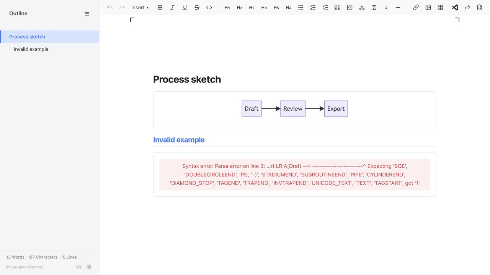

Current valid and invalid Mermaid diagrams. [Open full size](images/current/09-mermaid-error.jpg).

**Preserve:** Keep Mermaid source intact, retain a path to technical diagnostics, and preserve diagram copy/export behavior. Human summaries must fall back safely when the parser cannot identify a cause.

<a id="08-diagrams-recommended"></a>

### Recommended

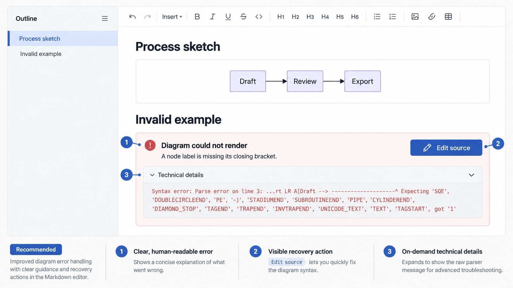

[Open full size](images/generated/08-diagrams-recommended.png). Static generated concept.

1. Concise human-readable error.
2. Visible recovery action.
3. Raw parser output is disclosed on demand.

**Rationale:** A short error, Edit source and expandable diagnostics support both novices and experienced authors. This reduces visual overload with limited workflow change.

**Practicality and tradeoff:** Medium effort. Derive reliable summaries and retain raw details without exposing private paths.

<a id="08-diagrams-moderate"></a>

### Moderate

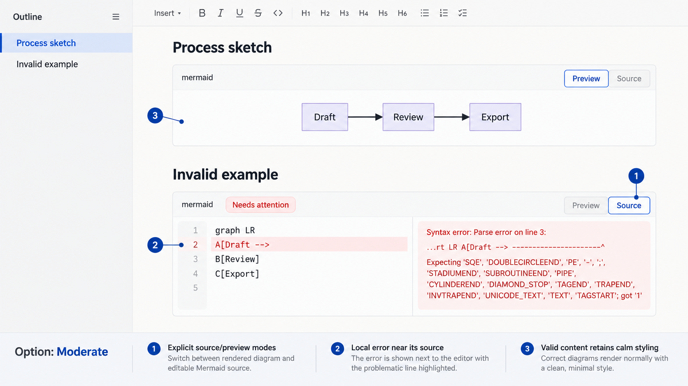

[Open full size](images/generated/08-diagrams-moderate.png). Static generated concept.

1. Explicit source/preview modes.
2. Local error near its source.
3. Valid content retains calm diagram styling.

**Rationale:** Explicit Preview and Source modes make the editing state clearer. Local line emphasis can help fix syntax when parser locations are trustworthy.

**Practicality and tradeoff:** Medium to high effort. Define source-mode and error-line behavior across Mermaid versions.

<a id="08-diagrams-experimental"></a>

### Experimental

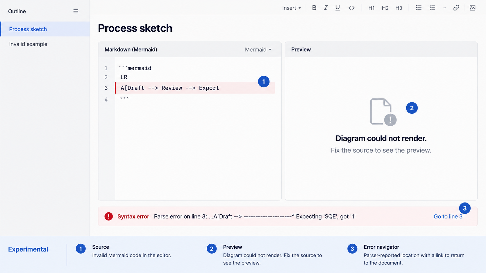

[Open full size](images/generated/08-diagrams-experimental.png). Static generated concept.

1. Source highlights the parser-reported problem.
2. Preview explains why the diagram cannot render.
3. Error navigator links a reliable parser location to source.

**Rationale:** A source/preview workspace supports large diagrams. It provides room for diagnostics but adds a separate interaction and more synchronization work.

**Practicality and tradeoff:** High effort. Workspace navigation, preview sizing and error linking require deeper design. The board illustrates error navigation; an explicit Return to document control must be added before implementing this workspace.

### Success criteria if authorized

These checks describe later implementation acceptance; they have not been satisfied by a static image.

- Valid diagrams remain unchanged; invalid source is preserved and recoverable.
- A concise summary and labeled edit action are visible; technical details remain available.
- Long parser messages do not dominate or overflow the writing pane.

<a id="09-find"></a>

## 09 · Find and Replace labeling and control hierarchy

**Evidence:** Observed labeling gap + design judgment. **Priority:** High · control clarity.

Find and Replace are represented by placeholders in a compact floating box. DOM inspection found no explicit aria-label, aria-labelledby or associated label element for either input. Filled fields therefore lose their visible purpose cue. Match count, small navigation buttons and bulk replacement share a dense layout. This is a targeted labeling observation, not a complete assistive-technology audit.

**Source pointers:** [Find and Replace input structure](../../../src/shared/editor-body-html.js) (line 125); [Search matching](../../../src/webview/editor.js) (line 15691); [Bulk replacement behavior](../../../src/webview/editor.js) (line 15837).

### Current visuals

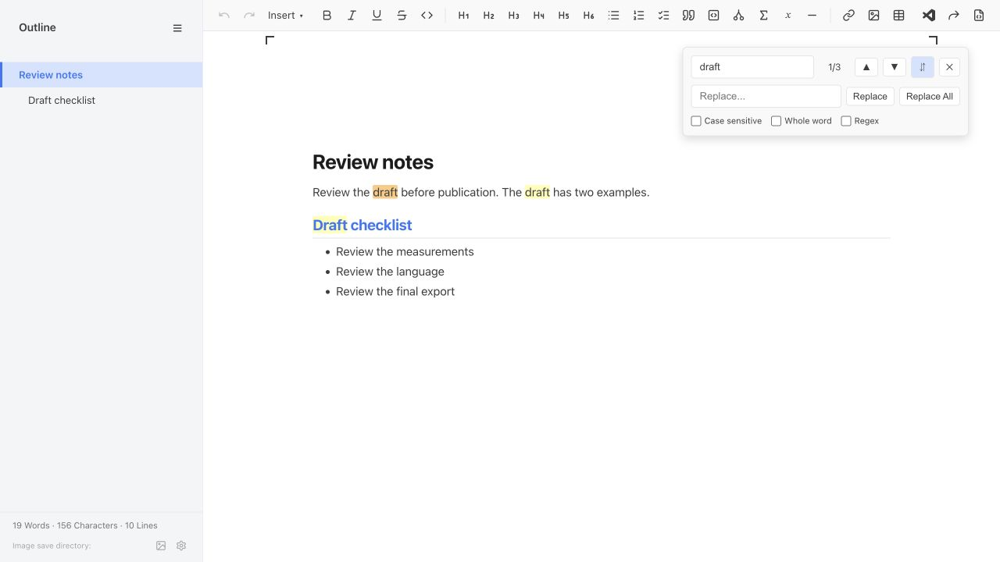

Current Find and Replace · filled Find field. [Open full size](images/current/10-find-replace.jpg).

**Preserve:** Keep current search scope, case/word/regex semantics, source and visual behavior, replacements and undo. A future scope selector must describe precisely what it changes.

<a id="09-find-recommended"></a>

### Recommended

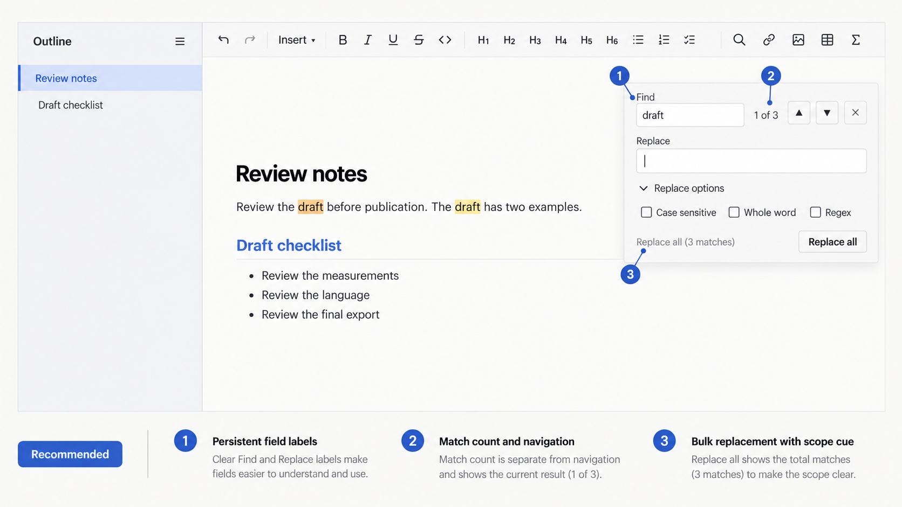

[Open full size](images/generated/09-find-recommended.png). Static generated concept.

1. Persistent field labels.
2. Match count and navigation are clear.
3. Bulk replacement has an explicit scope cue.

**Rationale:** Persistent labels and a clear count improve orientation immediately. A scope hint makes Replace all easier to distinguish from replacing one match.

**Practicality and tradeoff:** Low to medium effort. Add labels, accessible names and a less cramped layout.

<a id="09-find-moderate"></a>

### Moderate

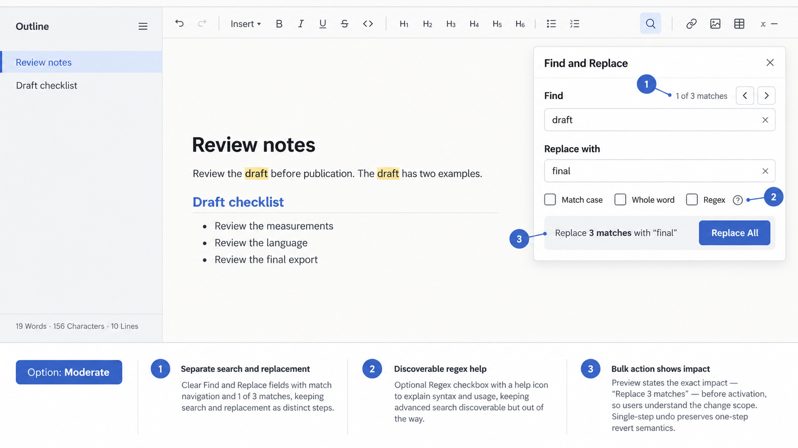

[Open full size](images/generated/09-find-moderate.png). Static generated concept.

1. Search and replacement are separate steps.
2. Regex help is discoverable.
3. Bulk action explains impact before activation.

**Rationale:** Separate Find and Replace sections guide the task in sequence. Regex help and an affected-match count clarify more advanced use.

**Practicality and tradeoff:** Medium effort. Impact count and regex feedback must stay accurate as edits occur.

<a id="09-find-experimental"></a>

### Experimental


[Open full size](images/generated/09-find-experimental.png). Static generated concept.

1. Results give context.
2. Replacement scope is selectable.
3. Highlights connect results to text.

**Rationale:** A results rail can provide context and selective replacement. It is a new interaction that needs a reliable result-to-source mapping.

**Practicality and tradeoff:** High effort. Results selection and replacement mapping need robust state and undo tests.

### Success criteria if authorized

These checks describe later implementation acceptance; they have not been satisfied by a static image.

- Inputs retain visible purpose labels when filled and have stable accessible names.
- Counts and navigation remain readable at narrow widths and high zoom.
- Replace one/all and undo preserve the intended source and accurately report scope.

<a id="10-metadata"></a>

## 10 · Metadata and generated contents ownership

**Evidence:** Design judgment. **Priority:** Medium · source ownership.

Front matter is already a disclosure containing an accessible raw-source textarea. Contents has an accessible Refresh button. These useful controls do not visually explain that YAML is authored source while the TOC is generated, or when an existing generated block refreshes. Pending [toc] blocks already have save/refresh guidance; retain that positive behavior.

**Source pointers:** [Raw front matter disclosure](../../../src/webview/editor.js) (line 2481); [Contents and refresh labels](../../../src/webview/editor.js) (line 2489); [Managed TOC refresh](../../../src/webview/editor.js) (line 2516).

### Current visuals

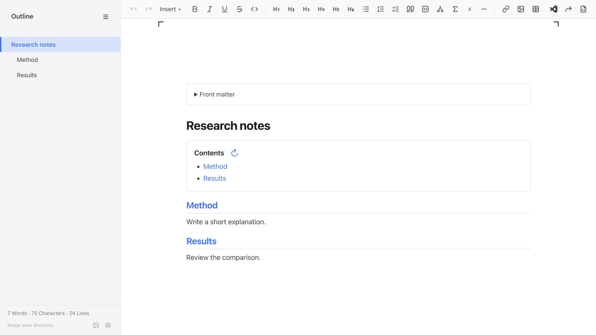

Current front matter and generated contents. [Open full size](images/current/11-metadata-toc.jpg).

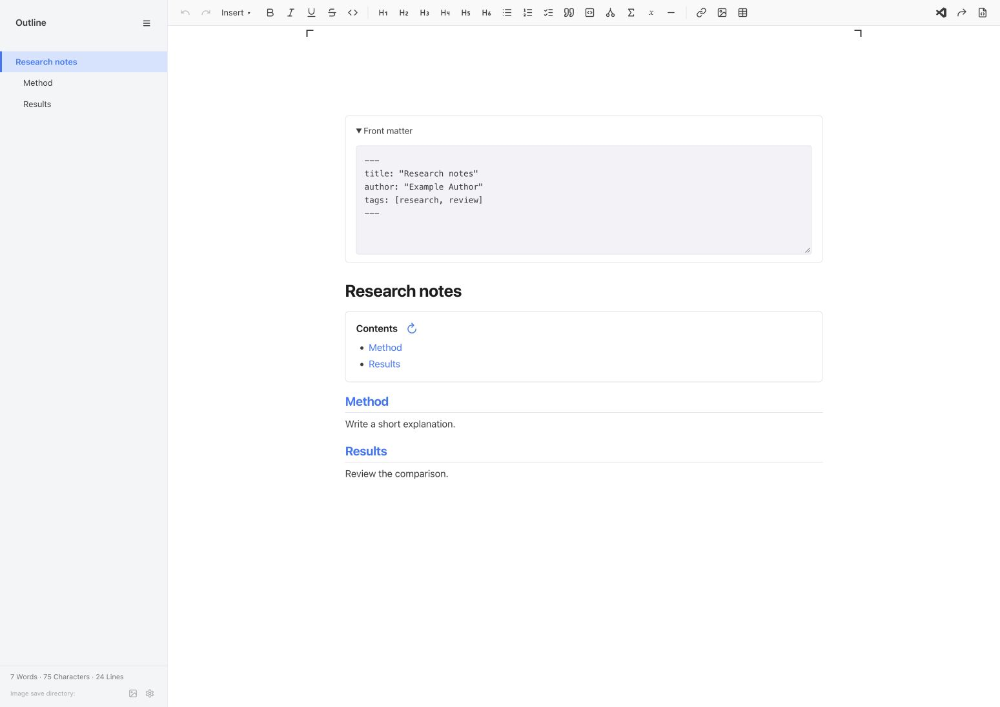

Current raw YAML editor. [Open full size](images/current/11-metadata-expanded.jpg).

**Preserve:** Keep YAML raw text, key order, comments and delimiters. Keep existing TOC ownership markers, generated heading order and refresh-on-save contract. A view disclosure must not refresh or rewrite contents merely by opening.

<a id="10-metadata-recommended"></a>

### Recommended


[Open full size](images/generated/10-metadata-recommended.png). Static generated concept.

1. Raw metadata ownership is explicit.
2. Generated entries are identified.
3. Refresh behavior is explained.

**Rationale:** Explicit YAML and Generated labels clarify ownership at little interaction cost. A visible Refresh label makes the existing capability easier to discover.

**Practicality and tradeoff:** Low to medium effort. Sync labels and help with actual refresh behavior in every host.

<a id="10-metadata-moderate"></a>

### Moderate

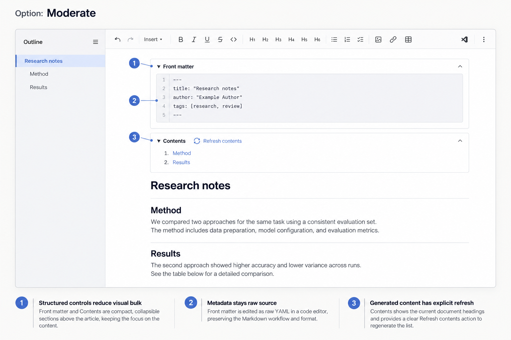

[Open full size](images/generated/10-metadata-moderate.png). Static generated concept.

1. Structured controls reduce visual bulk.
2. Metadata stays raw source.
3. Generated content has explicit refresh.

**Rationale:** A structure header groups auxiliary blocks while leaving the article primary. The metadata editor remains raw source rather than a lossy form.

**Practicality and tradeoff:** Medium effort. Disclosure placement and selection transitions need source-preservation checks.

<a id="10-metadata-experimental"></a>

### Experimental

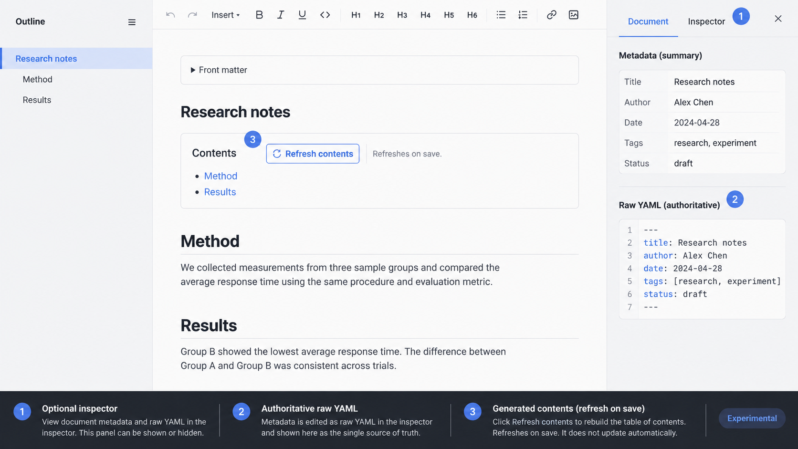

[Open full size](images/generated/10-metadata-experimental.png). Static generated concept.

1. Structure moves to an optional inspector.
2. Raw source remains authoritative.
3. Generated content management is explicit.

**Rationale:** An optional inspector can move structural controls outside the prose. A read-only summary may help orientation, but raw YAML must remain authoritative.

**Practicality and tradeoff:** High effort. A summary/inspector must handle arbitrary YAML without rewriting it.

### Success criteria if authorized

These checks describe later implementation acceptance; they have not been satisfied by a static image.

- Opening disclosures or reading a summary leaves authored YAML byte-for-byte unchanged.
- Refresh and save update only managed contents according to the established contract.
- Generated ownership and pending/stale state are understandable without icon-only cues.

<a id="11-source"></a>

## 11 · Visual and Source mode identity

**Evidence:** Observed ambiguity + design judgment. **Priority:** High · mode clarity.

Source mode shows the Markdown textarea while the full visual formatting toolbar remains visible. The active icon is blue, but there is no persistent text label naming the current mode. Open in text editor sits alongside Source as a separate icon. The switch code reads the current document before changing mode; preserve that source-current behavior.

**Source pointers:** [Host text editor and Source controls](../../../src/shared/editor-body-html.js) (line 107); [Source textarea](../../../src/shared/editor-body-html.js) (line 146); [Source-mode transition](../../../src/webview/editor.js) (line 12813).

### Current visuals

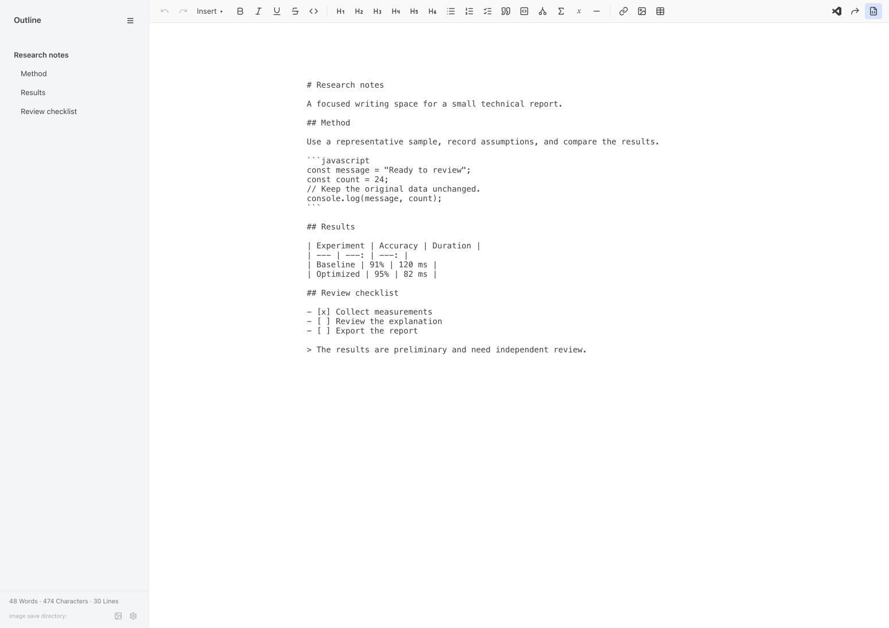

Current Source mode and utility icons. [Open full size](images/current/12-source-mode.jpg).

**Preserve:** Keep the latest edits, selection, save behavior and single document authority when switching. Open in VS Code is a separate host action; standalone hosts need their own appropriate label.

<a id="11-source-recommended"></a>

### Recommended

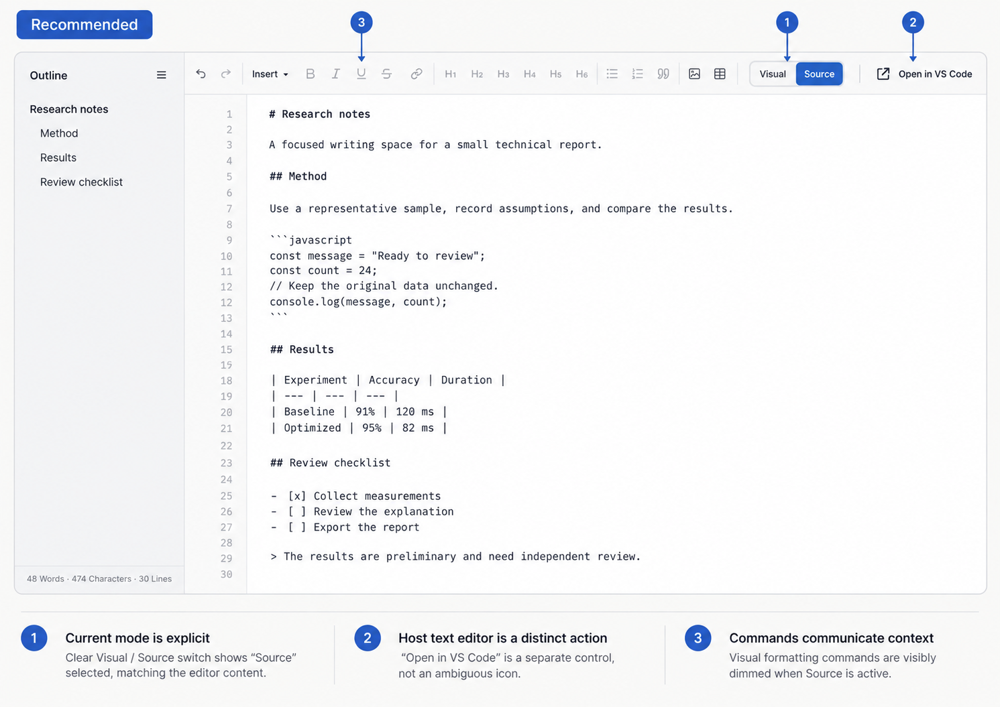

[Open full size](images/generated/11-source-recommended.png). Static generated concept.

1. Current mode is explicit.
2. Host text editor is a distinct action.
3. Commands communicate context.

**Rationale:** An explicit Visual/Source switch resolves mode uncertainty with the existing editor model. Context-aware command availability explains which actions apply.

**Practicality and tradeoff:** Medium effort. Determine applicable commands and preserve current switching semantics.

<a id="11-source-moderate"></a>

### Moderate


[Open full size](images/generated/11-source-moderate.png). Static generated concept.

1. Optional split view.
2. Visible correspondence between source and preview.
3. One document and one undo history remain the design constraint.

**Rationale:** An optional split view helps authors compare source with rendering. It needs a defined authoritative editor and synchronized position rather than two independent documents.

**Practicality and tradeoff:** High effort. Split layout and scroll/source mapping need a dedicated interaction design.

<a id="11-source-experimental"></a>

### Experimental

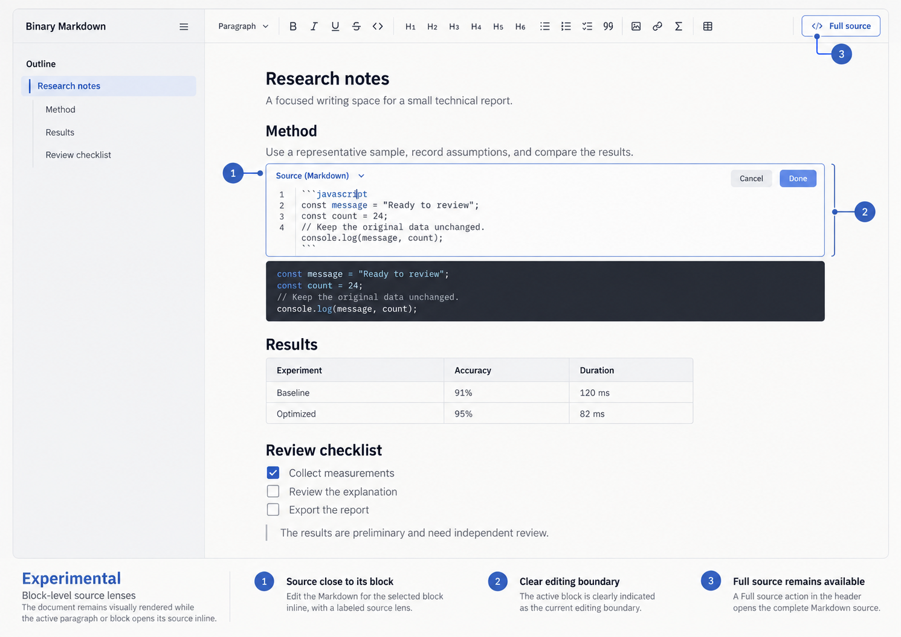

[Open full size](images/generated/11-source-experimental.png). Static generated concept.

1. Source close to its rendered block.
2. Explicit editing boundary.
3. Full source remains available.

**Rationale:** Inline source lenses bring source near the active rendered block. They are ambitious because block mapping, selection, serialization and undo must all stay coherent.

**Practicality and tradeoff:** Very high effort. Block lenses require new selection and undo architecture.

### Success criteria if authorized

These checks describe later implementation acceptance; they have not been satisfied by a static image.

- The current mode is named and visibly selected; host editor access stays distinct.
- Rapid switching captures the latest edit and never modifies a view-only document.
- Disabled or hidden commands communicate context while remaining discoverable through an appropriate path.

<a id="12-export"></a>

## 12 · Export choice, setup and recovery

**Evidence:** Mocked-state design judgment. **Priority:** High · task completion.

The current menu puts experimental and compatibility prose above the format list, then tool setup actions below it. The simulated failure state displays a message and expandable warnings, but no inline retry. These captures use injected capabilities and status to evaluate layout. They do not prove that a converter failed or that an output file was created.

**Source pointers:** [Export menu and status markup](../../../src/shared/editor-body-html.js) (line 24); [Capability-based availability](../../../src/webview/export-ui.js) (line 86); [Warning disclosure rendering](../../../src/webview/export-ui.js) (line 202).

### Current visuals

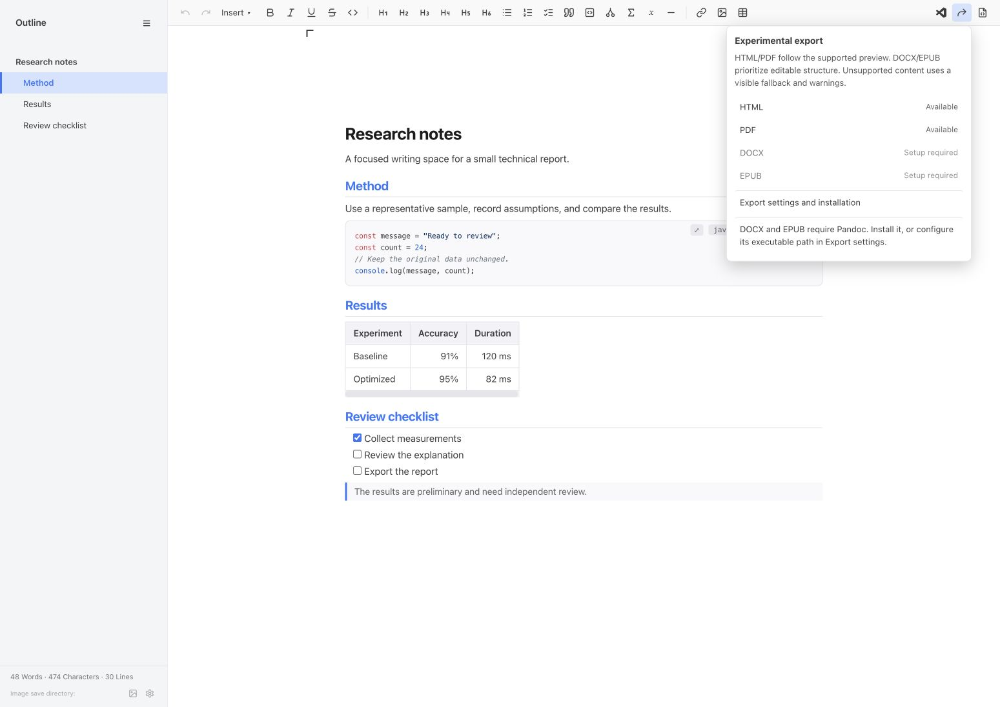

Current export menu · simulated tool availability. [Open full size](images/current/13-export-menu.jpg).

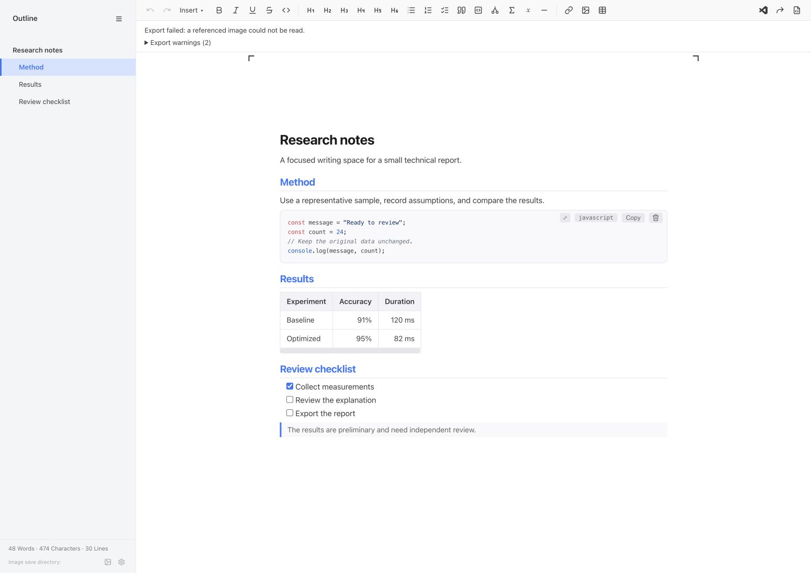

Current failure banner · simulated host status. [Open full size](images/current/14-export-failure.jpg).

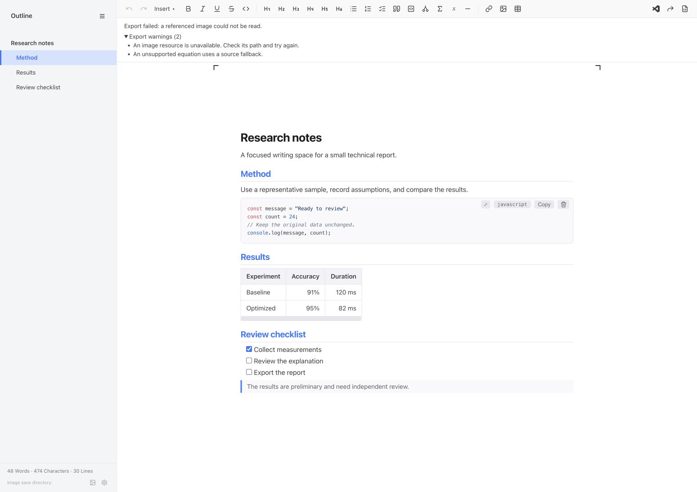

Current expanded warnings · simulated host status. [Open full size](images/current/14-export-warnings.jpg).

**Preserve:** Keep saved-revision export, current capabilities, unavailable-tool explanations, experimental/format limitations, cancellation and privacy boundaries. Retry is a proposed host action; it must recheck save state and tools. Any preview is indicative, not cross-reader fidelity proof.

<a id="12-export-recommended"></a>

### Recommended

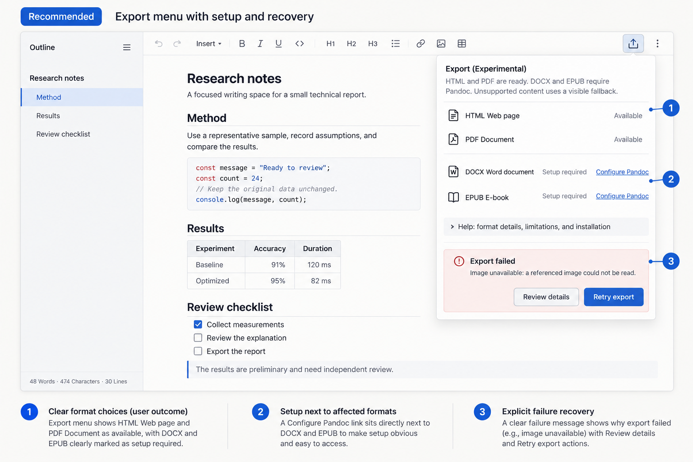

[Open full size](images/generated/12-export-recommended.png). Static generated concept.

1. Format names express user outcomes.
2. Setup sits beside affected formats.
3. Failure recovery is explicit.

**Rationale:** Outcome-oriented format labels and nearby setup make choice easier. Compact help preserves necessary limitations while a clear recovery action supports failed jobs.

**Practicality and tradeoff:** Medium effort. Localize labels, retain support text and define safe retry behavior.

<a id="12-export-moderate"></a>

### Moderate


[Open full size](images/generated/12-export-moderate.png). Static generated concept.

1. Capabilities and setup are separated.
2. Status shows the current stage.
3. Warnings and outputs have clear actions.

**Rationale:** An anchored panel can connect format, setup and job status without scattering the task. A stage label and warning count are more honest than an invented progress percentage.

**Practicality and tradeoff:** High effort. Panel lifecycle and accessible stage updates require host integration.

<a id="12-export-experimental"></a>

### Experimental

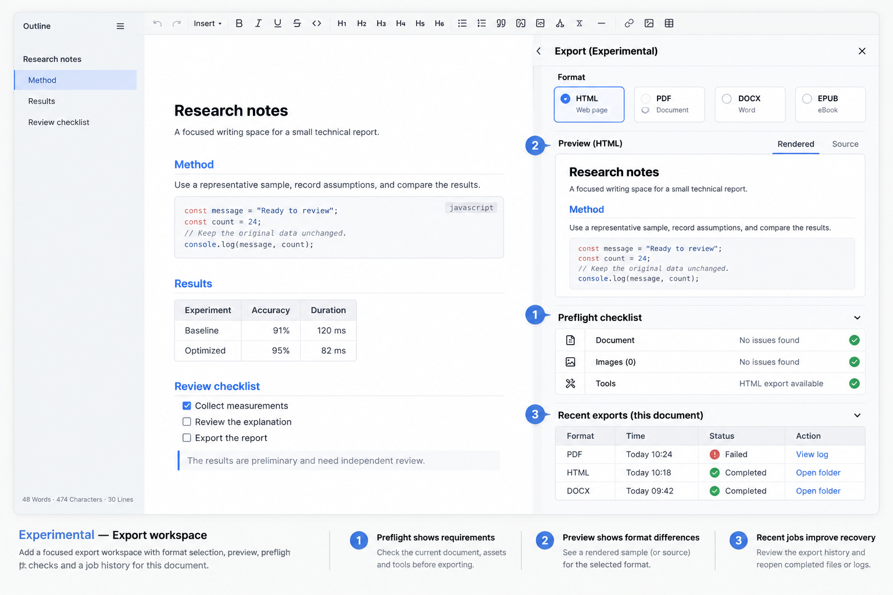

[Open full size](images/generated/12-export-experimental.png). Static generated concept.

1. Preflight makes requirements visible.
2. Preview exposes format differences.
3. Recent jobs improve recovery.

**Rationale:** An optional export workspace can support preflight and recent jobs. It is substantially new functionality and needs storage, lifecycle and reader-validation decisions.

**Practicality and tradeoff:** Very high effort. Preflight, preview and history need new contracts and explicit acceptance work.

### Success criteria if authorized

These checks describe later implementation acceptance; they have not been satisfied by a static image.

- Unavailable formats explain the missing prerequisite beside the choice.
- Progress, cancel, failure, warnings and completion are accessible and use real host state.
- Export uses the agreed saved revision and actual output-reader checks remain separate from UI approval.

## Reproduction and retained artifacts

Open `index.html` in a browser for the visual gallery; it uses only local assets and also works without a server. The Markdown report remains the authoritative written review. Current captures are in `images/current/`; final concepts are in `images/generated/`. Earlier replaced illustrations are in `images/generated/superseded/` and are excluded from the three-option set. Image hashes and dimensions are recorded in [the artifact inventory](evidence/artifacts.json). Exact generation prompts are in [the prompt inventory](evidence/generation-prompts.json).

To rebuild the unchanged-source preview, use the repository root as the working directory. Prerequisites are the recorded source revision, the exact Node version in `.node-version` (24.21.0 for this review), npm, Python 3 and a local browser. Follow the [build guide](../../../docs/building.md) for the supported environment. Do not reuse these historical visuals as evidence for another revision.

```sh
npm ci --no-audit --no-fund
npm run compile
node reports/investigations/2026-09-30-ui-ux-visual-review/evidence/build-preview.cjs
python3 -m http.server 8767 --bind 127.0.0.1 --directory .vscode-test/ui-ux-visual-review/web
```

Open `http://127.0.0.1:8767/overview.html`. Other generated pages and fixture names are listed in [capture-source.json](evidence/capture-source.json); synthetic inputs and mock export states are in [fixtures.json](evidence/fixtures.json). Interact through the visible editor: open Insert or More, search unmatched-command in the palette, select a table cell, open a code language menu, enter equation source, open Find/Replace, expand front matter, or switch Source mode. These actions recreate the kinds of states captured; exact screenshot dimensions and interactions are in [captures.json](evidence/captures.json). Browser screenshots may differ with fonts, viewport, zoom and focus state. Generation is nondeterministic; the retained PNGs and hashes identify these specific concepts.

## Validation and remaining decision

The unchanged source compiled successfully with Node 24.21.0 after `npm ci --no-audit --no-fund`. Compilation produced the source preview assets; it is not evidence that any proposed interaction is implemented. No VSIX was installed or exported document reader checked for this review. Original review checks, image inventory, source preservation and rendered-review results are recorded in the historical [validation.json](evidence/validation.json). Sharing and publication checks are recorded in [sharing-validation.json](evidence/sharing-validation.json).

The owner can authorize any option by area ID, request changes or defer it. Application implementation, product defaults, merging and product release preparation remain outside this design review. Publishing this report is for review and discussion. A selected option should first become a focused implementation plan using the preservation constraints and success criteria above.
