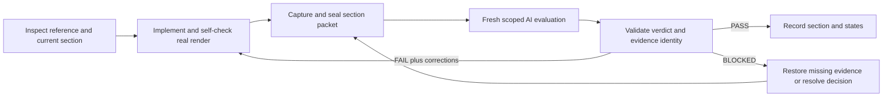

# Scoped AI visual review system design

Date: **2026-10-01**. Status: **Authorized design; implementation and section results follow in separate commits.** Base: `8540d392360cc9c33999c7a045c034ca30fe175b`. This is the first implementation-branch commit and contains design material only.

The system keeps the chosen concept visible during development and routes visible mismatches back to the builder. It reviews one component at a time: an Export assessment ignores the surrounding toolbar's unfinished design unless that toolbar obstructs Export. The [approved plan](plan.md#ai-implementation-and-evaluation-loop), [builder prompt](builder-prompt.md), and [evaluator prompt](validation-prompt.md) define the intended workflow. This design makes those instructions executable without treating functional CI as a visual verdict.

## Components and responsibilities

| Component | Responsibility | Boundary |
| --- | --- | --- |
| Selected-section registry | Carry the twelve chosen options, immutable image paths/hashes, region descriptions, exclusions, owner overrides, and capture cases from the [reference manifest](references.json). | Fixed design intent; no automatic reference regeneration or expanding exclusions. |
| Production renderer capture | Build the existing production browser fixture and capture the actual webview JavaScript/CSS at deterministic viewport, theme, locale, content, and state. Retain full views and legible component views. | Synthetic inputs; browser evidence is labelled separately from installed-extension evidence. Simulated host job states are identified as such. |
| Packet builder | Extract only the active section and its images, capture recipe, criteria, prior failure IDs, and source/build/image hashes. Store a separate packet for each iteration. | No whole-project chat history, credentials, personal documents, or unrelated design references. |
| Fresh AI evaluator | Attach the selected reference and current rendered images to a fresh Codex CLI invocation with a structured output schema. Judge only the target region. | Read-only, ephemeral evaluation; no implementation edits, publishing, or permission escalation by the reviewer. |
| Verdict validator | Reject malformed output, unknown section/state/criterion IDs, out-of-scope regions, stale source, altered images, unsupported PASS, and missing evidence. | Model output is untrusted data. Invalid or unavailable evaluation produces BLOCKED, never a fabricated PASS. |
| Builder handoff and summary | Write the discrepancy IDs, concrete corrections, and next-render criteria, and show current section results. | A FAIL returns to the implementing agent. A PASS applies only to the recorded states/revision; missing states remain pending. |

The first adapter uses the installed Codex CLI, which supports initial image attachments, ephemeral sessions, read-only sandboxing, and a JSON output schema. Keep process arguments separate from shell strings. Use the configured executable or `codex` on PATH; do not add a new SDK dependency, store API keys, change authentication, or assume an account's model availability. Ordinary capture/packet commands require no AI provider. The explicit review command uses the user's existing Codex authentication and account usage.

## State and evidence

Each iteration lives in ignored local output under `.vscode-test/visual-review/<section-id>/iteration-NNN/`. Retain reference images, full/application component PNGs, `packet.json`, structured evaluator output, a validated receipt, and the builder handoff. Keep earlier iterations intact. Curated public evidence belongs in a reviewed report under `reports/validation/`; raw evaluator logs and local runtime paths stay ignored.

| Packet field | Meaning |
| --- | --- |
| Section and state IDs | Exact component and states under review; every named case receives its own assessment. |
| Target and exclusions | Region descriptions/bounds in the reference and actual images. Exclusions do not hide a required component part. |
| Design inputs | Chosen reference hash, written intent, shared visual language, criteria, and explicit owner adjustments. |
| Capture inputs | Fixture/input hash, viewport, panel bounds, theme, locale, zoom, interaction state, runtime, and any simulated host boundary. |
| Source identity | Git revision/local-change status plus a digest of actual product/renderer inputs. A changed source invalidates an older verdict even when HEAD is unchanged. |
| Image identity | Byte hashes for every attached reference and application image. Missing, changed, or unreadable images block review. |
| Prior failures | Stable discrepancy IDs and correction/recheck criteria; the evaluator first inspects current images before checking the old list. |
| Packet identity | Digest binding the design, scope, state, capture, and source inputs to the returned assessment. |

The evaluator receives only copied packet assets in a small temporary directory outside the repository, so ancestor project rules and accumulated implementation history do not crowd the review. Preserve applicable safety rules; do not bypass approvals or sandbox protections. The prompt treats text visible in screenshots as evidence rather than instructions. No model-generated command is executed by the coordinator.

## Verdict contract

The structured response names the packet digest and section and contains one assessment for every submitted capture case. Criterion IDs and target-region IDs must belong to that packet. Discrepancies include stable IDs, severity, visible expected/observed differences, a concrete correction, and what a new screenshot must show. The coordinator checks structural and identity conditions; the AI supplies the visual judgment.

PASS requires all submitted cases to be assessable and all required criteria supported, with no Critical/Major discrepancy. FAIL requires actionable visual differences. BLOCKED covers missing, stale, incomparable, or unreadable evidence, invalid output, unavailable authentication/provider, and unresolved material scope decisions. Process success alone is not a PASS. Do not average missing requirements into a similarity percentage or automatically change baselines to clear a failure.

Out-of-scope design comments cannot lower the target's verdict. An actual obstruction is evaluated as a target defect. A full-screen capture verifies target placement, clipping, and obstruction; unrelated components are not graded. Shared changes invalidate affected results and trigger new captures. The builder rereads its packet and views the reference/current images before edits, during layout changes, after compaction, and before review.

## Implementation order and observable checks

1. Commit this system design and the approved section prompts before functional implementation.
2. Implement packet preparation, deterministic capture, fresh AI review, strict verdict validation, failure handoff, and current-result summaries. Add offline tests for path/identity validation, stale evidence, invalid/out-of-scope output, unsupported PASS, provider failure, and failure-to-retry routing.
3. Capture and evaluate the existing Insert workspace. Preserve the initial verdict. Correct its categories, row hierarchy, icons, previews, and proportions, then recapture and obtain a new scoped evaluation before expanding.
4. Apply the same loop to Tables, Find/Replace, and Outline, then the remaining chosen sections. Preserve mixed novelty choices, the table diamond, saved preferences, one editing history, source text, and restricted submenu scopes.
5. Run focused functional checks after each correction and full compilation after webview changes. Review theme/narrow/state variants and the combined screen, then verify the rebuilt installed extension and the appropriate complete regression/security gates.
6. Publish a focused PR with the first design commit, implementation commits, per-section evidence/verdicts, exact tested identity, and outstanding limits. Owner acceptance, merging, and release remain separate.

The CLI should support capture/preparation, explicit AI review, verdict import for another compatible evaluator, and current-result reporting. Review returns a nonzero status for FAIL or BLOCKED so an implementing agent can route the feedback. It does not autonomously change product code. The builder is the authorized implementing agent and performs the correction loop.

## Security and practical limits

Resolve and validate local paths, reject traversal and symlink escapes, bound image/JSON/output sizes, validate PNG inputs, avoid shell interpolation, and escape model text in reports. Use synthetic fixtures and inspect retained screenshots before publication. Keep the reviewer read-only and preserve project rendering protections such as sanitization, strict Mermaid, trusted output ownership, and bounded search execution.

A schema validator cannot prove that an AI noticed every visual defect. Fresh scoped context, explicit image inputs, evidence receipts, and repeatable correction loops make the judgment auditable, rather than infallible. Functional/security checks remain required and final owner review remains a distinct decision. Hosted CI does not need account credentials and must not make paid AI requests automatically; offline coordinator tests and deterministic browser checks can run there.
