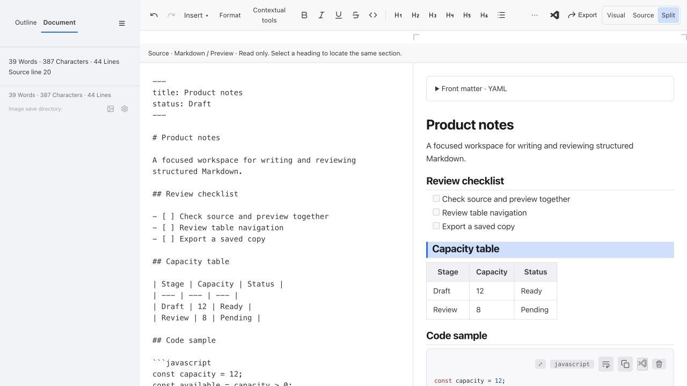
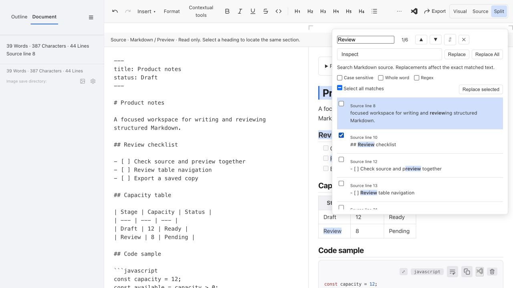
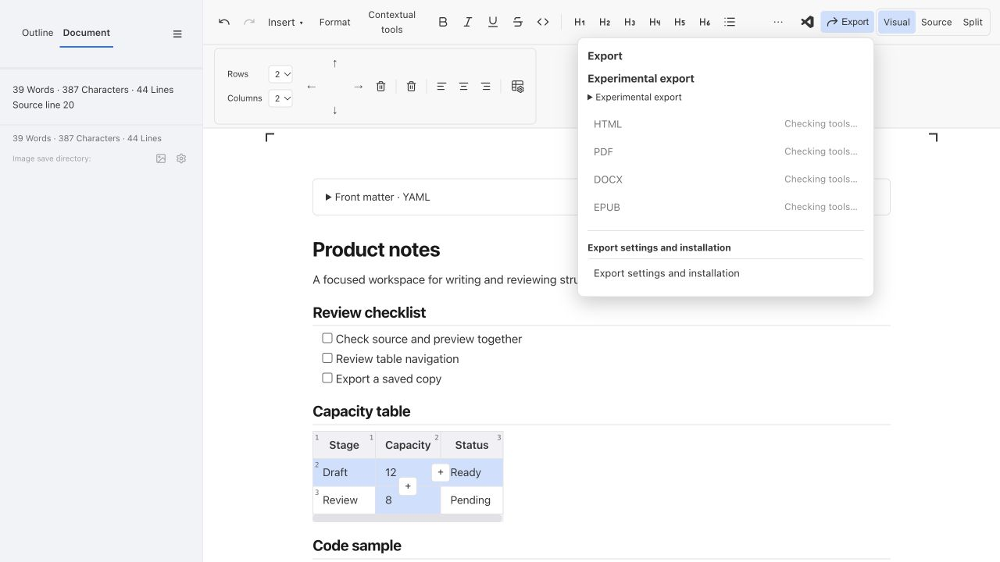
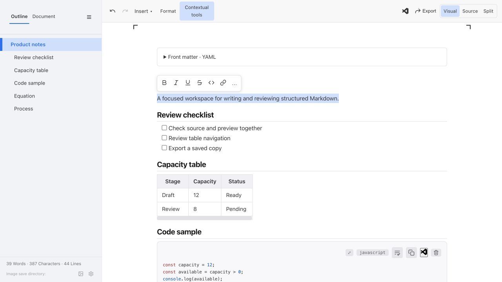
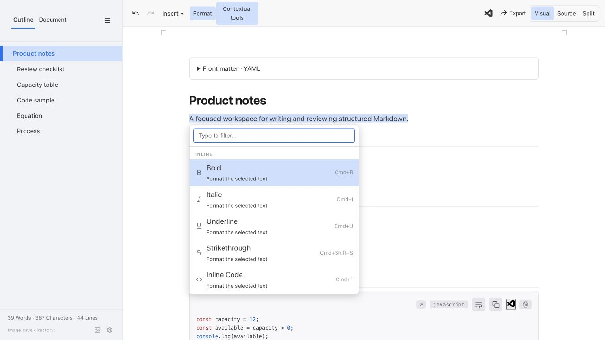

# Selected UI/UX implementation and security review

Date: **2026-10-01**. Status: **Development implementation for maintainer testing; no merge, release, or human acceptance established by this report.**

This report records the implementation of the 12 choices selected from the [visual design review](https://github.com/BinaryOutlook/binary-markdown/blob/a798921f7e5a9b01a88360315b035a391f69da47/reports/investigations/2026-09-30-ui-ux-visual-review/report.md), discussed in [design PR #94](https://github.com/BinaryOutlook/binary-markdown/pull/94). That review contains the original screenshots and the three ranked concepts for each item. This implementation record adds actual browser screenshots, the chosen behavior, a scoped security review, and a manual acceptance checklist.

## Revision and evidence scope

The feature branch is `feat/selected-ui-ux-redesign`, based on canonical `main` at `092e712baa7080ac492c7c4714c485a19e8ab2fa`. Existing stationary code copy/wrap controls from PR #93 are retained. The branch keeps the extension identifier, package version, command IDs, and saved setting defaults.

Implementation and security changes are separated into focused commits. The code and regression-test revision for the full local checks is `3c582f603b3dd3189775d146581c915594fc27b2`; subsequent documentation records those checks. Supplemental shared-native table preflight applies to test revision `6475f1ceb1dbdcf2301a61e586cb40acd007c597`, which changes test assumptions and adds two shared-harness browser cases without changing product code. The local environment uses Node **24.21.0** on **macOS ARM64**, Playwright **1.58.1**, and bundled Chromium **145.0.7632.6**. The implementation PR's exact head and **Checks** identify hosted CI results, including installed-VSIX and converter checks; this local record does not replace those results.

Pull-request CI packages GitHub's test merge revision of the PR head with `main`. Its candidate artifact name and build information record that tested revision, which can differ from the branch head. Use the source identity of the matching successful CI candidate when installing and reporting manual results.

The screenshots were captured from the compiled feature-branch browser fixture at 1280 × 720 using a synthetic document. They show implemented interfaces rather than generated concepts. The fixture does not have a VS Code export controller, so its Export screenshot honestly shows **Checking tools…**; completed exports and output opening are covered by the automated host/UI checks and require installed-extension review. No real document, account, image directory, conversion output path, or machine identifier appears in the images. All ten JPEGs were inspected for content and contain no EXIF or XMP metadata.

## Selection-to-implementation mapping

The design language uses restrained spacing, theme-derived colors, plain labels, lightweight borders, and explicit focus and selection states. Changes share existing editing commands and history rather than introducing independent document state.

| Item | Selected direction | Implemented behavior and rationale | Main evidence |
| --- | --- | --- | --- |
| 1. Writing canvas | Recommended | Reduce excess vertical padding, quiet heading and width-guide treatments, and retain the configured column width/alignment. More document content fits without changing authored Markdown or layout defaults. | [Canvas](#canvas-and-outline) |
| 2. Toolbar | Experimental, optional | Session-only **Contextual tools** toggle shows a formatting strip for selected prose. **Format** retains a searchable command fallback, including history and view actions. Saved Full/Simple choices remain usable. | [Contextual toolbar](#optional-contextual-toolbar) |
| 3. Commands | Experimental Insert; Moderate elsewhere | Insert becomes a searchable, categorized workspace with descriptions, Markdown examples, and unavailable-context explanations. The Action Palette adds descriptions and recovery from empty searches without changing editing commands. | [Insert](#insert-workspace), [palette](#action-palette) |
| 4. Outline | Experimental | An **Outline / Document** rail combines heading navigation, statistics, and reading progress. Heading navigation also locates source in Source/Split. Small panes use an overlay without changing the stored desktop preference. | [Canvas](#canvas-and-outline), [Split](#split-and-document-rail) |
| 5. Tables | Experimental with directional diamond | Above/left/right/below arrows form the requested diamond. Row/column selectors navigate; selected row/column feedback and boundary **+** controls clarify the target. Existing placement, alignment, deletion, and protected-header/last-column rules remain active. | [Table tools](#spatial-table-tools) |
| 6. Code | Moderate | Retain anchored copy/wrap/language controls, add **Open in Text Editor**, and adjust syntax colors for readable contrast across seven themes. View wrapping does not add source line breaks. | [Block controls](#code-equations-and-diagrams) |
| 7. Equations | Recommended | Label Source/Preview, explain Shift+Enter, and provide bounded plain-text diagnostics and a source line when available. Retain source-position/wrap settings and editable TeX without rewriting invalid input. | [Block controls](#code-equations-and-diagrams) |
| 8. Diagrams | Moderate | Mermaid Source/Preview controls and visible parser feedback make the current state explicit. Strict rendering limits document-defined HTML interactions and callbacks. | [Block controls](#code-equations-and-diagrams) |
| 9. Find/Replace | Experimental, submenu only | Search Markdown source, show context and source lines, select replacement targets, and share one undo history. Worker isolation bounds expensive regex work and result rendering. Literal replacement avoids interpreting replacement text as markup. | [Find/Replace](#find-and-replace) |
| 10. Metadata | Recommended | **Front matter · YAML** and **Contents · Generated** distinguish editable source from generated content. **Refresh** and save-time help explain TOC maintenance; disclosure alone remains view-only. | [Front matter](#front-matter), metadata regressions |
| 11. Views | Moderate Split; Recommended Visual/Source | Explicit view controls share one editable source, save route, and history. Split provides a live, read-only preview, with stacked panes at small widths. Visual selection/source mapping preserves literal text where a counterpart exists. | [Split](#split-and-document-rail) |
| 12. Export | Moderate, submenu only | Keep format availability, setup, actual stage, cancellation, warnings, and completion together in an anchored panel. **Open exported file** accepts no client path and uses only the host's completed output. | [Export](#export-submenu), export host/UI regressions |

No spreadsheet formulas, table merging, multi-cell editing, dual-editable Split document, external search provider, or fabricated export progress was added. Full/Simple and existing view/format shortcuts continue to route through the current editor.

## Implemented visuals

### Canvas and outline

**Pointers:** The left rail adds tabs and reading progress. The document starts closer to the toolbar, headings remain legible with less ornament, and existing width marks retain their preference. The screenshot shows actual document controls with synthetic content.

### Insert workspace

**Pointers:** Search opens with focus. Categories provide a narrow list of relevant operations; each choice explains its result and shows syntax. The scrollable list keeps all eight insertion commands reachable. Canceling returns to the retained document selection.

### Spatial table tools

**Pointers:** The diamond encodes insertion direction spatially. Rows/Columns select a destination without editing; shaded row/column context and small boundary **+** buttons identify the target of an edit. This screenshot intentionally selects the existing **Always in top bar** placement. Automatic and fixed placements remain available, with compact menus in narrow panes.

**Manual-review limit:** Fixed floating placements retain the existing viewport-clamping behavior. In a narrow 500 px pane, the enlarged fixed **Left** inspector can overlap the first table cell and obstruct a pointer click. Inspect this case during visual acceptance; **Automatic** or **Always in top bar** provides an alternative placement. The installed harness's DOM activation checks do not establish pointer reachability for this case.

### Code, equations, and diagrams

**Pointers:** The code header keeps copy, wrap, language, and host text-editor access together. Equation and Mermaid headers identify their content and explain how to exit editing. Mermaid Source/Preview controls expose its current mode. Invalid input has a separate diagnostic state covered by tests; this screenshot shows valid synthetic inputs.

### Split and Document rail

**Pointers:** Explicit labels establish which pane accepts edits. One source document drives the preview, including metadata and table syntax. The rail displays statistics and source position. An Outline selection locates the corresponding heading; literal text maps between Visual and Source where possible, while hidden syntax and transformed equations can require direct Source navigation.

### Find and Replace

**Pointers:** Source-line context makes each match assessable before replacing. Individual checkboxes and **Replace selected** allow a narrower edit. The screenshot has one selected result and replacement text entered; replacement has not been applied. Search intentionally includes Markdown syntax and metadata. Regex feedback, timeouts, result caps, and one-step undo have automated coverage.

### Export submenu

**Pointers:** Availability and setup stay beside the chosen format. This fixture lacks a host capability response, so format buttons show **Checking tools…**. Real job stages are indeterminate, and completion supplies the host-recorded output and expandable warnings; the screenshot does not establish an actual export or a converter pass.

### Optional contextual toolbar

**Pointers:** Selected prose receives a compact strip close to its context. Full command access remains under Format, and the optional toggle restores the normal formatting row. Protected code/equation/generated contexts and Source/Split do not receive visual formatting edits.

### Action Palette

**Pointers:** Descriptions explain effects, shortcuts remain visible, and keyboard navigation uses enabled choices. Formatting, insertion, history, views, search, Outline, and host utilities remain discoverable. Empty searches provide a clear recovery action.

### Front matter

**Pointers:** The title distinguishes YAML source from document prose. The disclosure edits the original metadata text rather than regenerating key order or comments. Generated contents have a separate label and Refresh action; both remain outside prose statistics and exported editor chrome.

## Scoped security audit

The review covers changed dependencies, browser rendering and new DOM paths, regex search, view-only behavior, export messages/output access, and public report material. It is not a whole-application penetration test or a guarantee that the existing application has no vulnerabilities.

| Area | Finding or boundary | Change and verification |
| --- | --- | --- |
| Dependencies | The initial audit identified a low-severity advisory in DOMPurify 3.4.15. | Update the lockfile to 3.4.16, reinstall, and rebuild the bundled vendor assets. The [published advisory](https://github.com/advisories/GHSA-p98j-92pf-mc4p) identifies the patched version. Final `npm audit --json`: **0 known vulnerabilities** across 626 installed dependencies. This does not claim a demonstrated exploit in this application. |
| Inline formatting | Selected literal HTML must not become active HTML when wrapped in inline code. | Escape the selected text before the existing inline-code insertion. Browser coverage verifies that a literal image/event-handler string becomes code text without an image element. |
| Diagnostics and search results | Document text, regex matches, and parser errors are untrusted strings. | New labels, context, warnings, and diagnostics use plain-text DOM construction. Parser details are bounded; KaTeX diagnostic rendering uses `trust: false`, and Mermaid uses strict security mode. |
| Regex availability | A pathological regex can block the editing thread if evaluated there. | Run static matching code in a local worker, terminate on the 500 ms deadline, exclude zero-length replacement targets, cap results at 10,000, and display result rows in batches. Invalid, zero-length, and pathological patterns have browser coverage. |
| Worker policy | Search requires a local blob worker in the webview. | Add `worker-src blob:` for static bundled worker code; user query/source travels through messages, not executable source interpolation. Existing unrelated CSP directives remain. The review does not characterize the baseline CSP as fully hardened. |
| Export output | A webview-supplied path must not select an arbitrary file to open. | The bridge sends no output path. The controller opens only its host-recorded finalized output and rechecks trust/local-host/disposal constraints. Unit coverage rejects pre-completion requests, ignores forged client paths, and covers revoked trust/disposal. |
| Editing boundaries | View controls and Split preview must not dirty or independently edit source. | Reuse one history/save path, disable visual format/insert actions in source views, disable preview inputs, and guard inline-equation editing. Browser coverage checks clean snapshots, shared Undo/Redo, selection mapping, and read-only preview interactions. |
| Public evidence | Screenshots, prose, metadata, and logs can expose personal information. | Use synthetic document values and project-relative links. Inspect all image content and JPEG metadata. Keep raw logs/traces, local paths, account data, and conversion output locations out of the report. Run the repository documentation/privacy checker and review staged paths before publication. |

Strict Mermaid rendering deliberately restricts callback/HTML interactions that permissive diagrams may previously have attempted. Replacement text is literal even when Regex is enabled. These behaviors are documented in the [editor guide](../../../docs/editor-guide.md).

## Validation and remaining acceptance

The final local validation results are recorded after the clean regression run. Earlier runs exposed stale broad test selectors and old toolbar/palette assumptions, plus a real table row-number reflow issue that shifted focused inline-equation targets. The implementation makes row/column numbers out-of-flow so focusing a cell no longer moves its content. Those earlier failures are not counted as passes.

An [initial hosted run](https://github.com/BinaryOutlook/binary-markdown/actions/runs/36776653882) passed packaging, units, real converters, and archive parity, but all four installed-extension lanes stopped at the shared table-overflow watchdog. That helper expected **More** at 520 px, where the directional controls now fit inline. The correction uses the existing browser regression's 420 px pane and updated action order, retains all reachability/selection/undo assertions, and adds shared overflow and contextual-row preflight cases. Its final focused run passed all 35 checks; the current implementation PR's checks establish the replacement candidate's hosted result.

| Check | Result and limit |
| --- | --- |
| `npm run compile` | Pass, including TypeScript, seven locales, shared/browser assets, and vendor copying. |
| `npm run lint` | Pass with 0 errors and 11 existing warnings. |
| `npm run test:unit` | 360 tests: 341 passed and 19 explicit prerequisite-dependent skips. Local skips do not establish real-converter/package validation. |
| `npx playwright test --workers=2 --max-failures=5` | **1,220 passed**, 0 failures, and no retries in the clean full local run (7.0 minutes), including the selected-design and legacy editing regressions. |
| Supplemental table preflight | **35 passed**, including two new cases that reuse the shared native overflow/contextual-row checks. Pointer checks use the existing browser cases; the shared contextual-row preflight uses the installed harness's DOM activation contract. |
| `npm audit --json` | 0 known vulnerabilities after the DOMPurify patch. |
| Markdown/privacy and whitespace checks | Repository checker passed: 65 text files and 533 local links, with no common private-data patterns. `git diff --check` passed. Six affected Markdown files received separate complete raw-source/diff and rendered-browser reviews. Tables, images, paragraphs, lists, and code fences were checked; no remaining layout issue was identified. |
| Hosted CI | Check the implementation PR's exact head and per-lane results. The required **VSIX validation** gate includes Linux, macOS, Windows, and minimum-supported VS Code. |
| Maintainer testing | Pending. Visual acceptance and real document-reader behavior remain the maintainer's decision. |

See the [testing guide](../../../docs/testing/README.md) for the complete gate definitions. Local browser tests exercise the production HTML fixture and legacy editing regressions; a browser fixture pass does not establish installed-extension behavior or export reader acceptance.

## Manual review checklist

Install the development VSIX from the implementation PR's successful CI artifact, or follow the [source build and installation guide](../../../docs/building.md). Inspect **Binary Markdown: Copy Build Information** and compare its source commit with the revision encoded in that CI candidate's artifact name before reporting a result. For a source build, compare it with the clean local build revision. Save a disposable document and test with non-private inputs. See [export help](../../../media/export-help.md) for local tools and workspace prerequisites.

| Item | Suggested acceptance check |
| --- | --- |
| Canvas | Compare short and long documents, all seven themes, configured widths/alignment, and small panes. Confirm comfortable spacing and readable focus states. |
| Toolbar | Use saved Full and Simple choices; turn contextual tools on/off, format selected prose, and find commands through Format and narrow-pane overflow. Reopen to check the session-only toggle behavior. |
| Commands | Search each Insert category, cancel with Escape, inspect unavailable contexts, and confirm insertions use the retained caret/selection and undo once. Check Action Palette keyboard navigation and empty-search recovery. |
| Rail | Navigate headings in all three views, switch tabs, inspect statistics/progress, and open/close the narrow-pane overlay. |
| Tables | Use all four diamond directions, row/column selectors, both boundary **+** actions, alignment/deletion, protected headers/final columns, wide-table scrolling, and every stored placement. Undo actual edits and confirm navigation alone leaves source clean. |
| Code | Scroll a long line, copy exact text, wrap/unwrap, search languages, open in the text editor, and check syntax colors in your themes. Confirm source blank lines/indentation survive saving. |
| Equations | Edit valid and invalid TeX, inspect diagnostics, use Shift+Enter, and check both source positions and wrapping. Confirm view-only actions retain the original expression. |
| Diagrams | Switch Source/Preview, edit valid/invalid Mermaid, review errors and Undo, and inspect any existing diagrams that depend on callbacks or HTML interactions. |
| Find/Replace | Search repeated prose and source syntax, choose selected replacements, Undo/Redo once, and try invalid/zero-length/expensive regex. Verify literal replacement and unchanged surrounding source. |
| Metadata | Expand/collapse YAML without edits, modify a comment/key deliberately and Undo, and refresh generated contents on request and save. |
| Views | Switch Visual/Source/Split around a selection, edit source and observe live preview, Undo across modes, save/reopen, and verify that preview tasks/equations cannot edit. |
| Export | In trusted local VS Code, review availability/setup, export saved HTML/PDF/DOCX/EPUB, cancel a job, inspect warnings and output, and open the completed file. Inspect the result in your intended reader. |

Record the tested source commit, setting/theme, sample, action, and observed outcome. Approval of the design, merging, and publishing a release are separate decisions after this implementation PR is reviewed.
