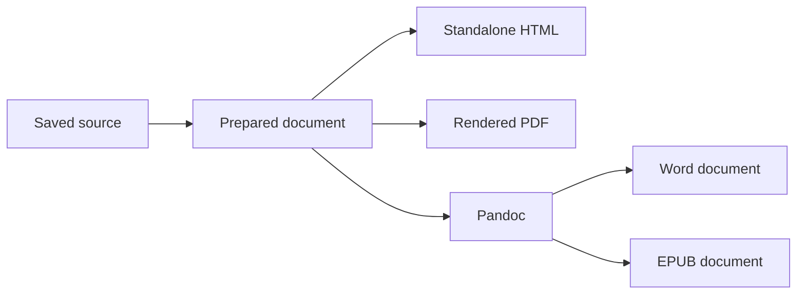

# Export mixed-content reference

BASIC-FIRST-MARKER: This is an original, saved Markdown export fixture.

[TOC]

## Text and structure

This paragraph contains **strong emphasis**, *emphasis*, ~~deleted wording~~, and `inline_code`. Unicode text includes café, naïve, Ελληνικά, 中文, and 日本語. These words are content, not filenames or instructions.

1. Capture the saved revision.
2. Prepare its resources.
   - Keep the selected document identity.
   - Preserve each supported block.
3. Save the completed artifact beside the source.

- [x] A completed checklist item.
- [ ] An incomplete checklist item.

> A quoted note should remain recognizable as a quotation.

| Item | Expected representation | Quantity |
| --- | --- | ---: |
| Paragraph | Editable text | 1 |
| Diagram | Packaged vector or compatible image | 1 |
| Image | Original source resolution | 1 |

## Code and mathematics

```typescript
const BASIC_CODE_FIRST = "saved revision";
const pathExample = "assets/Field sample 图像.png";
const metadataExample = "IMAGE_DIR: keep this code literal";
const BASIC_CODE_LAST = `${BASIC_CODE_FIRST}: ${pathExample}`;
```

The inline equation $a^2+b^2=c^2$ accompanies a single-line display equation:

$$
E = mc^2
$$

## Diagram and image




The PNG is 2400 by 1600 pixels. Resizing its display is acceptable; reducing its stored source resolution intentionally is not.

## Links and footnote

[Jump to the end marker](#end-marker). An ordinary [documentation link](https://example.com/export-reference) must remain a link and must not trigger a resource fetch merely because it appears in the document.

The footnote has an independent text marker.[^basic-note]

[^basic-note]: BASIC-FOOTNOTE-MARKER: The note belongs to the saved source.

<div><strong>BASIC-HTML-MARKER</strong>: An ordinary raw HTML block contains visible text.</div>

## End marker

BASIC-LAST-MARKER: Every supported block before this sentence belongs in the export.

---
IMAGE_DIR: assets
FORCE_RELATIVE_PATH: true
