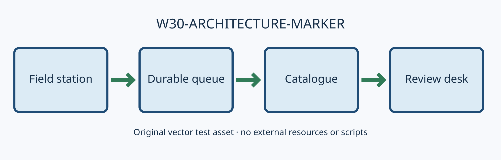
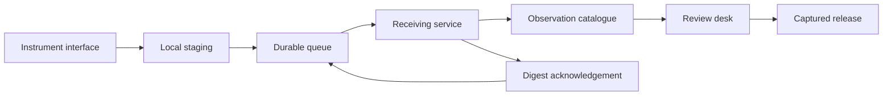
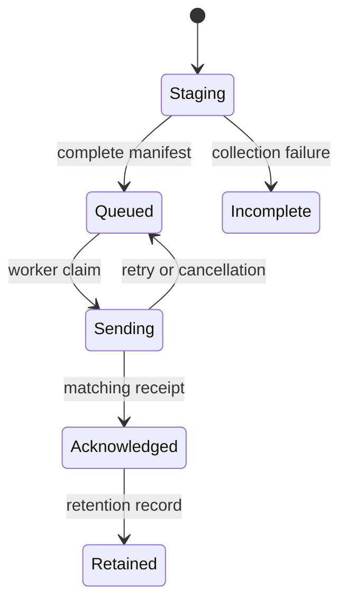
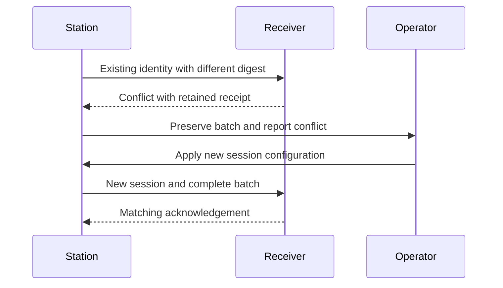

# Tern Observatory — synthetic engineering assessment

W30-FIRST-MARKER: This original report is a fixed Markdown export workload. The organization, station names, measurements, incidents, quotations and decisions are fictional. It is a document-rendering test, not scientific evidence, security advice, or a statement about an operating system.

[TOC]

## 1. Executive assessment

Tern Observatory is a fictional coastal observation service designed to collect modest quantities of environmental measurements from several independent field stations. Its purpose in this report is to give the reader a coherent technical problem with enough variety to exercise a document converter. The network has instruments, operators, local storage, a receiving service, a searchable catalogue and a review desk. Each part produces a different kind of evidence. A measurement is useful only when a later reader can explain what was measured, how the record reached the catalogue, and which corrections were applied before publication. A colourful dashboard alone does not answer those questions.

The assessment follows one imaginary observation from its creation at a remote station to its inclusion in a monthly report. Along that path, it considers identity, clock uncertainty, interrupted transfer, duplicate delivery, quality flags, configuration changes, human review and recovery. The design separates raw records from interpretations so that a revised interpretation does not erase the original reading. It also separates an operator's intention from the system's observed result. For example, a successful request to restart a station is not evidence that the station resumed collecting valid measurements. The receiving service must observe fresh records carrying the expected configuration before the incident can be closed.

The proposed initial service is deliberately small. Four stations send batches to one receiving site. Operators review exceptions during a staffed shift, and an offline copy holds the latest acknowledged batches. The small installation makes ownership understandable while retaining difficult boundaries: a station can disconnect, a disk can fill, a credential can expire, and a person can make a correction after a report has been assembled. Expanding to more stations would require fresh capacity and operating evidence. This report does not infer that a small demonstration establishes the safety or reliability of a larger deployment.

The conclusion is conditional. The architecture is suitable for an incremental demonstration if the team can trace records through every state transition, reproduce a recovery from an empty receiving machine, and explain every omitted or altered observation. The demonstration should retain a few deliberately awkward cases rather than polishing only the happy path. A late packet, an unfamiliar unit, a damaged batch and a missing image provide useful evidence about whether the system preserves its reasoning when something goes wrong. Those cases recur in the appendices because a review record should remain intelligible after the original authors have moved on.

| Decision | Initial choice | Evidence needed before expansion |
| --- | --- | --- |
| Raw observations | Append-only batches | Original digest survives transfer and restore |
| Quality corrections | Separate revision record | Earlier and later interpretations can be compared |
| Transfer | Acknowledged batches with retry | Duplicate delivery does not duplicate catalogue rows |
| Operations | One named duty owner | Escalation can be followed from a written record |
| Publication | Reviewed release snapshot | A published claim links to its captured inputs |

> Review note: A demonstration is strongest when its limits are visible beside its results.

## 2. Scope, audiences and vocabulary

The scope covers the movement and interpretation of fictional records. It does not prescribe the construction of a sensor, claim a calibration method for real instruments, or describe controls for a critical infrastructure deployment. The design assumes that an instrument emits a value, unit, local sequence number and a timestamp estimate. The field station packages those values with configuration information. A receiving service checks the package and creates durable catalogue entries. A reviewer then decides whether a record is suitable for a particular report. These activities have different owners and different failure conditions, even when one person performs several roles in the demonstration.

The intended audiences are an implementer, an operator and a reviewer. The implementer needs concrete state transitions and examples of rejected input. The operator needs actions that can be taken while a station is offline or producing unusual records. The reviewer needs evidence that supports the words appearing in the final publication. A useful document lets all three readers follow the same record without forcing them to adopt the same terminology for every task. The glossary therefore distinguishes a batch, an observation, an interpretation and a release. Treating those as interchangeable would make later discussions about deletion or correction dangerously ambiguous.

An observation is the immutable value received from the instrument interface. An interpretation is a statement about that observation under a named rule set, such as whether its unit is recognized or whether it lies inside a configured demonstration range. A batch is a transport container holding ordered observations and a manifest. A release is a fixed selection of reviewed interpretations with their provenance. None of these nouns implies that the underlying measurement is scientifically accurate. The report uses the word valid narrowly: valid syntax means the record can be parsed; valid transfer means the bytes match; valid for publication means the reviewer has completed the declared checks.

The exercise also separates missing information from negative evidence. If a station sends no records, the catalogue cannot infer that the measured quantity was zero. If a reviewer has not examined a batch, the user interface should not present that batch as rejected. An unknown state is useful information when its cause is visible and an owner can resolve it. This principle applies to progress messages as well. A conversion, transfer or recovery stage may remain active without a meaningful percentage. Reporting the operation actually underway is more informative than inventing apparent advancement from the passage of time.

- **Observation:** one immutable instrument record with a station identity and sequence number.
- **Batch:** a transport package with a fixed record list and digest.
- **Interpretation:** a separately versioned quality decision about an observation.
- **Release:** an explicitly reviewed snapshot intended for another reader.
- **Unknown:** a state in which the available evidence does not justify a positive or negative conclusion.

The fictional names include North Jetty, Salt Meadow, Beacon Ridge and Quiet Inlet. They are labels for test data, not actual locations. Unicode labels such as Café Station and 海岸觀測 appear in selected records to exercise text preservation.

## 3. Context and information flow

The context diagram presents four logical roles. A field station owns short-term collection, a durable queue decouples collection from connectivity, a catalogue makes acknowledged records discoverable, and a review desk assembles releases. The arrows describe a transfer of responsibility rather than a guarantee that a packet travels only once. Repeated delivery is expected after interruption. The receiving side must recognize the stable batch identity and answer consistently when the same bytes arrive again. A duplicate identifier carrying different bytes is a separate conflict, because silently choosing either version would hide a disagreement about the historical record.

The field station first writes a complete batch into a local staging area. It closes the file, calculates the digest and promotes it into the outgoing queue. The transport layer can then retry the batch without reconstructing it from changing live data. At the receiving site, a temporary file holds incoming bytes until the declared length and digest have been checked. Only a completed package becomes visible in the durable catalogue. This ordering prevents a reader from mistaking a partially transferred file for a short but legitimate batch. The receiver's acknowledgement names the accepted identity and digest so the sender can verify what was accepted.

The review desk consumes catalogue records through a captured query result. While a reviewer is preparing a release, new observations may arrive, and earlier observations may receive new interpretation records. Those changes should not silently alter a release that has already been assembled. Instead, the release records the exact input identifiers and interpretation versions that it used. A later release can choose newer data and explain the difference. This approach makes a review reproducible without freezing the entire operational catalogue. It also makes cancellation straightforward: abandoning an unfinished release does not delete the observations it was considering.

The context includes ordinary documentation links, but those links do not authorize a background crawler. A report can cite [an example external reference](https://example.com/tern-observatory/reference) without fetching the referenced site as a required image or stylesheet. By contrast, the local architecture image below is a required rendering resource. That distinction matters for a portable export. The final artifact should contain the image needed to explain the report, while leaving a normal hyperlink available for the reader to follow deliberately. An offline review should preserve the report's content even when the cited website cannot be reached.





## 4. Record identity and immutable evidence

Every observation needs an identity that survives transport, reordering and later interpretation. The demonstration uses a station identifier, a boot-session identifier and a monotonically increasing local sequence number. The boot-session component avoids reusing an observation identity when a device restarts and its counter begins again. The identity is not a substitute for the content digest. Two records can claim the same identity while containing different values, and the receiver must expose that conflict. Conversely, two legitimately distinct observations can contain equal values. Deduplicating solely by the numerical reading would erase real records.

The raw observation is serialized in a documented order before it is included in a batch. A reviewer should be able to distinguish the instrument's text from values introduced during interpretation. For example, an input unit might be written as `degC`, while a presentation layer shows a degree symbol and the letter C. That display choice does not require rewriting the original field. Keeping the raw representation also helps explain future parsing changes. If a newer parser accepts a previously unfamiliar value, the team can apply a new interpretation to the same source record rather than pretending that the source itself changed.

An interpretation record names its parent observation and the version of the rule set that produced it. The initial rules are intentionally simple: recognize declared units, check that required fields are present, and attach a visible flag when a fictional demonstration bound is exceeded. The rules do not discard raw records. A rejected interpretation can still be useful evidence that a station was emitting malformed data. The catalogue therefore distinguishes a record that is absent from a record that is present but unsuitable for a chosen report. Queries used for publication must state which interpretation states they include.

The same principle applies to corrections entered by a person. A reviewer can add a note explaining that a station label was configured incorrectly, but the note should carry its author role, reason and affected record range. A correction that changes a published result creates a new release revision. The earlier release remains identifiable so a downstream reader can explain which version they received. This is a modest accountability mechanism for the fictional service: it aims to preserve a chain of reasoning, not to establish the identity of real individuals or to introduce a complex approval system into every minor operation.

```json
{
  "observationId": "north-jetty/session-07/000042",
  "station": "north-jetty",
  "sequence": 42,
  "instrumentTime": "2026-08-12T08:30:00Z",
  "receivedValue": "18.25",
  "receivedUnit": "degC",
  "interpretationVersion": "demo-rules-3",
  "quality": "reviewable"
}
```

| Identity component | Example | Failure exposed |
| --- | --- | --- |
| Station | `north-jetty` | A batch claims a station unknown to the receiver |
| Session | `session-07` | A restarted counter collides with an earlier session |
| Sequence | `000042` | An expected interval contains a missing or repeated number |
| Content digest | Recorded separately | An existing identity arrives with different bytes |

## 5. Collection and queue ownership

Collection should continue while the receiving service is temporarily unavailable, within the declared local storage boundary. The field station therefore treats its outgoing queue as durable data rather than as a transient memory buffer. A batch enters the queue only after its content has been closed and its manifest has been written. Collection and transport can work independently on different batches. This division reduces the chance that a retry observes a half-written record or that a slow connection blocks a new instrument reading. It also creates a clear unit for cancellation: cancelling a transfer releases the worker but leaves the queued batch available for a later attempt.

Queue ownership must be visible when two workers run accidentally. Each worker may claim a batch for a bounded operation, but a crash should not leave the batch permanently invisible. The demonstration represents the claim separately from the batch itself. When a worker restarts, it inspects unfinished claims and reconciles them with acknowledgements already stored on disk. A batch with a matching receipt can move to retained history; a batch without one remains eligible for transfer. The recovery process should not infer success merely because the previous worker wrote a log line announcing that it was about to send the batch.

Storage pressure requires an explicit policy. The fictional initial installation stops creating new batches when it cannot retain a complete record safely and surfaces a local warning. It does not delete the oldest unacknowledged data to maintain an apparently healthy queue length. A later product might support a documented retention tradeoff, but that would change the meaning of a missing record and would need a visible policy. In this exercise, queue capacity is described through a test configuration and a deliberately small test disk. No real-world capacity recommendation follows from those chosen values.

An operator needs enough context to distinguish a disconnected receiver from a blocked local writer. The station status therefore shows the oldest queued identity, the most recent matching receipt and the current operation. A repeated failure includes its cause, such as an unavailable destination or insufficient space. A lack of fine-grained transfer progress does not justify cycling through fictional stages. The status remains at the operation actually underway until it succeeds, fails or is cancelled. This also makes logs more useful: a later investigation can compare reported states with durable transitions instead of interpreting an animation as a record of work performed.



1. Create an immutable batch and manifest.
2. Record the queue entry before announcing availability.
3. Claim one transfer operation without changing the source batch.
4. Compare the receiver's acknowledgement with the identity and digest sent.
5. Retain the acknowledgement before changing the queue state.

## 6. Transport, retry and duplicate delivery

An unreliable connection makes retry part of the normal protocol. The sender can lose contact after the receiver has committed a batch but before the acknowledgement reaches the station. Repeating the request in that case should recover the acknowledgement without adding a second catalogue copy. The receiver therefore performs an identity lookup and a byte comparison before accepting a repeated batch. If both identity and content match, it returns the existing receipt. If the identity exists with different content, it records a conflict that requires investigation. This branch is important because a successful network operation can still carry contradictory application data.

The protocol separates transport errors from content errors. A connection failure leaves the batch available for retry. A complete but malformed manifest is rejected with a reason tied to the batch identity. A complete package with an unexpected station identifier is also rejected, but the reason differs from a missing file or a connection timeout. Clear categories help an operator choose a next action. Retrying a syntactically invalid package without changing anything will not improve it, while manually modifying the immutable package would destroy the evidence needed to understand how it was produced.

The sender retains enough receipt history to answer a later question about whether a particular batch reached the catalogue. This history is a record of completed transitions, not every packet that crossed the network. A compact receipt names the accepted digest and the receiver's catalogue revision. Diagnostic logs can record failed attempts separately. Keeping these roles distinct prevents a long sequence of retries from obscuring the single acceptance event. It also reduces accidental coupling between the user-facing status and the catalogue's durable state. A log viewer may be unavailable while the actual transfer protocol remains usable.

For the demonstration, resource fetching is limited to the destination needed for the current transfer. The station does not follow arbitrary hyperlinks embedded in a record or run a command supplied in a description field. A record that contains shell-like text remains text. Similarly, a document export of this report should retain the following command example without executing it. The example uses a harmless printed marker so that a reviewer can identify its first and last lines in a generated artifact. It is included as technical content, not as setup instructions for the host running the export.

```sh
printf '%s\n' 'W30-TRANSPORT-CODE-FIRST'
printf '%s\n' 'send a captured batch, then compare its receipt'
printf '%s\n' 'a retry is not a new observation'
printf '%s\n' 'W30-TRANSPORT-CODE-LAST'
```

| Received state | Request content | Demonstration result |
| --- | --- | --- |
| Identity absent | Complete and consistent | Accept once and issue receipt |
| Identity present | Bytes identical | Return the existing receipt |
| Identity present | Bytes differ | Preserve both evidence records and raise conflict |
| Identity absent | Manifest malformed | Reject with a content reason |
| Transfer interrupted | Package incomplete | Remove owned staging bytes and retain sender batch |

## 7. Time, ordering and mathematical summaries

A timestamp is an estimate made by a clock, not an unqualified proof of event order. A remote station may start before its clock has been synchronized, and its estimate may move after a correction. The demonstration keeps the station timestamp and the receiver timestamp separately. It also retains sequence numbers so a reader can reconstruct local ordering without assuming that every clock is aligned. When records from different stations are compared, the release states how uncertain or missing timestamps were handled. A neat chronological table would be misleading if it concealed the uncertainty that determined its ordering.

The initial summary calculation uses only explicitly selected observations. For an ordinary arithmetic mean, the report defines the total value and the number of included records separately. Missing observations are excluded from both quantities and counted in a separate field. A quality flag does not automatically mean exclusion: the release rule decides which flags are acceptable for its purpose. This makes the summary reproducible. A later reader can inspect the selected identities, apply the same rule version and recover the same fictional result. The example equations are deliberately small so that both rendered and native document mathematics can be checked.

The equation $\bar{x}=\frac{1}{n}\sum_{i=1}^{n}x_i$ describes a mean of the included values. A separate completeness ratio is shown below. The symbols are explanatory notation in a synthetic report; they do not define performance targets for the Markdown exporter or confidence levels for real environmental data.

$$
C = \frac{n_{received}}{n_{expected}}
$$

The review desk also records a difference between two release summaries. Equal rounded numbers do not establish that the underlying input sets are identical. A change might remove one observation and add another while leaving the displayed mean unchanged. The comparison therefore includes set membership as well as the numerical result. This is a useful example of why a report needs tables, code and prose together. The equation explains the calculation, the table exposes which observations were included, and the prose states the decision rule that made those observations relevant to the chosen release.

| Station | Expected records | Received records | Included records | Missing-state explanation |
| --- | ---: | ---: | ---: | --- |
| North Jetty | 24 | 24 | 23 | One unit required review |
| Salt Meadow | 24 | 22 | 22 | Two sequence numbers absent |
| Beacon Ridge | 24 | 24 | 24 | No missing records in this synthetic interval |
| Quiet Inlet | 24 | 23 | 21 | One absent record and two flagged readings |

The counts above are invented fixture data. They are fixed so that a converter cannot substitute a plausible-looking table and still satisfy the content inventory. The inline symbols, display equation and column headings must remain associated with their explanations.

## 8. Quality flags and review decisions

Quality handling begins with the question being asked. A record that is unsuitable for a monthly numerical summary may still be valuable in an incident timeline. The demonstration therefore avoids one universal good-or-bad field. It records individual flags such as unfamiliar unit, missing configuration reference or ambiguous time estimate. A release rule then states how those flags affect inclusion. This preserves the distinction between a property of the evidence and a decision made for a particular purpose. It also allows a reviewer to revise a rule without erasing the original flag or pretending the earlier decision never happened.

A reviewer can accept, exclude or defer a flagged observation for a named release. Each decision carries a short explanation connected to the affected identities. The explanation should identify the uncertainty being resolved instead of using a vague label such as cleaned. For example, saying that a record was excluded because its unit was not recognized provides a concrete path for later reconsideration. If the unit mapping is subsequently established, a new release can include the record and cite the new rule. The previous release remains a faithful record of what was known at the time it was assembled.

The user interface groups repeated issues without hiding the individual records. Ten observations with the same unfamiliar unit can appear as one review group with ten members. Expanding the group reveals the identities and original values. A bulk decision applies a visible reason to each member, so an exported report can show the grouped explanation while retaining a machine-readable membership list elsewhere. This distinction between presentation and stored evidence is important for accessibility as well: a short summary helps orientation, while the full record remains available to someone navigating by headings or reading the text linearly.

Recovery from a mistaken review action should be ordinary rather than exceptional. The reviewer adds a new decision that supersedes the earlier decision for a later release. The system does not require editing the raw observation or removing the previous explanation from history. The report can then compare the two release choices directly. This is an example of reversible workflow design: the person can correct an interpretation while the evidence of the correction remains understandable. In the export fixture, the nested list below tests whether that reasoning retains its hierarchy when it moves into HTML, PDF, DOCX or EPUB.

1. Inspect the flagged observation.
   - Compare the received unit with the captured configuration.
   - Check whether the timestamp estimate is sufficient for the intended analysis.
2. Choose a release-specific decision.
   - Include with an explanatory note.
   - Exclude with an explicit reason.
   - Defer while recording the unresolved question.
3. Record the affected identities and rule version.
4. Revisit the decision through a new revision when evidence changes.

> W30-REVIEW-QUOTE-MARKER: An unresolved question should be named plainly enough that another reviewer can continue the investigation.

## 9. Configuration and controlled change

Configuration gives meaning to an observation. A numeric value can be misread if a station changes its unit or instrument mapping without recording the change. Each batch therefore names the configuration revision active during collection. The revision contains the demonstration's station label, input mapping and declared units. It is captured before the batch begins so a configuration update cannot alter the meaning of records already staged for transfer. If a change takes effect midway through a collection interval, the station closes the current batch and starts another under the new revision.

The configuration process distinguishes a proposed change from an observed deployment. An operator can write a new configuration and request that the station use it, but the catalogue records deployment only when fresh observations identify that revision. This distinction avoids closing a change ticket on the strength of an acknowledgement from the control channel alone. A station could accept the request and then fail to restart its collection process. The review record should say which part succeeded and which part remains unverified. This makes it possible to reason about partial progress without forcing every event into a single success label.

The demonstration uses a small validation layer before a configuration is applied. Required keys must be present, the unit must be recognized by the selected input mapping, and paths must refer to intended local data locations. A text field containing a command is still a text field. The system does not treat configuration embedded in a report as permission to install a tool or launch an arbitrary process. For this fixture, the fenced YAML example includes words that resemble editor directives. Those words must remain visible inside code, even though actual trailing editor directives are excluded from visible exported content.

Change review remains proportional to the consequence. Updating a display label can be handled as a small reversible change with a focused check. Changing identity construction, retention behavior or the meaning of a quality flag affects other components and requires a coordinated update to examples and verification. The important boundary is the observable contract, not the number of edited lines. A tiny parser modification can alter the interpretation of an entire archive, while a large documentation rewrite may leave behavior unchanged. The release record should describe that practical effect so a future maintainer can decide which evidence needs to be refreshed.

```yaml
station: north-jetty
configurationRevision: demo-config-12
input:
  name: temperature-example
  unit: degC
displayNote: "IMAGE_DIR: this literal is part of the configuration example"
otherNote: "FORCE_RELATIVE_PATH: this literal must not disappear from code"
```

| Change | Required observation | Reason |
| --- | --- | --- |
| Display label | New label shown beside the same stable identity | Presentation must not create a new station |
| Unit mapping | New batch names the revised configuration | Existing values retain their original meaning |
| Queue location | Recovery finds the intended retained batches | A path edit must not masquerade as data loss |
| Rule version | Interpretation names the exact rule revision | Release results need reproducible selection |

## 10. Resources, diagrams and readable reports

A technical report often depends on more than text. A diagram explains the relationship between components, a chart makes a pattern visible, and a code sample gives a concrete representation of a record. The report should retain those resources when moved away from the source directory. A link to a temporary editor address is insufficient because that address belongs to a particular running application. For the fictional review workflow, a released report must remain readable on a separate machine with no access to the working checkout. This is why the fixture includes original assets with known dimensions and visible landmarks.

The chart below is a synthetic raster test image, not a visualization of the invented station counts. Its four colored regions, central crossing lines and diagonal make gross corruption or accidental cropping easy to spot. The source is 2400 by 1600 pixels. A report may display it at a much smaller physical size while retaining the original pixels in a format that supports embedded source images. A page layout does not need to reserve one printed point for each pixel. The distinction between display size and source resolution lets the report fit an ordinary page without silently replacing the source with a reduced-resolution copy.

Resource preparation should resolve relative references against the Markdown file's location. The image name contains both a space and non-ASCII characters, while the Markdown reference uses percent encoding. A renderer that interprets the reference relative to its process working directory could appear to work during development and fail after installation. The fixture deliberately avoids relying on the repository root for this reference. It also uses a local SVG whose text, shapes and colors are contained in the file. That SVG has no linked fonts, remote images or executable scripts, making its expected resource boundary easy to inspect.

Diagram preparation must account for asynchronous rendering. The presence of a code fence in the source does not establish that the corresponding diagram has finished rendering in the document view. A completed export needs the prepared visual representation or a declared fallback if preparation fails. The report uses several Mermaid diagrams with different structures to exercise this boundary. Their source text remains a useful fallback for an unsupported renderer, but leaving every supported diagram as code without a warning would misrepresent the promised output. A diagram is part of the argument, not merely decorative content that can be removed without consequence.


The [architecture diagram](#3-context-and-information-flow) presents the same service from a structural perspective. The images support navigation, while their alternative text preserves a concise description for readers who cannot inspect the pixels directly. A missing image must leave an identifiable explanation at its location rather than closing the surrounding paragraphs together as if no resource had been referenced.

## 11. Incident narrative and operational evidence

The demonstration incident begins when Salt Meadow stops delivering acknowledgements. The initial status shows queued batches but does not identify whether the receiver, network or local station caused the interruption. The duty operator first records the affected station identity, the oldest queued batch and the most recent matching receipt. Those facts establish the investigation boundary without changing the data. Restarting everything immediately might restore service, but it would also remove useful evidence about which component was blocked. The exercise therefore starts with read-only observations before applying a reversible recovery action.

The operator finds that the station can create complete batches and that their digests remain stable across repeated reads. The receiving service is also accepting batches from other stations. A manual retry for the affected batch reaches the receiver, but the returned receipt names a different digest under the same batch identity. This is a content conflict rather than ordinary network loss. The station preserves the outgoing file and the receiver preserves its existing catalogue entry. Neither side overwrites the other version. The issue is escalated with both manifests so the team can determine how the identity was reused.

The investigation discovers a fictional configuration bug: the boot-session identifier was restored from an old snapshot while the local sequence counter restarted. New observations therefore reused an earlier identity range. The correction creates a new session identifier and leaves the conflicting batches available for review. The catalogue can accept later batches under their new identities while the earlier conflict remains explicitly unresolved. This partial recovery is useful. Operators can resume ordinary collection without claiming that the historical disagreement has disappeared. The incident record separates restored forward operation from reconciliation of the affected archive range.

The final review checks whether the written narrative follows the evidence. A claim that no data was lost would require a comparison between expected and recovered observation identities; a successful restart alone would not support it. The team instead records which batches were recovered, which identities remained ambiguous and which release queries excluded the unresolved range. The narrative includes a short account of the implementation change and the focused regression case added for restored snapshots. This style makes the incident useful to a future maintainer because it connects an observable failure to a concrete prevention mechanism without expanding into speculative claims about unrelated components.

| Event marker | Observation | Interpretation |
| --- | --- | --- |
| INCIDENT-01 | Queue contains complete unacknowledged batches | Collection continues locally |
| INCIDENT-02 | Other stations receive matching receipts | Receiver is not universally unavailable |
| INCIDENT-03 | Same identity returns a different digest | Content conflict requires preservation |
| INCIDENT-04 | Restored session identifier matches old history | Identity reuse explains the conflict |
| INCIDENT-05 | New-session batches are acknowledged | Forward collection restored; archive review remains |



## 12. Recovery, release review and limitations

Recovery is tested from a deliberately empty receiving directory. The operator restores retained batches and their receipts, rebuilds the catalogue, and compares the reconstructed identities with a fixed inventory. The exercise does not rely on the application cache from the original machine. A cache can make a demonstration look successful while masking missing files or undeclared dependencies. The restored service records its executable versions, selected configuration and asset locations so another reviewer can repeat the procedure. The result is a bounded recovery claim for the chosen inventory, not a promise that every possible deployment state has been exercised.

The release review then selects a captured set of interpretations and assembles the final report. Editing can continue in the working document after capture, but those edits do not change the already captured release. If the operator wants the new wording or a newly reviewed observation, they begin another release revision. A safe output naming policy preserves earlier artifacts. The final name is based on the completed bytes where a collision requires a digest, and those bytes are not changed after hashing. If an existing file is reused because its content is identical, the result says so rather than claiming that a new file was written.

Reviewers inspect representative rendered pages as well as container structure. A PDF can contain extractable text while clipping a tall table at a page boundary. A document package can open successfully while presenting a supported diagram as an unexplained code block. A standalone HTML file can look correct in the development checkout while depending on an editor-only address. Each observation answers a different question. The acceptance record therefore combines content markers, resource checks, page inspection and a real application walkthrough. The matrix in the fixture README records expected outcomes before these checks are performed.

The limitations are explicit. This workload is synthetic and does not estimate the proportion of users whose documents will export correctly. It contains a substantial mix of ordinary technical content, but it is not an exhaustive language, script, font or layout corpus. Its approximately thirty-page reference layout must be calibrated and recorded against a real rendering engine before the workload is used as acceptance evidence. The input stays fixed during that evaluation. A failed supported case should lead to an implementation fix or an explicit contract discussion, not to deleting the awkward source block and describing the reduced fixture as a successful run.

- [x] Define fixed source text and original resource files.
- [x] Give large content blocks recognizable boundary markers.
- [ ] Record a real reference render and its page count.
- [ ] Inspect the installed export path in the required host.
- [ ] Compare all four output formats with the declared inventory.

The remaining appendices carry operational cases, a deliberately oversized code listing, a long table and controlled fallback content. Their presence is part of the workload definition. The last marker at the end of the report makes it possible to detect a converter that stops after an earlier section while still emitting a structurally valid artifact.

## Appendix A. Scenario review cards

The following cards are original synthetic scenarios. Each card names a different boundary, identifies the evidence a reviewer would retain and states a narrow conclusion that the evidence could support. They are intended to be read as a connected engineering appendix, while their unique markers make omissions detectable in exported output.

### A01. A batch reaches the receiver twice

SCENARIO-A01-MARKER. North Jetty retries a batch after losing the connection immediately before a receipt arrives. The receiving catalogue already holds the same identity and the same bytes. The reviewer compares the manifest and receipt rather than counting request attempts as observations. The expected result is one catalogue entry and a recoverable acknowledgement. A second request can be successful without creating a second record. The retained evidence includes the original batch, the accepted digest and the stable catalogue identity.

The useful failure case is an implementation that issues a fresh catalogue identifier for every retry. Such an implementation would make a report depend on network interruptions rather than on the instrument's observation sequence. The check therefore includes a query that counts distinct observation identities before and after the retry. A normal user should see the batch as acknowledged, while diagnostic history may still show both transport attempts. The two views answer different questions and should remain consistent.

### A02. A batch identity names contradictory bytes

SCENARIO-A02-MARKER. Beacon Ridge sends a complete batch whose identity already exists, but one measurement differs. Both files are syntactically valid and both digests can be calculated. Those facts do not justify choosing the more recent arrival automatically. The reviewer preserves the existing entry, the incoming package and the conflict reason. The receiver reports an unresolved identity conflict without exposing the incoming package as a normal accepted batch. Later reconciliation may establish the cause, but the first response must preserve the disagreement.

This case exercises the distinction between collision handling and overwrite behavior. A unique destination path for the conflicting evidence lets the operator inspect it without changing the accepted catalogue. The recovery check verifies that the original bytes survive a failed or cancelled investigation. A clear warning names the affected batch, so the operator does not have to infer the conflict from a generic conversion or write error. The scenario remains unresolved until a separate review decision accounts for both versions.

### A03. The source changes after capture

SCENARIO-A03-MARKER. A reviewer begins assembling a release, then corrects a paragraph in the working document while resource preparation is still active. The in-progress release retains its captured source. The next release may include the correction, but the two jobs do not share a mutable document buffer. The reviewer compares the output with the captured marker and checks that the new working text remains available for ordinary editing. Exporting the earlier snapshot must not undo or save the later edit.

This is a concurrency case even when only one person is using the editor. An asynchronous converter can observe different pieces of mutable state at different moments if the boundary is not explicit. A stable source snapshot should therefore travel with its resource base and resolved appearance. The expected evidence names the captured revision and shows that the output contains one coherent version. It is insufficient to inspect only the first paragraph or to rely on the editor's current dirty indicator after conversion finishes.

### A04. A local image has a spaced Unicode name

SCENARIO-A04-MARKER. Quiet Inlet's report references the original chart through a filename containing a space and Chinese characters. The source uses an encoded relative URL, while the actual file on disk uses its ordinary Unicode name. The resolver starts from the Markdown file's directory, decodes the path appropriately and captures the needed bytes. The expected image is the same 2400 by 1600 source used in the basic fixture, not a convenient screenshot of the editor's display.

The reviewer moves the completed HTML into a separate directory and opens it with network access disabled. The chart remains visible, and its embedded data matches the original asset where the format preserves its bytes. A failure that occurs only after relocation reveals a resource dependency hidden by the original checkout. The report's alternative text remains useful if the image cannot be read, but a missing-resource fallback must be accompanied by a named warning rather than accepted silently as equivalent visual content.

### A05. An ordinary hyperlink resembles a resource location

SCENARIO-A05-MARKER. A paragraph cites an external page whose path ends in an image-like suffix. The link is ordinary prose navigation, not a displayed image or required stylesheet. Resource preparation leaves it as a hyperlink without visiting the destination. The reviewer records network requests during conversion and checks that they correspond to required references. The presence of an address in the document is not blanket permission to crawl the website or retrieve every linked object.

This card complements the local-image case by testing restraint instead of successful retrieval. The exported report can retain a clickable address while remaining readable offline. When a reader chooses to follow that address later, their viewer may make a separate request under its own interaction model. That later navigation does not belong to the export's resource inventory. The acceptance evidence should distinguish these events so a valid hyperlink is not mistaken for an unintended background request.

### A06. The configured converter path is invalid

SCENARIO-A06-MARKER. An operator explicitly configures a path that does not identify a usable document converter. Another converter happens to be installed elsewhere. The system reports the invalid explicit configuration instead of quietly choosing the other executable. A silent fallback would make the result depend on a hidden environment difference and make future debugging difficult. The operator receives a path-setting action or installation instructions, while backends with independent dependencies remain available.

The reviewer verifies the reported path and checks that no unrelated executable was launched. The failure is distinct from a document syntax problem: the source itself need not change. Once the operator corrects the setting, a new job resolves and records the actual executable and version. The earlier failed job remains a failure, even if the next attempt succeeds. This preserves an honest status history and prevents a setup problem from being misreported as a successful conversion with empty output.

### A07. Cancellation arrives during preparation

SCENARIO-A07-MARKER. The reviewer cancels while the job is capturing an original image and preparing a diagram. The source document remains open and editable. Owned temporary resources are removed, outstanding work is stopped where supported, and the user sees a cancelled result. A late completion message from an already cancelled worker must not reopen the job as successful. The reviewer checks both the visible state and the absence of an apparently completed artifact at the destination.

Cancellation is not evidence that the resource itself was invalid. A later export of the same source can succeed. The test therefore reuses the fixture without altering its content, starts a new job and verifies that the cancelled job's stale messages cannot attach to the new job. Job identity matters as much as document identity here. A warning about unsupported content should also remain attached to the job that encountered it, rather than leaking into the summary of the next unrelated conversion.

### A08. A table exceeds one printable page

SCENARIO-A08-MARKER. The catalogue appendix contains more rows than a page can hold. Keeping the whole table together would either overflow the page or produce an impossible pagination request. The layout instead allows the oversized table to split while preserving all rows in order. The first and last row markers in Appendix C make gross truncation detectable, and intermediate identifiers make a more selective omission visible. Large blank regions elsewhere are acceptable under the initial policy.

The reviewer inspects the rendered boundary between pages and compares extracted text with the fixed row inventory. Text extraction alone cannot prove that a row is readable because clipped text may remain in the PDF content stream. Conversely, a screenshot alone can miss a row skipped in the middle of a long table. Combining the two checks gives more useful evidence. The output is judged on preservation and readability, not on matching the page count produced by a different word processor.

### A09. A code listing exceeds one printable page

SCENARIO-A09-MARKER. A diagnostic listing contains enough lines to span several pages. The listing is preformatted technical text, so spaces and line boundaries carry meaning. A fixed-height editor container would hide later lines; an unconditional keep-together rule would prevent ordinary fragmentation. The export removes viewport restrictions and permits the large block to continue across pages. Its first and final markers remain visible, and the numerical line labels retain their order.

The reviewer checks a middle page as well as the first and last pages. This catches a layout that duplicates a slice while preserving both outer markers. Long individual lines may wrap according to the declared print treatment, but their text must not disappear beyond the right edge. The fixture's listing uses modest line widths so that the primary stress is vertical fragmentation. A separate future case can investigate unusually wide source code without changing the meaning of this fixed test.

### A10. A tall image must fit a page

SCENARIO-A10-MARKER. The graphic in Appendix D has an intrinsic portrait ratio that is much taller than the printable area. The renderer scales it as a single graphic so all landmarks remain visible and the aspect ratio is preserved. It should not split the image into unrelated fragments or clip its lower bands. The stored source image remains the original resource; display scaling is a layout operation rather than a justification for deliberate resolution reduction.

The reviewer looks for the distinctive top, middle and bottom bands and compares the displayed shape with the source dimensions. The image's alternative text names these landmarks to support a reader who cannot inspect the visual rendering. A diagram made from vector elements follows the same fit principle, although its internal text can become small when scaled. The initial acceptance is preservation within the page; later customization may provide orientation or dedicated figure-page controls.

### A11. An unfamiliar mathematical command appears

SCENARIO-A11-MARKER. Appendix E contains one deliberately unsupported command. It is separate from the supported single-line equations in the main report. The converter preserves an identifiable fallback for the unsupported expression and reports the affected content in the warning summary. The paragraph following the expression remains present. Treating the whole document as successful while silently dropping the expression would hide a known limitation, while treating every supported equation as unsupported would weaken the promised format matrix.

The reviewer compares the fallback with the original source and confirms that the warning points to the correct case. A native mathematical object is preferred for supported equations in editable document formats, but the unsupported expression is evaluated under the declared fallback policy. This distinction makes the fixture useful across backends with different capabilities. It also prevents a regression from being disguised by changing the support label after observing a failed output.

### A12. A filename is occupied before finalization

SCENARIO-A12-MARKER. A previous report already uses the ordinary output name. The new conversion completes its bytes before calculating a digest suffix. The final eight lowercase hexadecimal characters form the first alternate candidate. The reviewer recomputes the digest from the saved artifact and checks that the candidate corresponds to those exact bytes. No later metadata edit may change the output after the name has been chosen from its hash.

If the alternate candidate already contains identical bytes, the result can reuse it without rewriting the file. If those bytes differ, a numbered candidate is needed. The existing ordinary file is preserved even if it happens to match the new result. This case separates naming policy from conversion determinism: document packages may include metadata that changes between runs, so unchanged source text does not imply identical output bytes. The check reasons about the artifact that actually exists.

### A13. Another process claims the candidate

SCENARIO-A13-MARKER. A second export claims a candidate filename after the first job has checked it but before the first job finishes. A simple existence check followed by an ordinary overwrite-capable write is insufficient. The finalization step must claim a name without replacing existing content and continue through the permitted naming sequence when it loses the race. The reviewer preserves both outputs and compares their bytes with the jobs that produced them.

The controlled race uses distinct content markers so an overwrite cannot hide behind equal file sizes. A successful result names the file actually claimed, not the candidate that the job first intended to use. Failed claims do not create a partial successful artifact. The test also verifies that temporary files belong to a specific job and are cleaned up without deleting another job's work. This is a narrow concurrency case with a concrete existing-file integrity expectation.

### A14. A required resource is absent

SCENARIO-A14-MARKER. The report references a local image that was intentionally never created. The resolver reports the missing path and inserts an identifiable fallback near the reference. Conversion can continue because the surrounding document remains meaningful, but the warning summary must make the compromise visible. A broken image icon without explanation gives a reader too little context, especially after the artifact has been moved away from the source directory.

The reviewer checks that content before and after the missing reference survives. The output should not invent replacement measurements or silently substitute a different available image. A fallback is an explanation of missing content, not fabricated content. The basic supported fixture remains free of this deliberate failure, so an unexpected warning there still indicates a defect. Separating the fixtures makes it easier to tell expected limitations from regressions introduced during resource handling.

### A15. A setting changes while the editor is open

SCENARIO-A15-MARKER. The operator corrects a machine-specific export setting while a Markdown document has unsaved edits. Discovery should refresh for the next job without rebuilding the editor and losing its working state. The reviewer records the selection and dirty state before the setting change, then verifies that both remain intact. A new dependency path is configuration for export services; it is not a request to reload the user's document.

The test also checks that an already captured job uses its resolved dependency consistently. Changing the setting midway through conversion should not cause half the job to use one executable and half to use another. The new path applies when a later job resolves its capability. This gives the operator a predictable boundary for changes without requiring an elaborate global lock. The resulting status should name actual configuration errors and preserve independent backends.

### A16. The document is saved and immediately exported

SCENARIO-A16-MARKER. The reviewer types a distinctive final sentence, saves and immediately selects an export format. The editor may have a deferred synchronization queue, so the host's dirty flag alone does not establish agreement with what the reviewer sees. The export gate needs evidence that pending changes have reached the saved revision. The expected artifact contains the distinctive sentence and names the intended document, in both source and visual editing modes.

If the pending work has not been saved, the correct result is a save-and-retry explanation. Export itself does not silently save the document. The reviewer also checks selection and undo behavior after the attempt. A gate that obtains the right text by rewriting the editor or consuming its undo history would violate a separate integrity expectation. This scenario is therefore verified through the native editor path, not only by passing a string directly to a backend function.

### A17. An installed package lacks a development dependency

SCENARIO-A17-MARKER. The extension works in a source checkout where many packages are installed, but the packaged artifact runs with only its shipped files and explicitly installed external tools. The reviewer stops the development server and opens an isolated application profile. Missing runtime JavaScript, fonts or vendor assets must become visible during this check. A developer's module cache is not part of the extension's declared deployment contract.

The evidence records the package hash and the actual executable paths resolved by external backends. An isolated profile can still discover tools installed elsewhere on the machine, so missing-dependency behavior is exercised separately with controlled configuration. The reviewer does not infer a clean machine from a clean profile alone. This case distinguishes packaging completeness from dependency discovery and from the quality of the converted document.

### A18. A progress stage has no measurable percentage

SCENARIO-A18-MARKER. A backend accepts the captured document and works without issuing useful intermediate events. The interface remains at the actual conversion stage with an indeterminate indicator. It does not invent a percentage based on elapsed time or cycle through stages that have not occurred. The reviewer can continue ordinary editing and reach the cancellation action while the backend is active. The final state follows the actual worker result.

This case does not impose a duration target. A controlled worker lets the reviewer hold the operation open long enough to inspect the interface, then release it deliberately. The observation is about truthful status and usable controls, not about how fast the computer processes a particular document. The test records stage transitions as evidence without treating a lack of fine-grained progress as a failure by itself.

### A19. A document contains active-looking text

SCENARIO-A19-MARKER. The source contains a fenced command example, a YAML field named filters and an HTML fragment containing a script. These constructs belong to the document under inspection. The exporter must not execute them as host instructions or permit the script to run in a prepared artifact. Safe visible text can be retained, while active behavior is removed and incompatible structure is accounted for according to the support policy.

The reviewer observes execution and resource boundaries directly. A conversion that happens to finish without noticeable side effects is insufficient if it would execute a different document's content. The prepared HTML is inspected for active script and unsafe URL behavior, and subprocess arguments are inspected for document-supplied executable options. The deliberate fixture marker allows the check to identify the source case without running a harmful payload.

### A20. An artifact opens but loses its structure

SCENARIO-A20-MARKER. A word-processing package opens successfully, yet every paragraph has been flattened into one image. That result preserves a visual impression but fails the preference for editable content and document structure. The reviewer inspects headings, table cells, hyperlinks and supported native math in the package and in a representative viewer. Process exit status and archive readability answer only part of the acceptance question.

The HTML and PDF routes have different fidelity goals, so the review does not demand identical pagination from all four formats. It asks whether each route satisfies its declared contract for the same captured input. A warning can explain a known unsupported construct, but it cannot excuse the wholesale loss of supported text. The scenario makes the support matrix an observable boundary rather than a marketing statement detached from artifacts.

### A21. An output directory is unwritable

SCENARIO-A21-MARKER. The conversion succeeds in temporary storage, but the source directory does not permit creating the automatic sibling output. The job reports a write failure and removes owned temporary data. It does not silently redirect the artifact into another folder or report a successful saved location that does not exist. The reviewer checks that the original Markdown and any earlier exports remain unchanged.

This is a fatal destination problem even though valid bytes were generated. A recovery action belongs to the user, who can change the directory permissions or move the source and retry. The failed export should provide an actionable explanation without requiring the user to reconstruct a raw stack trace. The test separates conversion success from successful delivery because a usable artifact includes a real, accessible output location.

### A22. A table contains Unicode labels

SCENARIO-A22-MARKER. A review table contains Café Station, 海岸觀測, Ελληνικά and a filename with accented characters. The source is valid UTF-8. The reviewer checks the container text and the rendered result, since preserved character codes do not guarantee that a selected font has visible glyphs. Missing glyphs require a declared font limitation or fallback; replacing labels with unrelated ASCII approximations would change the source content.

This case does not claim complete coverage of writing systems or bidirectional layout. It establishes a small fixed set of mixed-script labels with known expected text. The reference environment records its fonts so another reviewer can explain a difference caused by font availability. The normal output remains readable offline with required bundled resources. The fixture's scope stays explicit instead of treating one successful multilingual line as universal language certification.

### A23. A viewer computes different page breaks

SCENARIO-A23-MARKER. The PDF reference render and a word processor place a table on different pages. Their layouts use different engines and may have different line metrics. The reviewer first asks whether the content is preserved, ordered and readable in each format. The exact page count is descriptive evidence, not a cross-format equality requirement. Blank areas introduced by the simple block-fitting policy are acceptable in the initial release.

The fixed W-30 reference layout still matters because it defines the scale of the workload. Its paper size, margins, font setup and engine version are recorded before acceptance is claimed. The input is not shortened after a failed render to produce a more convenient page count. A layout calibration can choose the declared reference font size before evaluation, while the later acceptance run preserves both the input hash and that declared setup.

### A24. A final marker is missing from a valid package

SCENARIO-A24-MARKER. A converter emits a well-formed artifact that ends before the final appendix. It opens without an error, and its first pages look plausible. The unique last marker exposes the omission immediately. The reviewer then compares intermediate headings and table identifiers to determine where the content stopped. This is why a fixed workload needs content inventory in addition to a visual cover page and a process completion code.

The recovery is an implementation investigation, not a revision of the fixture's expectations. The missing suffix might result from a stale preview, a hidden overflow container or premature resource capture. Each cause requires different evidence, but all share the same preservation obligation. Once fixed, the reviewer repeats the affected checks against the unchanged source and records the new artifact hash. The audit trail distinguishes the failed output from the successful correction.

## Appendix B. Oversized diagnostic listing

The following listing intentionally extends beyond one printable page. Its line numbers and first/last markers are fixed input. The text represents invented observation-processing events, not commands to run. All lines should remain in order; a page break may divide the block.

```text
0001 W30-CODE-FIRST-MARKER station=2 state=captured source=retained
0002 OBS-0002 station=3 state=captured source=retained
0003 OBS-0003 station=4 state=captured source=retained
0004 OBS-0004 station=1 state=captured source=retained
0005 OBS-0005 station=2 state=captured source=retained
0006 OBS-0006 station=3 state=captured source=retained
0007 OBS-0007 station=4 state=captured source=retained
0008 OBS-0008 station=1 state=captured source=retained
0009 OBS-0009 station=2 state=queued source=retained
0010 OBS-0010 station=3 state=queued source=retained
0011 OBS-0011 station=4 state=queued source=retained
0012 OBS-0012 station=1 state=queued source=retained
0013 OBS-0013 station=2 state=queued source=retained
0014 OBS-0014 station=3 state=queued source=retained
0015 OBS-0015 station=4 state=queued source=retained
0016 OBS-0016 station=1 state=queued source=retained
0017 OBS-0017 station=2 state=received source=retained
0018 OBS-0018 station=3 state=received source=retained
0019 OBS-0019 station=4 state=received source=retained
0020 OBS-0020 station=1 state=received source=retained
0021 OBS-0021 station=2 state=received source=retained
0022 OBS-0022 station=3 state=received source=retained
0023 OBS-0023 station=4 state=received source=retained
0024 OBS-0024 station=1 state=received source=retained
0025 OBS-0025 station=2 state=reviewed source=retained
0026 OBS-0026 station=3 state=reviewed source=retained
0027 OBS-0027 station=4 state=reviewed source=retained
0028 OBS-0028 station=1 state=reviewed source=retained
0029 OBS-0029 station=2 state=reviewed source=retained
0030 OBS-0030 station=3 state=reviewed source=retained
0031 OBS-0031 station=4 state=reviewed source=retained
0032 OBS-0032 station=1 state=reviewed source=retained
0033 OBS-0033 station=2 state=captured source=retained
0034 OBS-0034 station=3 state=captured source=retained
0035 OBS-0035 station=4 state=captured source=retained
0036 OBS-0036 station=1 state=captured source=retained
0037 OBS-0037 station=2 state=captured source=retained
0038 OBS-0038 station=3 state=captured source=retained
0039 OBS-0039 station=4 state=captured source=retained
0040 OBS-0040 station=1 state=captured source=retained
0041 OBS-0041 station=2 state=queued source=retained
0042 OBS-0042 station=3 state=queued source=retained
0043 OBS-0043 station=4 state=queued source=retained
0044 OBS-0044 station=1 state=queued source=retained
0045 OBS-0045 station=2 state=queued source=retained
0046 OBS-0046 station=3 state=queued source=retained
0047 OBS-0047 station=4 state=queued source=retained
0048 OBS-0048 station=1 state=queued source=retained
0049 OBS-0049 station=2 state=received source=retained
0050 OBS-0050 station=3 state=received source=retained
0051 OBS-0051 station=4 state=received source=retained
0052 OBS-0052 station=1 state=received source=retained
0053 OBS-0053 station=2 state=received source=retained
0054 OBS-0054 station=3 state=received source=retained
0055 OBS-0055 station=4 state=received source=retained
0056 OBS-0056 station=1 state=received source=retained
0057 OBS-0057 station=2 state=reviewed source=retained
0058 OBS-0058 station=3 state=reviewed source=retained
0059 OBS-0059 station=4 state=reviewed source=retained
0060 OBS-0060 station=1 state=reviewed source=retained
0061 OBS-0061 station=2 state=reviewed source=retained
0062 OBS-0062 station=3 state=reviewed source=retained
0063 OBS-0063 station=4 state=reviewed source=retained
0064 OBS-0064 station=1 state=reviewed source=retained
0065 OBS-0065 station=2 state=captured source=retained
0066 OBS-0066 station=3 state=captured source=retained
0067 OBS-0067 station=4 state=captured source=retained
0068 OBS-0068 station=1 state=captured source=retained
0069 OBS-0069 station=2 state=captured source=retained
0070 OBS-0070 station=3 state=captured source=retained
0071 OBS-0071 station=4 state=captured source=retained
0072 OBS-0072 station=1 state=captured source=retained
0073 OBS-0073 station=2 state=queued source=retained
0074 OBS-0074 station=3 state=queued source=retained
0075 OBS-0075 station=4 state=queued source=retained
0076 OBS-0076 station=1 state=queued source=retained
0077 OBS-0077 station=2 state=queued source=retained
0078 OBS-0078 station=3 state=queued source=retained
0079 OBS-0079 station=4 state=queued source=retained
0080 OBS-0080 station=1 state=queued source=retained
0081 OBS-0081 station=2 state=received source=retained
0082 OBS-0082 station=3 state=received source=retained
0083 OBS-0083 station=4 state=received source=retained
0084 OBS-0084 station=1 state=received source=retained
0085 OBS-0085 station=2 state=received source=retained
0086 OBS-0086 station=3 state=received source=retained
0087 OBS-0087 station=4 state=received source=retained
0088 OBS-0088 station=1 state=received source=retained
0089 OBS-0089 station=2 state=reviewed source=retained
0090 OBS-0090 station=3 state=reviewed source=retained
0091 OBS-0091 station=4 state=reviewed source=retained
0092 OBS-0092 station=1 state=reviewed source=retained
0093 OBS-0093 station=2 state=reviewed source=retained
0094 OBS-0094 station=3 state=reviewed source=retained
0095 OBS-0095 station=4 state=reviewed source=retained
0096 OBS-0096 station=1 state=reviewed source=retained
0097 OBS-0097 station=2 state=captured source=retained
0098 OBS-0098 station=3 state=captured source=retained
0099 OBS-0099 station=4 state=captured source=retained
0100 OBS-0100 station=1 state=captured source=retained
0101 OBS-0101 station=2 state=captured source=retained
0102 OBS-0102 station=3 state=captured source=retained
0103 OBS-0103 station=4 state=captured source=retained
0104 OBS-0104 station=1 state=captured source=retained
0105 OBS-0105 station=2 state=queued source=retained
0106 OBS-0106 station=3 state=queued source=retained
0107 OBS-0107 station=4 state=queued source=retained
0108 OBS-0108 station=1 state=queued source=retained
0109 OBS-0109 station=2 state=queued source=retained
0110 OBS-0110 station=3 state=queued source=retained
0111 OBS-0111 station=4 state=queued source=retained
0112 OBS-0112 station=1 state=queued source=retained
0113 OBS-0113 station=2 state=received source=retained
0114 OBS-0114 station=3 state=received source=retained
0115 OBS-0115 station=4 state=received source=retained
0116 OBS-0116 station=1 state=received source=retained
0117 OBS-0117 station=2 state=received source=retained
0118 OBS-0118 station=3 state=received source=retained
0119 OBS-0119 station=4 state=received source=retained
0120 OBS-0120 station=1 state=received source=retained
0121 OBS-0121 station=2 state=reviewed source=retained
0122 OBS-0122 station=3 state=reviewed source=retained
0123 OBS-0123 station=4 state=reviewed source=retained
0124 OBS-0124 station=1 state=reviewed source=retained
0125 OBS-0125 station=2 state=reviewed source=retained
0126 OBS-0126 station=3 state=reviewed source=retained
0127 OBS-0127 station=4 state=reviewed source=retained
0128 OBS-0128 station=1 state=reviewed source=retained
0129 OBS-0129 station=2 state=captured source=retained
0130 OBS-0130 station=3 state=captured source=retained
0131 OBS-0131 station=4 state=captured source=retained
0132 OBS-0132 station=1 state=captured source=retained
0133 OBS-0133 station=2 state=captured source=retained
0134 OBS-0134 station=3 state=captured source=retained
0135 OBS-0135 station=4 state=captured source=retained
0136 OBS-0136 station=1 state=captured source=retained
0137 OBS-0137 station=2 state=queued source=retained
0138 OBS-0138 station=3 state=queued source=retained
0139 OBS-0139 station=4 state=queued source=retained
0140 OBS-0140 station=1 state=queued source=retained
0141 OBS-0141 station=2 state=queued source=retained
0142 OBS-0142 station=3 state=queued source=retained
0143 OBS-0143 station=4 state=queued source=retained
0144 OBS-0144 station=1 state=queued source=retained
0145 OBS-0145 station=2 state=received source=retained
0146 OBS-0146 station=3 state=received source=retained
0147 OBS-0147 station=4 state=received source=retained
0148 OBS-0148 station=1 state=received source=retained
0149 OBS-0149 station=2 state=received source=retained
0150 OBS-0150 station=3 state=received source=retained
0151 OBS-0151 station=4 state=received source=retained
0152 OBS-0152 station=1 state=received source=retained
0153 OBS-0153 station=2 state=reviewed source=retained
0154 OBS-0154 station=3 state=reviewed source=retained
0155 OBS-0155 station=4 state=reviewed source=retained
0156 OBS-0156 station=1 state=reviewed source=retained
0157 OBS-0157 station=2 state=reviewed source=retained
0158 OBS-0158 station=3 state=reviewed source=retained
0159 OBS-0159 station=4 state=reviewed source=retained
0160 W30-CODE-LAST-MARKER station=1 state=reviewed source=retained
```

## Appendix C. Oversized catalogue inventory

This long table is a fixed synthetic inventory. It deliberately crosses ordinary page boundaries. Its row identifiers, station labels and dispositions must remain present in order. The first and last rows carry additional markers to detect truncation.

| Record | Station | Received value | Unit | Disposition |
| --- | --- | ---: | --- | --- |
| W30-TABLE-FIRST-MARKER | North Jetty | 18.1 | degC | Included under demo-rules-3 |
| CAT-002 | Salt Meadow | 18.2 | degC | Deferred; unit mapping review |
| CAT-003 | Beacon Ridge | 18.3 | degC | Excluded from this release only |
| CAT-004 | Quiet Inlet | 18.4 | degC | Reviewed; retain original evidence |
| CAT-005 | Café Station | 18.5 | degC | Included under demo-rules-3 |
| CAT-006 | 海岸觀測 | 18.6 | degC | Deferred; unit mapping review |
| CAT-007 | North Jetty | 18.7 | degC | Excluded from this release only |
| CAT-008 | Salt Meadow | 18.8 | degC | Reviewed; retain original evidence |
| CAT-009 | Beacon Ridge | 18.9 | degC | Included under demo-rules-3 |
| CAT-010 | Quiet Inlet | 19.0 | degC | Deferred; unit mapping review |
| CAT-011 | Café Station | 19.1 | degC | Excluded from this release only |
| CAT-012 | 海岸觀測 | 19.2 | degC | Reviewed; retain original evidence |
| CAT-013 | North Jetty | 19.3 | degC | Included under demo-rules-3 |
| CAT-014 | Salt Meadow | 19.4 | degC | Deferred; unit mapping review |
| CAT-015 | Beacon Ridge | 19.5 | degC | Excluded from this release only |
| CAT-016 | Quiet Inlet | 19.6 | degC | Reviewed; retain original evidence |
| CAT-017 | Café Station | 19.7 | degC | Included under demo-rules-3 |
| CAT-018 | 海岸觀測 | 19.8 | degC | Deferred; unit mapping review |
| CAT-019 | North Jetty | 18.0 | degC | Excluded from this release only |
| CAT-020 | Salt Meadow | 18.1 | degC | Reviewed; retain original evidence |
| CAT-021 | Beacon Ridge | 18.2 | degC | Included under demo-rules-3 |
| CAT-022 | Quiet Inlet | 18.3 | degC | Deferred; unit mapping review |
| CAT-023 | Café Station | 18.4 | degC | Excluded from this release only |
| CAT-024 | 海岸觀測 | 18.5 | degC | Reviewed; retain original evidence |
| CAT-025 | North Jetty | 18.6 | degC | Included under demo-rules-3 |
| CAT-026 | Salt Meadow | 18.7 | degC | Deferred; unit mapping review |
| CAT-027 | Beacon Ridge | 18.8 | degC | Excluded from this release only |
| CAT-028 | Quiet Inlet | 18.9 | degC | Reviewed; retain original evidence |
| CAT-029 | Café Station | 19.0 | degC | Included under demo-rules-3 |
| CAT-030 | 海岸觀測 | 19.1 | degC | Deferred; unit mapping review |
| CAT-031 | North Jetty | 19.2 | degC | Excluded from this release only |
| CAT-032 | Salt Meadow | 19.3 | degC | Reviewed; retain original evidence |
| CAT-033 | Beacon Ridge | 19.4 | degC | Included under demo-rules-3 |
| CAT-034 | Quiet Inlet | 19.5 | degC | Deferred; unit mapping review |
| CAT-035 | Café Station | 19.6 | degC | Excluded from this release only |
| CAT-036 | 海岸觀測 | 19.7 | degC | Reviewed; retain original evidence |
| CAT-037 | North Jetty | 19.8 | degC | Included under demo-rules-3 |
| CAT-038 | Salt Meadow | 18.0 | degC | Deferred; unit mapping review |
| CAT-039 | Beacon Ridge | 18.1 | degC | Excluded from this release only |
| CAT-040 | Quiet Inlet | 18.2 | degC | Reviewed; retain original evidence |
| CAT-041 | Café Station | 18.3 | degC | Included under demo-rules-3 |
| CAT-042 | 海岸觀測 | 18.4 | degC | Deferred; unit mapping review |
| CAT-043 | North Jetty | 18.5 | degC | Excluded from this release only |
| CAT-044 | Salt Meadow | 18.6 | degC | Reviewed; retain original evidence |
| CAT-045 | Beacon Ridge | 18.7 | degC | Included under demo-rules-3 |
| CAT-046 | Quiet Inlet | 18.8 | degC | Deferred; unit mapping review |
| CAT-047 | Café Station | 18.9 | degC | Excluded from this release only |
| CAT-048 | 海岸觀測 | 19.0 | degC | Reviewed; retain original evidence |
| CAT-049 | North Jetty | 19.1 | degC | Included under demo-rules-3 |
| CAT-050 | Salt Meadow | 19.2 | degC | Deferred; unit mapping review |
| CAT-051 | Beacon Ridge | 19.3 | degC | Excluded from this release only |
| CAT-052 | Quiet Inlet | 19.4 | degC | Reviewed; retain original evidence |
| CAT-053 | Café Station | 19.5 | degC | Included under demo-rules-3 |
| CAT-054 | 海岸觀測 | 19.6 | degC | Deferred; unit mapping review |
| CAT-055 | North Jetty | 19.7 | degC | Excluded from this release only |
| CAT-056 | Salt Meadow | 19.8 | degC | Reviewed; retain original evidence |
| CAT-057 | Beacon Ridge | 18.0 | degC | Included under demo-rules-3 |
| CAT-058 | Quiet Inlet | 18.1 | degC | Deferred; unit mapping review |
| CAT-059 | Café Station | 18.2 | degC | Excluded from this release only |
| CAT-060 | 海岸觀測 | 18.3 | degC | Reviewed; retain original evidence |
| CAT-061 | North Jetty | 18.4 | degC | Included under demo-rules-3 |
| CAT-062 | Salt Meadow | 18.5 | degC | Deferred; unit mapping review |
| CAT-063 | Beacon Ridge | 18.6 | degC | Excluded from this release only |
| CAT-064 | Quiet Inlet | 18.7 | degC | Reviewed; retain original evidence |
| CAT-065 | Café Station | 18.8 | degC | Included under demo-rules-3 |
| CAT-066 | 海岸觀測 | 18.9 | degC | Deferred; unit mapping review |
| CAT-067 | North Jetty | 19.0 | degC | Excluded from this release only |
| CAT-068 | Salt Meadow | 19.1 | degC | Reviewed; retain original evidence |
| CAT-069 | Beacon Ridge | 19.2 | degC | Included under demo-rules-3 |
| CAT-070 | Quiet Inlet | 19.3 | degC | Deferred; unit mapping review |
| CAT-071 | Café Station | 19.4 | degC | Excluded from this release only |
| CAT-072 | 海岸觀測 | 19.5 | degC | Reviewed; retain original evidence |
| CAT-073 | North Jetty | 19.6 | degC | Included under demo-rules-3 |
| CAT-074 | Salt Meadow | 19.7 | degC | Deferred; unit mapping review |
| CAT-075 | Beacon Ridge | 19.8 | degC | Excluded from this release only |
| CAT-076 | Quiet Inlet | 18.0 | degC | Reviewed; retain original evidence |
| CAT-077 | Café Station | 18.1 | degC | Included under demo-rules-3 |
| CAT-078 | 海岸觀測 | 18.2 | degC | Deferred; unit mapping review |
| CAT-079 | North Jetty | 18.3 | degC | Excluded from this release only |
| CAT-080 | Salt Meadow | 18.4 | degC | Reviewed; retain original evidence |
| CAT-081 | Beacon Ridge | 18.5 | degC | Included under demo-rules-3 |
| CAT-082 | Quiet Inlet | 18.6 | degC | Deferred; unit mapping review |
| CAT-083 | Café Station | 18.7 | degC | Excluded from this release only |
| CAT-084 | 海岸觀測 | 18.8 | degC | Reviewed; retain original evidence |
| CAT-085 | North Jetty | 18.9 | degC | Included under demo-rules-3 |
| CAT-086 | Salt Meadow | 19.0 | degC | Deferred; unit mapping review |
| CAT-087 | Beacon Ridge | 19.1 | degC | Excluded from this release only |
| CAT-088 | Quiet Inlet | 19.2 | degC | Reviewed; retain original evidence |
| CAT-089 | Café Station | 19.3 | degC | Included under demo-rules-3 |
| CAT-090 | 海岸觀測 | 19.4 | degC | Deferred; unit mapping review |
| CAT-091 | North Jetty | 19.5 | degC | Excluded from this release only |
| CAT-092 | Salt Meadow | 19.6 | degC | Reviewed; retain original evidence |
| CAT-093 | Beacon Ridge | 19.7 | degC | Included under demo-rules-3 |
| CAT-094 | Quiet Inlet | 19.8 | degC | Deferred; unit mapping review |
| CAT-095 | Café Station | 18.0 | degC | Excluded from this release only |
| W30-TABLE-LAST-MARKER | 海岸觀測 | 18.1 | degC | Reviewed; retain original evidence |

## Appendix D. Large graphic and layout landmarks

The following original PNG is 1200 by 4800 pixels. Its alternating color bands and edge rails are visible landmarks. The graphic must fit the printable page with its aspect ratio preserved. Display scaling is expected; intentional source-image downsampling is outside this fixture's preservation expectation.


W30-AFTER-TALL-GRAPHIC-MARKER: The paragraph after the graphic must not overlap the image or disappear below a clipped container.

## Appendix E. Deliberate fallback cases

The following cases are intentionally separate from supported content. A valid output may complete with explicit visible fallbacks and corresponding warnings. Their inclusion must not change the expected treatment of supported equations, diagrams or images elsewhere in the report.


$$
\BinaryMarkdownUnsupportedMacro{W30}
$$

W30-AFTER-UNSUPPORTED-MATH-MARKER: This sentence remains even when the preceding expression uses a fallback.

<details><summary>W30-RAW-HTML-SUMMARY-MARKER</summary><p>W30-RAW-HTML-BODY-MARKER: The disclosure widget can become ordinary readable text in a format without interactive details.</p></details>

## Appendix F. Closing record

The fixture README records provenance, authoring method, resource dimensions, hashes and expected support boundaries. The manifest freezes the Markdown and asset bytes. Rendering measurements belong to a later evidence record and do not establish new performance requirements. This report cites a public technical publication only as a complexity reference; it does not reproduce that publication's content or claim endorsement by its authors.

An ordinary reference link to the [NIST SP 800-218 publication page](https://csrc.nist.gov/pubs/sp/800/218/final) remains a hyperlink. It is not a required asset fetch during export. The report's actual content and assets are original contributions under the repository's MIT license.

The fixture includes a note whose text must remain identifiable when the target supports footnotes.[^w30-evidence]

[^w30-evidence]: W30-FOOTNOTE-MARKER: A generated artifact is evidence only for the captured input and declared environment that produced it.

W30-LAST-MARKER: The complete report ends here; every supported section and appendix before this line belongs in the export.

---
IMAGE_DIR: assets
FORCE_RELATIVE_PATH: true
